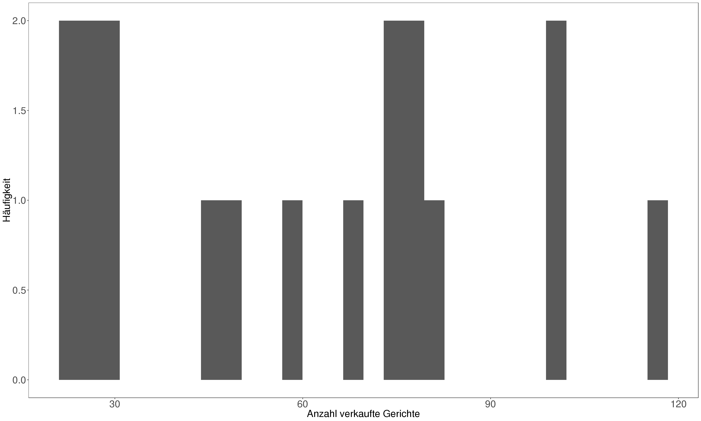
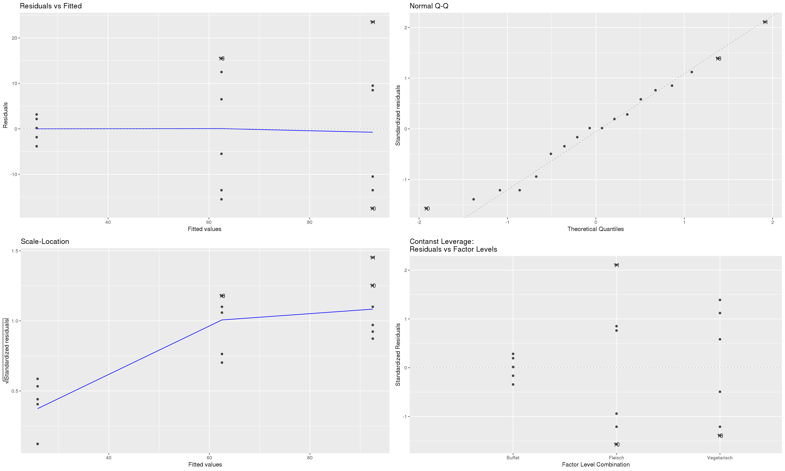
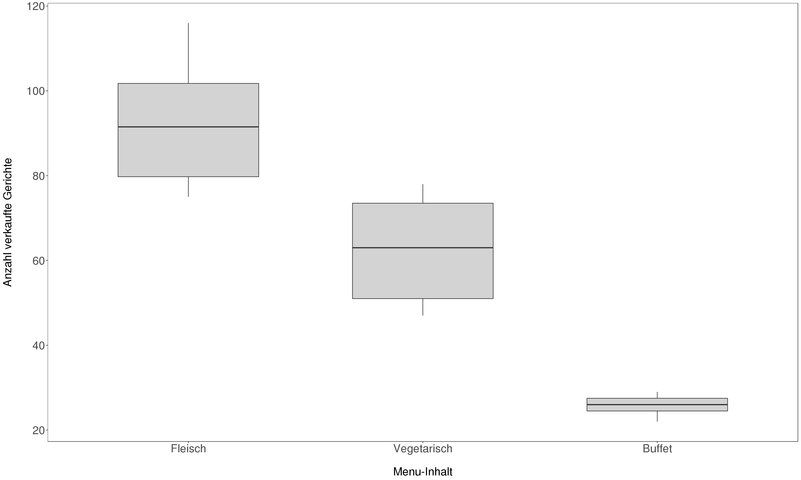
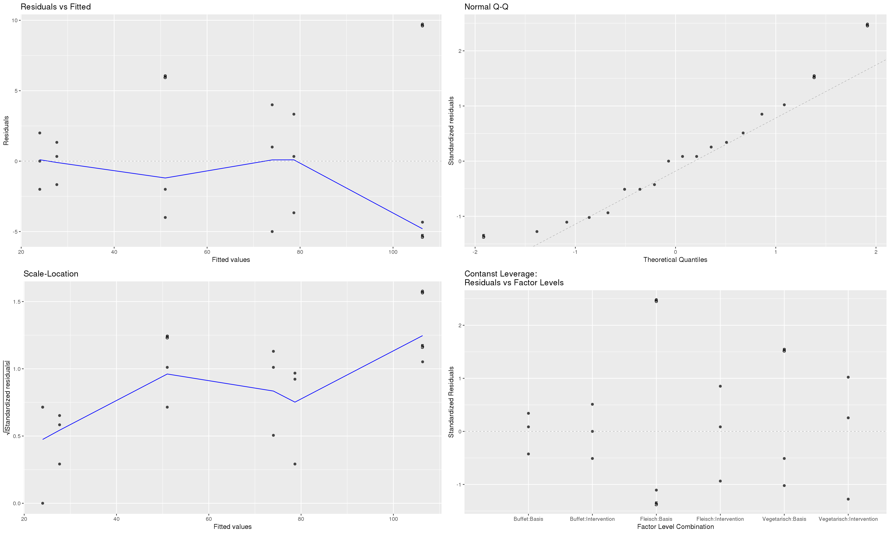
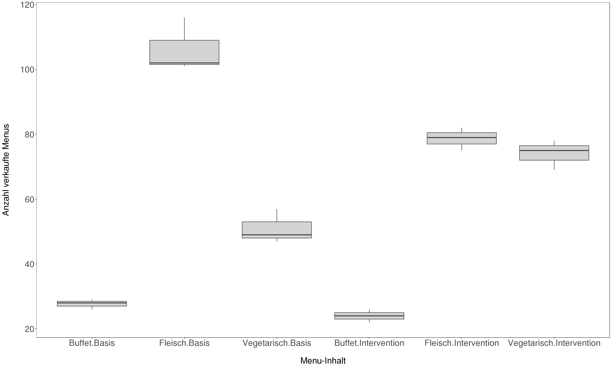

### Musterlösung Aufgabe 3


#### Unterscheiden sich die Verkaufszahlen pro Menü-Inhalt und Woche? 


```r
df <- nova # kopiere originaler Datensatz
df$label_content[grep("Pflanzlich+",df$label_content)] <- "Vegetarisch" # Fasse die Menü-Inhalte zusammen

# # lasse evtl weg, da gruppen zu klein für ANOVA
# df$age_groups <- cut(x = df$age, breaks = c(-Inf, 34, 49, 64, Inf), labels = c("18- bis 34-Jährigen", "35- bis 49-Jährigen", "50- bis 64-Jährigen", "65 Jahre und älter")) # 

df_ <- df %>%
    group_by(label_content, week) %>%
    summarise(tot_sold = n()) %>%
    na.omit() # lasse die unbekannten Verkäufe weg


# erstes Modell: werden die Verkaufszahlen durch den Menü-Inhalt erklärt?
model <- aov(tot_sold ~ label_content, data = df_)

ggplot(df_, aes(x = tot_sold, y = ..count..)) + geom_histogram() + labs(x = "Anzahl verkaufte Gerichte", y = "Häufigkeit") + theme_apa(x.font.size = 20, y.font.size = 20) +  theme(axis.text = element_text(size = 20))  # schaue die Verkaufszahlen in einem Histogramm an
```



```r
# Sieht nach keiner Normalverteilung aus, aber ab > 25 Beobachtungen pro Gruppe sind Verletzungen in der Regel unproblematisch (Quelle: www.uzh.ch).  
autoplot(model) # Aber Inspektion der Modellvoraussetzung zeigt klare Verletzungen der Nicht-Linearität und Homoskedastizität 
```



```r
leveneTest(df_$tot_sold, df_$label_content) # Zudem ist keine Varianzhomogenität gegeben
```

```
## Levene's Test for Homogeneity of Variance (center = median)
##       Df F value   Pr(>F)    
## group  2  12.844 0.000562 ***
##       15                     
## ---
## Signif. codes:  0 '***' 0.001 '**' 0.01 '*' 0.05 '.' 0.1 ' ' 1
```

```r
summary.lm(model) # Ergebnisse dürfen nicht interpretiert werden
```

```
## 
## Call:
## aov(formula = tot_sold ~ label_content, data = df_)
## 
## Residuals:
##      Min       1Q   Median       3Q      Max 
## -17.5000  -9.2500   0.1667   8.0000  23.5000 
## 
## Coefficients:
##                          Estimate Std. Error t value Pr(>|t|)    
## (Intercept)                25.833      4.986   5.181 0.000112 ***
## label_contentFleisch       66.667      7.052   9.454 1.04e-07 ***
## label_contentVegetarisch   36.667      7.052   5.200 0.000108 ***
## ---
## Signif. codes:  0 '***' 0.001 '**' 0.01 '*' 0.05 '.' 0.1 ' ' 1
## 
## Residual standard error: 12.21 on 15 degrees of freedom
## Multiple R-squared:  0.8567,	Adjusted R-squared:  0.8376 
## F-statistic: 44.84 on 2 and 15 DF,  p-value: 4.699e-07
```

```r
# Alternative Testung: Kruskal-Wallis Rank Sum Test
df_$label_content <- factor(df_$label_content, levels = c("Fleisch", "Vegetarisch", "Buffet")) # unabhängige Variable muss zuest als Faktor definiert werden -> erster Faktor (hier Fleisch) wird die Refernzkategorie bilden
kruskal.test(tot_sold ~ label_content, data = df_) # sieht aus als ob sich die Verkaufszahlen zwischen den Menü-Inhalten unterscheiden würden
```

```
## 
## 	Kruskal-Wallis rank sum test
## 
## data:  tot_sold by label_content
## Kruskal-Wallis chi-squared = 14.583, df = 2, p-value = 0.0006814
```

```r
dunnTest(tot_sold ~ label_content, data=df_, # wie unterscheiden sich die einzelnen Levels, hierfür kann der Dunn-Test zur Hand gezogen werden. Gemäss Zar (2010) kann der Dunn Test für ungleiche Gruppen angewendet werden
              method="bh") # werden korrigierte p-Werte ausgerechnet (Benjamini-Hochberg method)
```

```
##              Comparison         Z      P.unadj        P.adj
## 1      Buffet - Fleisch -3.816144 0.0001355536 0.0004066608
## 2  Buffet - Vegetarisch -2.029864 0.0423704010 0.0635556015
## 3 Fleisch - Vegetarisch  1.786280 0.0740539318 0.0740539318
```

```r
# Visualisierung und Dasrtellung der Ergebnisse 
ggplot(df_, aes(x = label_content, y= tot_sold)) + geom_boxplot(fill="lightgrey", width = .6) + labs(x = "\nMenu-Inhalt", y = "Anzahl verkaufte Gerichte\n") + theme_apa(x.font.size = 20, y.font.size = 20) +  theme(axis.text = element_text(size = 20))
```


Die Menü-Inhalte (Fleisch, Vegetarisch und Buffet) unterscheiden sich in den Verkaufszahlen signifikant ($\chi^2$ = 14.58, *p* < 0.001). Anschliessend durchgeführte Post-hoc-Tests (Dunn-Tests) zeigen, dass sich lediglich die Gruppen "Fleisch" und "Buffet" signifikant unterscheiden (z = -3.816, p = .0004)


#### Können die Unterschiede zwischen den Menü-Inhalten durch die beiden Bedingungen erklärt werden?


```r
#Gruppiere Daten und fasse sie nach Vorkommen/Häufigkeit zusammen
df_ <- df %>%
    group_by(condit, label_content, week) %>%
    summarise(tot_sold = n()) %>%
    na.omit() # lasse die unbekannten Verkäufe weg

# Soziodemografische Unterschiede in der Menü-Wahl?
model1 <- aov(tot_sold ~ label_content * condit, data = df_)
autoplot(model1)  # Inspektion der Modellvoraussetzung: sollte ok sein (?)
```



```r
leveneTest(df_$tot_sold ~ df_$label_content*df_$condit) # Varianzhomogenität gegeben
```

```
## Levene's Test for Homogeneity of Variance (center = median)
##       Df F value Pr(>F)
## group  5  0.4085 0.8339
##       12
```

```r
summary.lm(model1) # Bei Interaktionen dürfen die Haupteffekte nicht mehr interpretiert werden
```

```
## 
## Call:
## aov(formula = tot_sold ~ label_content * condit, data = df_)
## 
## Residuals:
##     Min      1Q  Median      3Q     Max 
## -5.3333 -3.2500  0.1667  1.8333  9.6667 
## 
## Coefficients:
##                                             Estimate Std. Error t value
## (Intercept)                                   27.667      2.769   9.992
## label_contentFleisch                          78.667      3.916  20.090
## label_contentVegetarisch                      23.333      3.916   5.959
## conditIntervention                            -3.667      3.916  -0.936
## label_contentFleisch:conditIntervention      -24.000      5.538  -4.334
## label_contentVegetarisch:conditIntervention   26.667      5.538   4.815
##                                             Pr(>|t|)    
## (Intercept)                                 3.61e-07 ***
## label_contentFleisch                        1.32e-10 ***
## label_contentVegetarisch                    6.62e-05 ***
## conditIntervention                          0.367539    
## label_contentFleisch:conditIntervention     0.000972 ***
## label_contentVegetarisch:conditIntervention 0.000422 ***
## ---
## Signif. codes:  0 '***' 0.001 '**' 0.01 '*' 0.05 '.' 0.1 ' ' 1
## 
## Residual standard error: 4.796 on 12 degrees of freedom
## Multiple R-squared:  0.9823,	Adjusted R-squared:  0.975 
## F-statistic: 133.4 on 5 and 12 DF,  p-value: 4.369e-10
```

```r
TukeyHSD(model1) # Tukey post hoc Tests
```

```
##   Tukey multiple comparisons of means
##     95% family-wise confidence level
## 
## Fit: aov(formula = tot_sold ~ label_content * condit, data = df_)
## 
## $label_content
##                          diff       lwr       upr p adj
## Fleisch-Buffet       66.66667  59.27969  74.05365 0e+00
## Vegetarisch-Buffet   36.66667  29.27969  44.05365 0e+00
## Vegetarisch-Fleisch -30.00000 -37.38698 -22.61302 4e-07
## 
## $condit
##                         diff       lwr      upr     p adj
## Intervention-Basis -2.777778 -7.703587 2.148031 0.2427422
## 
## $`label_content:condit`
##                                                     diff        lwr
## Fleisch:Basis-Buffet:Basis                     78.666667  65.513871
## Vegetarisch:Basis-Buffet:Basis                 23.333333  10.180538
## Buffet:Intervention-Buffet:Basis               -3.666667 -16.819462
## Fleisch:Intervention-Buffet:Basis              51.000000  37.847205
## Vegetarisch:Intervention-Buffet:Basis          46.333333  33.180538
## Vegetarisch:Basis-Fleisch:Basis               -55.333333 -68.486129
## Buffet:Intervention-Fleisch:Basis             -82.333333 -95.486129
## Fleisch:Intervention-Fleisch:Basis            -27.666667 -40.819462
## Vegetarisch:Intervention-Fleisch:Basis        -32.333333 -45.486129
## Buffet:Intervention-Vegetarisch:Basis         -27.000000 -40.152795
## Fleisch:Intervention-Vegetarisch:Basis         27.666667  14.513871
## Vegetarisch:Intervention-Vegetarisch:Basis     23.000000   9.847205
## Fleisch:Intervention-Buffet:Intervention       54.666667  41.513871
## Vegetarisch:Intervention-Buffet:Intervention   50.000000  36.847205
## Vegetarisch:Intervention-Fleisch:Intervention  -4.666667 -17.819462
##                                                      upr     p adj
## Fleisch:Basis-Buffet:Basis                     91.819462 0.0000000
## Vegetarisch:Basis-Buffet:Basis                 36.486129 0.0007250
## Buffet:Intervention-Buffet:Basis                9.486129 0.9291473
## Fleisch:Intervention-Buffet:Basis              64.152795 0.0000002
## Vegetarisch:Intervention-Buffet:Basis          59.486129 0.0000007
## Vegetarisch:Basis-Fleisch:Basis               -42.180538 0.0000001
## Buffet:Intervention-Fleisch:Basis             -69.180538 0.0000000
## Fleisch:Intervention-Fleisch:Basis            -14.513871 0.0001479
## Vegetarisch:Intervention-Fleisch:Basis        -19.180538 0.0000313
## Buffet:Intervention-Vegetarisch:Basis         -13.847205 0.0001871
## Fleisch:Intervention-Vegetarisch:Basis         40.819462 0.0001479
## Vegetarisch:Intervention-Vegetarisch:Basis     36.152795 0.0008244
## Fleisch:Intervention-Buffet:Intervention       67.819462 0.0000001
## Vegetarisch:Intervention-Buffet:Intervention   63.152795 0.0000003
## Vegetarisch:Intervention-Fleisch:Intervention   8.486129 0.8326526
```

```r
# # Alternative Testung: Kruskal-Wallis Rank Sum Test
# df_$label_content <- factor(df_$label_content, levels = c("Fleisch", "Vegetarisch", "Buffet")) # unabhängige Variable muss zuest als Faktor definiert werden
# kruskal.test(tot_sold ~ interaction(label_content, condit), data = df_) # sieht aus als ob sich die Verkaufszahlen zwischen den Menü-Inhalten unterscheiden würden
# dunnTest(tot_sold ~ interaction(label_content, condit), data=df_, # wie unterscheiden sich die einzelnen Levels, hierfür kann der Dunn-Test zur Hand gezogen werden. Gemäss Zar (2010) kann der Dunn Test für ungleiche Gruppen angewendet werden
#               method="bh") # werden korrigierte p-Werte ausgerechnet (Benjamini-Hochberg method)
# 

# visualisiere das Modell
ggplot(df_, aes(x = interaction(label_content, condit), y = tot_sold)) + geom_boxplot(fill="lightgrey") + labs(x = "\nMenu-Inhalt", y = "Anzahl verkaufte Menus\n") + theme_apa(x.font.size = 20, y.font.size = 20) +  theme(axis.text = element_text(size = 20))
```



Die Menü-Inhalte (Fleisch, Vegetarisch und Buffet) zwischen den Bedingungen Basis oder Interventionswochen unterscheiden sich in den Verkaufszahlen signifikant *F*(5, 12) = 133.4, *p* < .0001). Anschliessend durchgeführte Post-hoc-Tests (Tukey-Tests) zeigen vor allem zwei interessante Ergbenisse: in den Interventionswochen wurde signifikant weniger Fleischgerichte gekauft als in den Basiswochen.  Zudem sind in den Interventionswochen signifikant mehr vegetarische Gerichte verkauft worden. 


#### Referenzen

Zar, J. H. (2010). *Biostatistical Analysis*. Prentice Hall.


