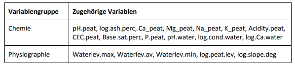

```{r,include=FALSE}
knitr::opts_chunk$set(fig.width = 20, fig.height = 12, warning = F, message = F, fig.pos = 'H',results = "hide")
```

## Musterlösung Aufgabe 7.1: RDA

**Übungsaufgabe (hier so ausführlich formuliert, wie dies auch in der Klausur der Fall sein wird)**

- Ladet die library dave, welche den Moordatensatz enthält. sveg beinhaltet presenceabsence-Daten  aller untersuchten Arten in den Plots; ssit beinhaltet 18 metrische Umweltdaten sowie Koordinaten der Plots
- **Führt eine RDA und eine Varianzpartizionierung in die Variablengruppen Physiographie**  (Waterlev.max, Waterlev.av, Waterlev.min, log.peat.lev, log
  slope.deg) **und Chemie** (alle übrigen) **durch.**
- Formuliert abschliessend einen Methoden- und Ergebnisteil (ggf. incl. adäquaten Abbildungen) zu dieser Untersuchung in der Form einer wissenschaftlichen Arbeit (ausformulierte schriftliche Zusammenfassung, mit je einem Absatz von ca. 60-100 Worten, resp. 3-8 Sätzen für den Methoden- und Ergebnisteil). D. h. alle wichtigen Informationen sollten enthalten sein, unnötige Redundanz dagegen vermieden werden.
- Während im Text normalerweise die Variablen ausgeschrieben werden solltet, genügt es hier (da ihr die entsprechenden Infos nicht bekommen habt und nur raten könntet), wenn ihr die Abkürzungen aus dem dataframe nehmt.

### Übung 7.1 - RDA -- Lösung

```{r eval=FALSE}
# Load the Moordatensatz data.
library(dave)
sveg
ssit
summary(sveg)
summary(ssit)
str(ssit)

# Remove x.axis and y.axis from ssit data frame
env2 <- ssit[, -c(19,20)]
```
Betrachtung der Daten zeigt, dass die Koordinaten in Spalten 19 und 20 sind, die daraufhin entfernt werden.

```{r eval=FALSE}
# Create two subsets of explanatory variables
# Physiography (upstream-downstream gradient)

envtopo <- env2[, c(11 : 15)]
names(envtopo)

# Chemistry
envchem <- env2[, c(1:10,16:18)]
names(envchem)
# Hellinger-transform the species dataset
library(vegan)
spe.hel <- decostand(sveg, "hellinger")
spe.hel
```

Vorstehend wurden die Variablen in die zwei Gruppen Chemistry und Physiography aufgteilt. Die Hellilnger-Transformation wird gemeinhin empfohlen (wobei dahingestellt sei, ob sie auch bei presence-absence-Daten nötig ist).
Die weiteren Analysen führen wir mit der default-Einstellung „Scaling 2“ durch. (Je nach Bedarf bzw. persönlichen Vorlieben könnte auch Scaling 1 genommen werden).

```{r eval=FALSE}
## RDA of the Hellinger-transformed mire species data, constrained
## by all the environmental variables contained in env2
(spe.rda <- rda(spe.hel ~ ., env2)) # Observe the shortcut formula
summary(spe.rda) # Scaling 2 (default)

# Canonical coefficients from the rda object
coef(spe.rda)
# Unadjusted R^2 retrieved from the rda object
(R2 <- RsquareAdj(spe.rda)$r.squared)
# Adjusted R^2 retrieved from the rda object
(R2adj <- RsquareAdj(spe.rda)$adj.r.squared)
```

Man erhält R²adj. = 0.376
Jetzt kann man den Triplot erstellen

```{r eval=FALSE}
## Triplots of the rda results (lc scores)
## Site scores as linear combinations of the environmental variables
#dev.new(
#  title = "RDA scaling 1 and 2 + lc",
#  width = 6,
#  height = 12,
#  noRStudioGD = TRUE
#)
par(mfrow = c(1, 1))
plot(spe.rda,
     scaling = 1,
     display = c("sp", "lc", "cn"),
     main = "Triplot RDA spe.hel ~ env3 - scaling 1 - lc scores"
)
spe.sc1 <- 
  scores(spe.rda, 
         choices = 1:2, 
         scaling = 1, 
         display = "sp"
  )
arrows(0, 0, 
       spe.sc1[, 1] * 0.92,
       spe.sc1[, 2] * 0.92,
       length = 0, 
       lty = 1, 
       col = "red"
)
text(-0.75, 0.7, "a", cex = 1.5)


# Scaling 2
plot(spe.rda,
 display = c("sp", "lc", "cn"),
 main = "Triplot RDA spe.hel ~ env3 - scaling 2 - lc scores"
)
spe.sc2 <-
 scores(spe.rda,
 choices = 1:2,
 display = "sp"
 )
arrows(0, 0,
 spe.sc2[, 1] * 0.92,
 spe.sc2[, 2] * 0.92,
 length = 0,
 lty = 1,
 col = "red"
)
text(-0.82, 0.55, "b", cex = 1.5)
```

Auswahl der höchstkorrelierten Arten (Grenzwert kann subjektiv nach Bedarf gesetzt werden, hier 0.5).

```{r eval=FALSE}
# Select species with goodness-of-fit at least 0.6 in the 
# ordination plane formed by axes 1 and 2
spe.good <- goodness(spe.rda)
sel.sp <- which(spe.good[, 2] >= 0.6)
sel.sp
# Triplots with homemade function triplot.rda(), scalings 1 and 2
source("19_Statistik7/triplot.rda.R")
#dev.new(
#  title = "RDA plot with triplot.rda",
#  width = 6,
#  height = 12,
#  noRStudioGD = TRUE
#)
par(mfrow = c(1, 1))
triplot.rda(spe.rda, 
            site.sc = "lc", 
            scaling = 1, 
            cex.char2 = 0.7, 
            pos.env = 3, 
            pos.centr = 1, 
            mult.arrow = 1.1, 
            mar.percent = 0.05, 
            select.spe = sel.sp
)
text(-0.92, 0.72, "a", cex = 2)
triplot.rda(spe.rda, 
            site.sc = "lc", 
            scaling = 2, 
            cex.char2 = 0.7, 
            pos.env = 3, 
            pos.centr = 1, 
            mult.arrow = 1.1, 
            mar.percent = 0.05, 
            select.spe = sel.sp
)
#text(-2.82, 2, "b", cex = 2)

# Global test of the RDA result
anova(spe.rda, permutations = how(nperm = 999))
# Tests of all canonical axes
anova(spe.rda, by = "axis", permutations = how(nperm = 999))
```

Die ersten drei RDA-Achsen sind also signifikant. Man könnte also auch noch eine
Visualisierung von RDA 3 vs. RDA 1 machen.

**Partielle RDA: ist im R-Script, wird hier aber nicht weiter behandelt.**

**Varianzpartitionierung**

```{r eval=FALSE}
## 1. Variation partitioning with all explanatory variables
(spe.part.all <- varpart(spe.hel, envchem, envtopo))
# Plot of the partitioning results
#dev.new(title = "Variation partitioning - all variables", 
# noRStudioGD = TRUE)
plot(spe.part.all, digits = 2, bg = c("red", "blue"),
 Xnames = c("Chemistry", "Physiography"),
 id.size = 0.7)
```
Die durch die erhobenen Umweltvariablen insgesamt erklärte Varianz (37.6%, s.o.) entfällt zu 19.4% auf chemische Variablen, 3.6% auf physiographische Variablen und zu 14.6% auf gemeinsame Erklärung.


**Darstellung der Vorgehensweise und Ergebnisse (in einer wiss. Arbeit)**

**Methoden**

**In 63 Plots eines Moores wurden die Artenzusammensetzung der Vegetation mit (Presenceabsence) und 18 metrische Umweltvariablen erhoben (Tab. 1).**




**Mittels RDA als „constrained ordination“ wurde anschliessend ermittelt, ob und wie die erhobenen Umweltvariablen, die Artverteilungsmuster erklären. Ein Triplot wurde verwendet, um die Beziehungen zwischen Plots, Arten und Umweltvariablen zu visualisieren.Abschliessend wurde die erklärte Varianz mittels Varianzpartitionierung in die Variablengruppen Physiographie und Chemie aufgeteilt.**

**Ergebnisse**

**In der RDA konnten die 20 erhobenen Umweltvariablen zusammen knapp 40% der Varianz in den Artvorkommen erklären (R²adj. = 0.376). Dabei waren die ersten drei RDA-Achsen signifikant. Die Varianzpartizionierung (Abb. 1). zeigte, dass dabei die chemischen Variablen alleine und in Kombination mit den physiographischen Variablen weitaus bedeutsamer waren als physiographische Variablen alleine.**


**Das Ordinationsdiagramm (Abb. 2) der ersten beiden RDA-Achsen zeigt, dass der Hauptgradient (1. Hauptachse) im Wesentlichen ein Aziditätsgradient mit den sauren Plots ganz links und denjenigen mit hohem pH, hohem Ca-Gehalten in Torf und Wasser sowie hoher Basensättigung rechts ist. Die zweite Hauptachste steht für einen Gradienten von unten trocken (mittlere, minimale und maximale Grundwasserstände weit unter Flur) bis oben nass. Die bezeichnensten Arten des Hauptgradienten sind die Säurezeiger Vaccinium oxycoccos und Sphagnum magellanicum links und die Basenzeiger Carex davalliana und Carex pulicaris rechts.**


