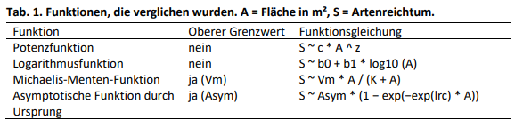
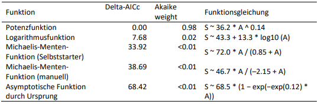
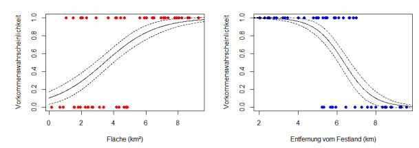
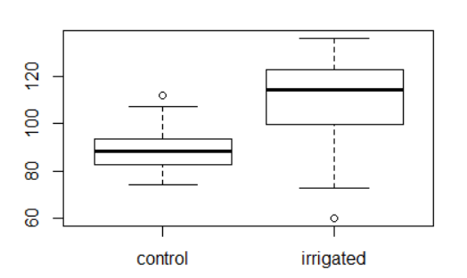
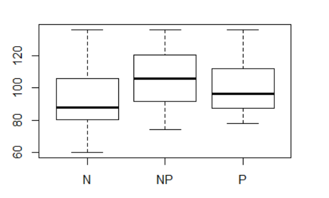
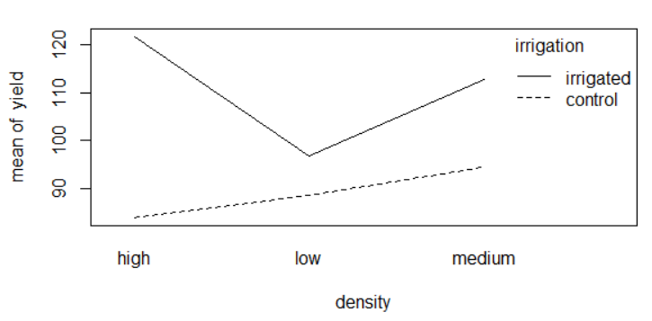

--- 
title: "Research Methods"
date: "`r Sys.Date()`"
site: bookdown::bookdown_site
#output: bookdown::gitbook
documentclass: book
bibliography: [00_Admin/book.bib, 00_Admin/packages.bib]
biblio-style: apalike
link-citations: yes
description: "Begleitmaterial zum Modul 'Research Methods' "
---

# Einleitung


Das Modul „Research Methods“ vermittelt vertiefte Methodenkompetenzen für praxisorientiertes und angewandtes wissenschaftliches Arbeiten im Fachbereich „Umwelt und Natürliche Ressourcen“ auf MSc-Niveau. Die Studierenden erarbeiten sich vertiefte Methodenkompetenzen für die analytische Betrachtung der Zusammenhänge im Gesamtsystem „Umwelt und Natürliche Ressourcen“. Die Studierenden erlernen die methodischen Kompetenzen, auf denen die nachfolgenden Module im MSc Programm UNR aufbauen. Das Modul vermittelt einerseits allgemeine, fächerübergreifende methodische Kompetenzen (z.B. Wissenschaftstheorie, computer-gestützte Datenverar-beitung und Statistik).

Auf dieser Plattform (RStudio Connect) werden die Unterlagen für die R-Übungsteile bereitgestellt. Es werden sukzessive sowohl Demo-Files, Aufgabenstellungen und Lösungen veröffentlicht.


```{r, include=F, message=F}
# Set Root Directory / Working directory to Project folder for all Files (if M-K)
knitr::opts_knit$set(root.dir = getwd())
```


```{r, include=F, message=F}


grepl_loop <- function(vector,remove){
  for(remove_i in remove){
    vector <- vector[!grepl(remove_i,vector)]
  }
  return(vector)
}


# Allow duplicate Labels so that calling purl() does not create an error
# https://stackoverflow.com/q/36868287/4139249
options(knitr.duplicate.label = 'allow')

# purl all Rmd Documents (with some exceptions) and store them in a Subfolder /RFiles
# Document cannot be knitted if the folder "RFiles" does not exist!
library(stringr)

keywords <- c("ResearchMethods","_Rcode","99_","index","Archive","Admin","main","Abstract")


rmds <- list.files(pattern = ".Rmd",recursive = T)

rmds <- grepl_loop(rmds,keywords)


# 2019-08-15 rata: folgender Teil ist auskommentiert, um die Komplexität des ganzen zu verkleinern
# for (file in rmds){
#   file_r <- gsub("Rmd","R",file)                          # change fileextension from .rmd to r
#   file_r <- str_split_fixed(file_r,"/",Inf)               # split path at /
#   file_r <- append(file_r, "RFiles",length(file_r)-1)     # append Foldername "RFiles" in 2nd last pos
#   file_r <- paste(file_r,collapse = "/")                  # collapse vector to string
#   if(file.exists(file_r)){
#     file.remove(file_r)
#   }
#   knitr::purl(file,documentation = 0,output = file_r)
# }

```


```{r include=FALSE, message=F}
# automatically create a bib database for R packages
# 2019-08-15 rata: folgender Teil ist auskommentiert, um die Komplexität des ganzen zu verkleinern
# knitr::write_bib(c(
#   .packages(), 'bookdown', 'knitr','forcats','carData', 'rmarkdown','tidyverse','plotly','car','ggfortify','boot','pander','scales','multicomp','ggExtra','lubridate','dplyr','purrr','readr','tidyr','tibble','ggplot2','webshot','bindrcpp','GGally','hier.part','gtools','MuMIn','nlme','lme4','languageR','lmerTest','rms','SparseM','Hmisc','Formula','survival','lattice','Matrix'
# ), '00_Admin/packages.bib')

```
```{r include=FALSE, cache=FALSE}


# detach packages
packages = sapply(sessionInfo()$otherPkgs, function(x) x$Package)
packages = packages[packages != "bookdown"]
packages = sapply(packages, function(p) paste0("package:", p))
lapply(packages, detach, character.only = TRUE, unload = TRUE)
# clear environment
rm(list = ls())
```

<!--chapter:end:index.Rmd-->

# PrePro1 (14.10.2019)

Die Datenkunde 2.0 gibt den Studierenden das Wissen und die Fertigkeiten an die Hand, selbst erhobene und bezogene Daten für Ihre eigenen Analysen vorzubereiten und anzureichern (preprocessing). Die Einheit vermittelt zentrale Datenverarbeitungskompetenzen und thematisiert bekannte Problemzonen der umweltwissenschaftlichen Datenverarbeitung – immer mit einer „hands-on“ Perspektive auf die begleitenden R-Übungen. Die Studierenden lernen die Eigenschaften ihrer Datensätze in der Fachsprache korrekt zu beschreiben. Sie lernen ausserdem Metadaten zu verstehen und die Implikationen derselben für ihre eigenen Analyseprojekte kritisch zu beurteilen. Zentrale Konzepte der Lerneinheit sind Skalenniveaus, Datentypen, Zeitdaten und Typumwandlungen.


<!-- sdf -->
```{r include=FALSE, cache=FALSE}


# detach packages
packages = sapply(sessionInfo()$otherPkgs, function(x) x$Package)
packages = packages[packages != "bookdown"]
packages = sapply(packages, function(p) paste0("package:", p))
lapply(packages, detach, character.only = TRUE, unload = TRUE)
# clear environment
rm(list = ls())
```

<!--chapter:end:09_PrePro1/Abstract.Rmd-->


```{r, include=FALSE, purl=F}

knitr::opts_chunk$set(echo = TRUE,include = T, collapse=TRUE)
```

## Demo: Datentypen, Tabellen

[R-Code als Download](09_PrePro1/RFiles/Demo_Datentypen.R)

### Datentypen 


#### Numerics

Unter die Kategorie `numeric` fallen in R zwei Datentypen:

- `double`: Gleitkommazahl (z.B. 10.3, 7.3)
- `integer`: Ganzzahl (z.B. 10, 7)

##### Doubles

Folgendermassen wird eine Gleitkommazahl einer Variabel zuweisen:

```{r}
x <- 10.3

x

typeof(x)
```


Statt `<-`kann auch `=` verwendet werden. Dies funktioniert aber nicht in allen Situationen, und ist zudem leicht mit `==` zu verwechseln.

```{r}
y = 7.3

y
```


Ohne explizite Zuweisung nimmt R immer den Datentyp `double`an:

```{r}
z <- 42
typeof(z)
is.integer(z)
is.numeric(z)
is.double(z)

```

#### Ganzzahl / Integer 


Erst wenn man eine Zahl explizit als `integer` definiert (mit `as.integer()` oder `L`), wird sie auch als solches abgespeichert.

```{r}
a <- as.integer(z)
is.numeric(a)
is.integer(a)

c <- 8L
is.numeric(c)
is.integer(c)
```


```{r}
typeof(a)

is.numeric(a)
is.integer(a)
```


Mit `c()` können eine Reihe von Werten in einer Variabel zugewiesen werden (als `vector`). Es gibt zudem auch `character verctors`. 

```{r}
vector <- c(10,20,33,42,54,66,77)
vector
vector[5]
vector[2:4]

vector2 <- vector[2:4]
```


Eine Ganzzahl kann explizit mit `as.integer()` definiert werden.

```{r}
a <- as.integer(7)
b <- as.integer(3.14)
a
b
typeof(a)
typeof(b)
is.integer(a)
is.integer(b)

```

Eine Zeichenkette kann als Zahl eingelesen werden.

```{r}
c <- as.integer("3.14")
c
typeof(c)
```


#### Logische Abfragen 

Wird auch auch als boolesch (Eng. **boolean**) bezeichnet.

```{r}
e <- 3
f <- 6
g <- e > f
e
f
g
typeof(g)

```

#### Logische Operationen


```{r}
sonnig <- TRUE
trocken <- FALSE

sonnig & !trocken
```

Oft braucht man auch das Gegenteil / die Negation eines Wertes. Dies wird mittels `!` erreicht

```{r}
u <- TRUE
v <- !u 
v
```


#### Zeichenketten

Zeichenketten (Eng. **character**) stellen Text dar

```{r}
s <- as.character(3.14)
s
typeof(s)
```


Zeichenketten verbinden / zusammenfügen (Eng. **concatenate**)

```{r}
fname <- "Hans"
lname <- "Muster"
paste(fname,lname)

fname2 <- "hans"
fname == fname2
```


#### `Factors`

Mit `Factors` wird in R eine Sammlung von Zeichenketten bezeichnet, die sich wiederholen, z.B. Wochentage (es gibt nur 7 unterschiedliche Werte für "Wochentage").

```{r}
wochentage <- c("Montag","Dienstag","Mittwoch","Donnerstag","Freitag","Samstag","Sonntag",
                "Montag","Dienstag","Mittwoch","Donnerstag","Freitag","Samstag","Sonntag")

typeof(wochentage)

wochentage_fac <- as.factor(wochentage)

wochentage
wochentage_fac


```

Wie man oben sieht, unterscheiden sich `character vectors` und `factors` v.a. dadurch, dass letztere über sogenannte `levels` verfügt. Diese `levels` entsprechen den Eindeutigen (`unique`) Werten.

```{r}
levels(wochentage_fac)

unique(wochentage)
```


#### Zeit/Datum

Um in R mit Datum/Zeit Datentypen umzugehen, müssen sie als `POSIXct` eingelesen werden (es gibt alternativ noch `POSIXlt`, aber diese ignorieren wir mal). Anders als Beispielsweise bei Excel, sollten in R Datum und Uhrzeit immer in **einer Spalte** gespeichert werden.

```{r}
datum <- "2017-10-01 13:45:10"

as.POSIXct(datum)

```

Wenn das die Zeichenkette in dem obigen Format (Jahr-Monat-Tag Stunde:Minute:Sekunde) daher kommt, braucht `as.POSIXct`keine weiteren Informationen. Sollte das Format von dem aber Abweichen, muss man der Funktion das genaue Schema jedoch mitteilen. Der Syntax dafür kann via `?strptime` nachgeschlagen werden.

```{r}
datum <- "01.10.2017 13:45"

as.POSIXct(datum,format = "%d.%m.%Y %H:%M")

```

Beachtet, dass in den den obigen Beispiel R automatisch eine Zeitzone angenommen hat (`CEST`). R geht davon aus, dass die Zeitzone der **System Timezone** (`Sys.timezone()`) entspricht.


### Data Frames und Conveniance Variabeln

Eine `data.frame` ist die gängigste Art, Tabellarische Daten zu speichern. 

```{r}
df <- data.frame(
  Stadt = c("Zürich","Genf","Basel","Bern","Lausanne"),
  Einwohner = c(396027,194565,175131,140634,135629),
  Ankunft = c("1.1.2017 10:00","1.1.2017 14:00",
              "1.1.2017 13:00","1.1.2017 18:00","1.1.2017 21:00")
)

str(df)

```

In der obigen `data.frame` wurde die Spalte `Einwohner` als Fliesskommazahl abgespeichert. Dies ist zwar nicht tragisch, aber da wir wissen das es sich hier sicher um Ganzzahlen handelt, können wir das korrigieren. Wichtiger ist aber, dass wir die Ankunftszeit (Spalte`Ankunft`) von  einem `Factor` in ein Zeitformat (`POSIXct`) umwandeln. 


```{r}
df$Einwohner <- as.integer(df$Einwohner)

df$Einwohner

df$Ankunft <- as.POSIXct(df$Ankunft, format = "%d.%m.%Y %H:%M")

df$Ankunft
```


Diese Rohdaten können nun helfen, um Hilfsvariablen (**convenience variables**) zu erstellen. Z.B. können wir die Städte einteilen in gross, mittel und klein. 

```{r}
df$Groesse[df$Einwohner > 300000] <- "gross"
df$Groesse[df$Einwohner <= 300000 & df$Einwohner > 150000] <- "mittel"
df$Groesse[df$Einwohner <= 150000] <- "klein"

```


Oder aber, die Ankunftszeit kann von der Spalte `Ankunft`abgeleitet werden. Dazu brauchen wir aber das Package `lubridate`

```{r, message = F}
library(lubridate)
```


```{r}
df$Ankunft_stunde <- hour(df$Ankunft)
```

### Quellen

```{r code=readLines('00_Admin/get_chapter_references.R'), echo=F, eval=T,purl = F, results="asis"}
```


```{r include=FALSE, cache=FALSE}


# detach packages
packages = sapply(sessionInfo()$otherPkgs, function(x) x$Package)
packages = packages[packages != "bookdown"]
packages = sapply(packages, function(p) paste0("package:", p))
lapply(packages, detach, character.only = TRUE, unload = TRUE)
# clear environment
rm(list = ls())
```

<!--chapter:end:09_PrePro1/Demo_Datentypen.Rmd-->


```{r, include=FALSE, purl = F}
knitr::opts_chunk$set(echo = F, include = T, collapse=TRUE, warning = F)
```


## Übung A

R ist ohne Zusatzpackete nicht mehr denkbar. Die allermeisten Packages werden auf [CRAN](https://cran.r-project.org/) gehostet und können leicht mittels `install.packages()` installiert werden. Eine sehr wichtige Sammlung von Packages wird von RStudio entwickelt. Unter dem Namen [Tidyverse](https://www.tidyverse.org/) werden eine Reihe von Packages angeboten, den R-Alltag enorm erleichtert. Wir werden später näher auf das "Tidy"-Universum eingehen, an dieser Stelle können wir die Sammlung einfach mal installieren.

```
install.packages("tidyverse")
```

Um ein `package` in R verwenden zu können, gibt es zwei Möglichkeiten: 

- entweder man lädt es zu Beginn der R-session mittles `library()`. 
- oder man ruft eine `function` mit vorangestelltem Packetname sowie zwei Doppelpunkten auf. `dplyr::filter()` ruft die Funktion `filter()` des Packets `dplyr` auf. 

Letztere Notation ist vor allem dann sinnvoll, wenn sich zwei unterschiedliche Funktionen mit dem gleichen namen in verschiedenen pacakges existieren. `filter()` existiert als Funktion einersits im package `dplyr` sowie in  `stats`. Dieses Phänomen nennt man "masking". 


Zu beginn laden wir die nötigen Pakete:


```{r,message = F}
library(tidyverse)
# Im Unterschied zu `install.packages()` werden bei `library()` keine Anführungs- 
# und Schlusszeichen gesetzt.


library(lubridate)
# Im Unterschied zu install.packages("tidyverse") wird bei library(tidyverse) 
# das package lubridate nicht berücksichtigt
```


### Aufgabe 1

Erstelle eine `data.frame` mit nachstehenden Daten.

Tipps:

- Eine leere `data.frame` zu erstellen ist schwieriger als wenn erstellen und befüllen der `data.frame` in einem Schritt erfolgt
- R ist dafür gedacht, Spalte für Spalte zu arbeiten ([warum?](http://www.noamross.net/blog/2014/4/16/vectorization-in-r--why.html)), nicht Reihe für Reihe. Versuche dich an dieses Schema zu halten.

```{r}

# Lösung Aufgabe 1

df <- data_frame(
  Tierart = c("Fuchs","Bär","Hase","Elch"),
  Anzahl = c(2,5,1,3),
  Gewicht = c(4.4, 40.3,1.1,120),
  Geschlecht = c("m","f","m","m"),
  Beschreibung = c("Rötlich","Braun, gross", "klein, mit langen Ohren","Lange Beine, Schaufelgeweih")
  )

```


```{r, echo = F, purl=F}
knitr::kable(df)
```


### Aufgabe 2

Was für Datentypen wurden (in Aufgabe 1) von R automatisch angenommen? Sind diese sinnvoll? 

Tipp: Nutze dazu `str()`

```{r}
# Lösung Aufgabe 2

str(df)

# Anzahl wurde als `double` interpretiert, ist aber eigentlich ein `integer`. 
# Mit data.frame() wurde Beschreibung wurde als `factor` interpretiert, ist 
# aber eigentlich `character`
```


```{r}


typeof(df$Anzahl)

df$Anzahl <- as.integer(df$Anzahl)
df$Beschreibung <- as.character(df$Beschreibung)

```


### Aufgabe 3


Nutze die Spalte `Gewicht` um die Tiere in 3 Gewichtskategorien einzuteilen: 

- leicht: < 5kg
- mittel: 5 - 100 kg
- schwer: > 100kg


```{r}

# Lösung Aufgabe 3

df$Gewichtsklasse[df$Gewicht > 100] <- "schwer"
df$Gewichtsklasse[df$Gewicht <= 100 & df$Gewicht > 5] <- "mittel"
df$Gewichtsklasse[df$Gewicht <= 5] <- "leicht"

```


```{r, purl=F}
knitr::kable(df)
```


### Aufgabe 4

Importiere den Datensatz [order_52252_data.txt](09_PrePro1/data/order_52252_data.txt). Es handelt sich dabei um die stündlich gemittelten Temperaturdaten an verschiedenen Standorten in der Schweiz im Zeitraum 2000 - 2005. Wir empfehlen `read_table()`^[@wickham2017, Kapitel 8 bzw. http://r4ds.had.co.nz/data-import.html)] anstelle von `read.table()`.

```{r, message = F}
# Lösung Aufgabe 4

wetter <- readr::read_table("09_PrePro1/data/order_52252_data.txt")
```


```{r, purl=F}
knitr::kable(head(wetter,10))
```


### Aufgabe 5

Schau dir die Rückmeldung von `read_table()`an. Sind die Daten korrekt interpretiert worden?


```{r}
# Lösung Aufgabe 5
# Die Spalte 'time' wurde als 'integer' interpretiert. Dabei handelt es
# sich offensichtlich um Zeitangaben.
```


### Aufgabe 6

Die Spalte `time` ist eine Datum/Zeitangabe im Format JJJJMMTTHH (siehe [meta.txt](09_PrePro1/data/meta.txt)). Damit R dies als Datum-/Zeitangabe erkennt, müssen wir die Spalte in einem R-Format (`POSIXct`) einlesen und dabei R mitteilen, wie sie aktuell formatiert ist. Lies die Spalte mit `as.POSIXct()` (oder `parse_datetime`) ein und spezifiziere sowohl `format` wie auch `tz`. 

Tipps: 

- Wenn keine Zeitzone festgelegt wird, trifft `as.POSIXct()` eine Annahme (basierend auf `Sys.timezone()`). In unserem Fall handelt es sich aber um Werte in UTC (siehe [meta.txt](09_PrePro1/data/meta.txt))
- `as.POSIXct`erwartet `character`

```{r}
# Lösung Aufgabe 6

# mit readr
parse_datetime(as.character(wetter$time[1:10]), format = "%Y%m%d%H")


# mit as.POSIXct()
wetter$time <- as.POSIXct(as.character(wetter$time), format = "%Y%m%d%H",tz = "UTC")

```


```{r, purl=F}
knitr::kable(head(wetter,10))
```


### Aufgabe 7


Erstelle zwei neue Spalten mit Wochentag (Montag, Dienstag, etc) und Kalenderwoche. Verwende dazu die neu erstellte `POSIXct`-Spalte


```{r}

# Lösung Aufgabe 7

wetter$wochentag <- wday(wetter$time,label = T)
wetter$kw <- week(wetter$time)

```


```{r, purl=F}
knitr::kable(head(wetter,10))
```


### Aufgabe 8


Erstelle eine neue Spalte basierend auf die Temperaturwerte mit der Einteilung "kalt" (Unter Null Grad) und "warm" (über Null Grad)

```{r}

# Lösung Aufgabe 8

wetter$temp_kat[wetter$tre200h0>0] <- "warm"
wetter$temp_kat[wetter$tre200h0<=0] <- "kalt"
```


```{r, purl=F}
knitr::kable(head(wetter,10))
```


```{r include=FALSE, cache=FALSE}


# detach packages
packages = sapply(sessionInfo()$otherPkgs, function(x) x$Package)
packages = packages[packages != "bookdown"]
packages = sapply(packages, function(p) paste0("package:", p))
lapply(packages, detach, character.only = TRUE, unload = TRUE)
# clear environment
rm(list = ls())
```

<!--chapter:end:09_PrePro1/Uebung_A.Rmd-->

## Übung A Lösung

[R-Script als Download](09_PrePro1/RFiles/Uebung_A.R)

```{r code=readLines('09_PrePro1/RFiles/Uebung_A.R'), echo=T, eval=F}
```

```{r include=FALSE, cache=FALSE}


# detach packages
packages = sapply(sessionInfo()$otherPkgs, function(x) x$Package)
packages = packages[packages != "bookdown"]
packages = sapply(packages, function(p) paste0("package:", p))
lapply(packages, detach, character.only = TRUE, unload = TRUE)
# clear environment
rm(list = ls())
```

<!--chapter:end:09_PrePro1/Uebung_A_loesung.Rmd-->


```{r, include=FALSE, purl = F}

knitr::opts_chunk$set(echo = F, include = T, collapse=TRUE)
# knitr::opts_knit$set(root.dir = "09_PrePro1") 

```


## Übung B 


```{r, message = F}
library(tidyverse)
```


Fahre mit dem Datensatz `wetter` aus Übung A fort. 
```{r, purl=F}
wetter <- read_table("09_PrePro1/data/order_52252_data.txt",
                  col_types = list(
                    col_factor(levels = NULL),    
                    col_datetime(format = "%Y%m%d%H"),
                    col_double()
                    )
                  )
```


### Aufgabe 1

Nutze `plot()` um die Temparaturkurve zu visualisieren. Verwende aber vorher `filter()` um dich auf eine Station (z.B. "`ABO`") zu beschränken (es handelt sich sonst um zuviele Datenpunkte).


```{r}
# Lösung Aufgabe 1

wetter_fil <- dplyr::filter(wetter, stn == "ABO")

plot(wetter_fil$time,wetter_fil$tre200h0, type = "l")

```


Nun schauen wir uns das plotten mit `ggplot2` an. Ein simpler Plot wie der in der vorherigen Aufgabe ist in `ggplot2` zugegebenermassen *etwas* komplizierter. `ggplot2` wird aber rasch einfacher, wenn die Grafiken komplexer werden. Wir empfehlen deshalb stark, `ggplot2` zu verwenden.

Schau dir ein paar online Tutorials zu `ggplot2` an (siehe ^[@wickham2017, Kapitel 1 bzw. [http://r4ds.had.co.nz/data-visualisation.html](http://r4ds.had.co.nz/data-visualisation.html) oder hier ein sehr schönes Video: [Learn R: An Introduction to ggplot2](https://youtu.be/YxKr2a-Y1WE?t=1m40s)]) 
und reproduziere den obigen Plot mit `ggplot2`


```{r}

p <- ggplot(wetter_fil, aes(time,tre200h0)) +
  geom_line()

p
```


### Aufgabe 2

Spiele mit Hilfe der erwähnten Tutorials mit dem Plot etwas rum. Versuche die x-/y-Achsen zu beschriften sowie einen Titel hinzu zu fügen.

```{r}
# Lösung Aufgabe 2
p <- p +
  labs(x = "Datum", y = "Temperatur", title = "Stündlich gemittelte Temperaturwerte")

p
```


### Aufgabe 3

Reduziere den x-Achsenausschnitt auf einen kleineren Zeitraum, beispielsweise einn beliebigen Monat. Verwende dazu `lims()` zusammen mit `as.POSIXct()` oder mache ein Subset von deinem Datensatz mit einer convenience-Variabel und `filter()`.

```{r}
# Lösung Aufgabe 3

limits <- as.POSIXct(c("2002-01-01 00:00:00","2002-02-01 00:00:00"),tz = "UTC")

p +
  lims(x = limits)
```


```{r include=FALSE, cache=FALSE}


# detach packages
packages = sapply(sessionInfo()$otherPkgs, function(x) x$Package)
packages = packages[packages != "bookdown"]
packages = sapply(packages, function(p) paste0("package:", p))
lapply(packages, detach, character.only = TRUE, unload = TRUE)
# clear environment
rm(list = ls())
```

<!--chapter:end:09_PrePro1/Uebung_B.Rmd-->

## Übung B Lösung

[R-Code als Download](09_PrePro1/Uebung_B.R)

```{r code=readLines('09_PrePro1/RFiles/Uebung_B.R'), echo=T, eval=F}
```

```{r include=FALSE, cache=FALSE}


# detach packages
packages = sapply(sessionInfo()$otherPkgs, function(x) x$Package)
packages = packages[packages != "bookdown"]
packages = sapply(packages, function(p) paste0("package:", p))
lapply(packages, detach, character.only = TRUE, unload = TRUE)
# clear environment
rm(list = ls())
```

<!--chapter:end:09_PrePro1/Uebung_B_loesung.Rmd-->

# Statistik 2 (29.10.2019)

In Statistik 2 lernen die Studierenden die Idee, die Voraussetzungen und die praktische Anwendung „einfacher“ linearer Modelle in R (sowie teilweise ihrer "nicht-parametrischen" bzw. "robusten" Äquivalente). Am Beginn stehen Korrelationen, die auf einen linearen Zusammenhang zwischen zwei metrischen Variablen testen, ohne Annahme einer Kausalität. Es folgen einfache lineare Regressionen, die im Prinzip das Gleiche bei klarer Kausalität leisten sowie deren Verallgemeinerung als polynomiale Regressionen, die z. B. auch einen Test auf unimodale Beziehungen erlaubt. Aufbauend auf Statistik 1 werden ANOVAs vertieft, u.a. post-hoc-Test und mehrfaktorielle ANOVAs. Zum Schluss wird noch die ANCOVA als eine Technik vorgestellt, die ANOVA und lineare Regression verbindet.
```{r include=FALSE, cache=FALSE}


# detach packages
packages = sapply(sessionInfo()$otherPkgs, function(x) x$Package)
packages = packages[packages != "bookdown"]
packages = sapply(packages, function(p) paste0("package:", p))
lapply(packages, detach, character.only = TRUE, unload = TRUE)
# clear environment
rm(list = ls())
```

<!--chapter:end:14_Statistik2/Abstract.Rmd-->

## Übungen

### Übung 2.1: Regression (NatWis)

**Regressionsanalyse mit [decay.csv](14_Statistik2/data/decay.csv)**

Der Datensatz beschreibt in einem physikalischen Experiment die Zahl der radioaktiven Zerfälle pro Minute in Abhängigkeit vom Zeitpunkt (min nach Start des Experimentes).

- Ladet den Datensatz in R und macht eine explorative Datenanalyse.
- Wählt unter den schon gelernten Methoden der Regressionsanalyse ein adäquates Vorgehen zur Analyse dieser Daten und führt diese dann durch.
- Prüft anhand der Residuen, ob die Modellvoraussetzungen erfüllt waren
- Stellt die erhaltenen Ergebnisse angemessen dar (Text, Abbildung und/oder Tabelle).
- Kennt ihr ggf. noch eine andere geeignete Herangehensweise?


### Übung 2.2: Einfaktrielle ANOVA (SozOek)

**ANOVA mit [novanimal.csv](13_Statistik1/data/novanimal.csv)**

Führt mit dem Datensatz novanimal.csv eine einfaktorielle ANOVA durch.Gibt es Unterschiede zwischen der Anzahl verkaufter Gerichte (Buffet, Fleisch oder Vegetarisch) pro Woche?

Hinweise für die Analysen:

- Fasst die vier Inhalte der Gerichte zu drei Inhalten zusammen. Das heisst, dass die pflanzlichen Gerichte neu zu den vegetarischen Gerichten gezählt
werden. Konkret könnt ihr das in R mit einer Umbenennung der Inhalte durchführen (z. B. mit grep()).
- Danach muss der Datensatz gruppiert und zusammengefasst werden.
- Unbekannte Menü-Inhalte können vernachlässigt werden.
- Wie gut sind die Voraussetzungen für eine ANOVA erfüllt? Wären allenfalls
auch nicht-parametrische Analysen zulässig?
- Führt anschliessend Post-hoc-Vergleiche durch.
- Fasst die Ergebnisse in einem Satz zusammen.


### Übung 2.3N: Mehrfaktorielle ANOVA (NatWis)

**ANOVA mit [kormoran.csv](14_Statistik2/data/kormoran.csv)**

Der Datensatz enthält 40 Beobachtungen zu Tauchzeiten zweier Kormoranunterarten (C = *Phalocrocorax carbo carbo* und S = *Phalacrocorax carbo sinensis*) aus vier Jahreszeiten (F = Frühling, S = Sommer, H = Herbst, W = Winter).

- Lest den Datensatz nach R ein und führt eine adäquate Analyse durch, um
beantworten zu können, wie Unterart und Jahreszeit die Tauchzeit
beeinflussen.
- Stellt Ihre Ergebnisse dann angemessen dar (Text, Abbildung und/oder
Tabelle).
- Gibt es eine Interaktion?

### Übung 2.3S: Mehrfaktorielle ANOVA mit Interaktion (SozOek)

**ANOVA mit [novanimal.csv](13_Statistik1/data/novanimal.csv)**

Können die Unterschiede in den verkauften Gerichten (Buffet, Fleisch oder
Vegetarisch) durch die beiden Bedingungen (Basis- oder Interventionswochen) erklärt werden?

Hinweise für die Analysen:

- Fasst die vier Inhalte der Gerichte zu drei Inhalten zusammen. Das heisst,
dass die pflanzlichen Gerichte neu zu den vegetarischen Gerichten gezählt
werden. Konkret könnt ihr das in R mit einer Umbenennung der Inhalte
durchführen (z. B. mit grep()).
- Danach muss der Datensatz gruppiert und zusammengefasst werden.
- Unbekannte Menü-Inhalte können vernachlässigt werden.
- Wie gut sind die Voraussetzungen für eine ANOVA erfüllt? Wären allenfalls
auch nicht-parametrische Analysen zulässig?
- Führt anschliessend Post-hoc-Vergleiche durch.
- Fasst die Ergebnisse in einem Satz zusammen.


### Quellen
```{r include=FALSE, cache=FALSE}


# detach packages
packages = sapply(sessionInfo()$otherPkgs, function(x) x$Package)
packages = packages[packages != "bookdown"]
packages = sapply(packages, function(p) paste0("package:", p))
lapply(packages, detach, character.only = TRUE, unload = TRUE)
# clear environment
rm(list = ls())
```

<!--chapter:end:14_Statistik2/Uebungen.Rmd-->

---
title: "MSc. Research Methods - Statistikteil Lösungen 2019"
author: "Juergen Dengler"
date: "`r format(Sys.Date(), '%B %Y')`"
output:
  pdf_document: default
  html_document:
    df_print: paged
---


```{r setup, include=FALSE, purl=F}
knitr::opts_chunk$set(fig.width = 20, fig.height = 12, warning = F, message = F, fig.pos = 'H')
#knitr::opts_chunk$get("root.dir")
# problems knitting the markdown file => always generates html files and not pdf's
```

## Musterlösung Aufgabe 2.1: Regression

**Übungsaufgabe (hier so ausführlich formuliert, wie dies auch in der Klausur der Fall sein
wird)**

- Laden Sie den Datensatz decay.csv. Dieser enthält die Zahl radioaktiver Zerfälle pro
Zeiteinheit (amount) für Zeitpunkte (time) nach dem Start des Experimentes.
- **Ermitteln Sie ein statistisches Modell, dass die Zerfallshäufigkeit in Abhängigkeit
von der Zeit beschreibt.**
- Bitte erklären und begründen Sie die einzelnen Schritte, die Sie unternehmen, um zu
diesem Ergebnis zu kommen. Dazu erstellen Sie bitte ein Word-Dokument, in das Sie
Schritt für Schritt den verwendeten R-Code, die dazu gehörigen Ausgaben von R, Ihre
Interpretation derselben und die sich ergebenden Schlussfolgerungen für das weitere
Vorgehen dokumentieren.
- Dieser Ablauf sollte insbesondere beinhalten:
    - Überprüfen der Datenstruktur nach dem Einlesen, welches sind die abhängige(n) und welches die             unabängige(n) Variablen
    - Explorative Datenanalyse, um zu sehen, ob evtl. Dateneingabefehler vorliegen oder
      Datentransformationen vorgenommen werden sollten
    - Auswahl und Begründung eines statistischen Verfahrens (es gibt hier mehrere
      statistisch korrekte Möglichkeiten!)
    - Ermittlung eines Modells
    - Durchführen der Modelldiagnostik für das gewählte Modell
    - Generieren aller Zahlen, Statistiken und Tabellen, die für eine wiss.
      Ergebnisdarstellung benötigt werden
    - Formulieren Sie abschliessend einen Methoden- und Ergebnisteil (ggf. incl.
      adäquaten Abbildungen) zu dieser Untersuchung in der Form einer
      wissenschaftlichen Arbeit (ausformulierte schriftliche Zusammenfassung, mit je
      einem Absatz von ca. 60-100 Worten, resp. 3-8 Sätzen für den Methoden- und
      Ergebnisteil). D. h. alle wichtigen Informationen sollten enthalten sein, unnötige
      Redundanz dagegen vermieden werden.
    - **Abzugeben sind am Ende (a) Ein lauffähiges R-Skript; (b) begründeter Lösungsweg
      (Kombination aus R-Code, R Output und dessen Interpretation) und (c)
      ausformulierter Methoden- und Ergebnisteil (für eine wiss. Arbeit).**
      
      

```{r, include=FALSE, purl=F}

knitr::opts_chunk$set(echo = TRUE,include = T, results = "hide",collapse=TRUE)
```

**Loesung -- Skript**

Uebung 2.1 - Regressionsanalyse

```{r}
data <-read.csv("14_Statistik2/data/decay.csv")
data
attach(data)
summary(data)
str(data)
```

**Explorative Datenanalyse**
```{r}
boxplot(time)
boxplot(amount)
plot(amount~time)
```

**Einfaches lineares Modell**
```{r}
model1<-lm(amount~time)
summary(model1)
```

**Modelldiagnostik**
```{r}
par(mfrow=c(2,2))
plot(model1)
```

**Ergebnisplot**
```{r}
par(mfrow=c(1,1))
plot(time,amount)
abline(lm(amount~time),col="red")
```

**Loesung 1: log-Transformation der abhaengigen Variablen**
```{r} 
par(mfrow=c(1,2))
boxplot(amount)
boxplot(log(amount))
hist(amount)
hist(log(amount))

model2<-lm(log(amount)~time)
summary(model2)
```

**Modelldiagnostik**
```{r}
par(mfrow=c(2,2))
plot(model2)
```

**Loesung 2: quadratische Regression (kam erst in Statistik 3;**
_**koente fuer die Datenverteilung passen, entspricht aber nicht der physikalischen**_

**Gesetzmaessigkeit**

```{r}
model.quad<-lm(amount~time+I(time^2))
summary(model.quad)
```

**Vergleich mit dem einfachen Modell mittels ANOVA (es ginge auch AICc)**
```{r}
anova(model1,model.quad)
```

**Modelldiagnostik**
```{r}
par(mfrow=c(2,2))
plot(model.quad)
```

**Loesung 3 (kam erst in Statistik 4; methodisch beste Loesung;**

_**mit Startwerten muss man ggf. ausprobieren)**_
```{r}
model.nls<-nls(amount~a*exp(-b*time),start=(list(a=100,b=1)))
summary(model.nls)
```

**Modelldiagnostik**
```{r}
library(nlstools)
residuals.nls <- nlsResiduals(model.nls)
plot(residuals.nls)
```

**Ergebnisplots**
```{r}
par(mfrow=c(1,1))
xv<-seq(0,30,0.1)
```

1. lineares Modell mit log-transformierter Abhaengiger

```{r}
plot(time,amount)
yv1<-exp(predict(model2,list(time=xv)))
lines(xv,yv1,col="red")
```

2. quadratisches Modell
```{r}
plot(time,amount)
yv2<-predict(model.quad,list(time=xv))
lines(xv,yv2,col="blue")
```

3. nicht-lineares Modell
```{r}
plot(time,amount)
yv3<-predict(model.nls,list(time=xv))
lines(xv,yv3,col="green")
```
```{r include=FALSE, cache=FALSE}


# detach packages
packages = sapply(sessionInfo()$otherPkgs, function(x) x$Package)
packages = packages[packages != "bookdown"]
packages = sapply(packages, function(p) paste0("package:", p))
lapply(packages, detach, character.only = TRUE, unload = TRUE)
# clear environment
rm(list = ls())
```

<!--chapter:end:14_Statistik2/Musterloesung_Statistik_2.1.Rmd-->

---
title: "MSc. Research Methods - Statistikteil Lösungen 2019"
author: "Gian-Andrea Egeler"
date: "`r format(Sys.Date(), '%B %Y')`"
output:
  html_document:
    df_print: paged
---


## Musterlösung Aufgabe 2.2: einfaktorielle ANOVA

```{r, message=FALSE, echo=FALSE, results='hide', warning=FALSE}

library(tidyverse)
library(ggfortify) # zur Testung der Voraussetzungen

## ladet die nötigen Packete und die novanimal.csv Datei in R
nova <- read_delim("13_Statistik1/data/novanimal.csv", delim = ";")

## definiert mytheme für ggplot2 (verwendet dabei theme_classic())
mytheme <- 
  theme_classic() + 
  theme(
    axis.line = element_line(color = "black"), 
    axis.text = element_text(size = 20, color = "black"), 
    axis.title = element_text(size = 20, color = "black"), 
    axis.ticks = element_line(size = 1, color = "black"), 
    axis.ticks.length = unit(.5, "cm")
    )


```


```{r}

df <- nova # klone den originaler Datensatz

# fasst die vier Inhalte der Gerichte zu drei Inhalten zusammen.
df$label_content[grep("Pflanzlich+",df$label_content)] <- "Vegetarisch" 

# gruppiert Daten nach Menü-Inhalt und Woche
df_ <- df %>%
    group_by(label_content, week) %>% 
    summarise(tot_sold = n()) %>%
    drop_na() # lasst die unbekannten Menü-Inhalte weg

# überprüft die Voraussetzungen für eine ANOVA
# Histogramm, sagt aber nicht viel aus
ggplot(df_, aes(x = tot_sold, y = ..count..)) + 
  geom_histogram() + 
  labs(x = "\nAnzahl verkaufte Gerichte pro Woche", y = "Häufigkeit\n") +
  mytheme 


# Boxplot
ggplot(df_, aes(x = label_content, y= tot_sold)) +
  geom_boxplot(fill="white", color = "black", size = 1) +
  labs(x = "\nMenü-Inhalt", y = "Anzahl verkaufte Gerichte pro Woche\n") +
  mytheme # klare Varianzheterogenität


# definiert das Modell
model <- aov(tot_sold ~ label_content, data = df_)

summary.lm(model)

autoplot(model) + mytheme 

```

Fazit: Inspektion der Modellvoraussetzung zeigt klare Verletzungen der Homoskedastizität. Nächster Schritt Welch-Test.

```{r}

# überprüft die Voraussetzungen des Welch-Test.
# Gibt es eine hohe Varianzheterogenität und 
# ist die relative Verteilung der Residuen gegeben? 
# In diesem Fall wäre ein Welch-Test passend
w_test <- oneway.test(data=df_, tot_sold ~ label_content, var.equal=F)
w_test
```
### Methoden

Ziel war es, die Unterschide in den Verkaufszahlen pro Menü-Inhalt aufzuzeigen. Da die Kriteriumsvariable (Verkaufszahlen) metrisch und die Prädiktorvariable kategorial sind, wurde eine einfaktorielle ANOVA gerechnet. Die visuelle Inspektion der Voraussetzungen zeigte insbesondere schwere Verletzungen der Homoskedastizität. Der Boxplot bestätigt diesen Befund. Daher wurde in einem weiteren Schritt den Welch-Test für ungleiche Varianzen gerechnet.  

### Ergebnisse

Die Menü-Inhalte (Fleisch, Vegetarisch und Buffet) unterscheiden sich in den Verkaufszahlen signifikant (*F*(2,7) = `r round(w_test$statistic[[1]],2)`, *p* < .001). Die Figure 1 zeigt die Verkaufszahlen pro Menü-Inhalt.

```{r, echo=F, fig.cap="Die wöchentlichen Verkaufzahlen unterscheiden sich je nach Menü-Inhalt stark.", tidy=T}

# plottet die Ergebnisse
ggplot(df_, aes(x = label_content, y= tot_sold)) +
  geom_boxplot(fill="white", color = "black", size = 1) + 
  labs(x = "\nMenü-Inhalt", y = "Anzahl verkaufte Gerichte pro Woche\n") + 
  mytheme 

```


```{r include=FALSE, cache=FALSE}


# detach packages
packages = sapply(sessionInfo()$otherPkgs, function(x) x$Package)
packages = packages[packages != "bookdown"]
packages = sapply(packages, function(p) paste0("package:", p))
lapply(packages, detach, character.only = TRUE, unload = TRUE)
# clear environment
rm(list = ls())
```

<!--chapter:end:14_Statistik2/Musterloesung_Statistik_2.2.Rmd-->

---
output:
  html_document: default
  pdf_document: default
---

## Musterlösung Aufgabe 2.3N: Mehrfaktorielle ANOVA

**Übungsaufgabe (hier so ausführlich formuliert, wie dies auch in der Klausur der Fall sein
wird)**

- Laden Sie den Datensatz kormoran.txt mit read.table. Dieser enthält Tauchzeiten
(hier ohne Einheit) von Kormoranen in Abhängigkeit von Jahreszeit und Unterart.
Unterarten: Phalacrocorax carbo carbo (C) und Phalacrocorax carbo sinensis (S);
Jahreszeiten: F = Frühling, S = Sommer, H = Herbst, W = Winter.
- **Ihre Gesamtaufgabe ist es, aus diesen Daten ein minimal adäquates Modell zu
ermitteln, das diese Abhängigkeit beschreibt.**
- Bitte erklären und begründen Sie die einzelnen Schritte, die Sie unternehmen, um zu
diesem Ergebnis zu kommen. Dazu erstellen Sie bitte ein Word-Dokument, in das Sie
Schritt für Schritt den verwendeten R-Code, die dazu gehörigen Ausgaben von R, Ihre
Interpretation derselben und die sich ergebenden Schlussfolgerungen für das weitere
Vorgehen dokumentieren.
- Dieser Ablauf sollte insbesondere beinhalten:
  - Überprüfen der Datenstruktur nach dem Einlesen, welches sind die abhängige(n)
    und welches die unabängige(n) Variablen, welches statistische Verfahren wenden Sie
    an?
  - Explorative Datenanalyse, um zu sehen, ob schon vor dem Start der Analysen
    Transformationen o.ä. vorgenommen werden sollten
  - Definition eines vollen Modelles, das nach statistischen Kritierien zum minimal
    adäquaten Modell reduziert wird
  - Durchführen der Modelldiagnostik, um zu entscheiden, ob das gewählte Vorgehen
    korrekt war oder ggf. angepasst werden muss
  - Generieren aller Zahlen, Statistiken und Tabellen, die für eine wiss.
    Ergebnisdarstellung benötigt werden
- Formulieren Sie abschliessend einen Methoden- und Ergebnisteil (ggf. incl.
  adäquaten Abbildungen) zu dieser Untersuchung in der Form einer
  wissenschaftlichen Arbeit (ausformulierte schriftliche Zusammenfassung, mit je
  einem Absatz von ca. 60-100 Worten, resp. 3-8 Sätzen für den Methoden- und
  Ergebnisteil). D. h. alle wichtigen Informationen sollten enthalten sein, unnötige
  Redundanz dagegen vermieden werden.
- **Abzugeben sind am Ende (a) Ein lauffähiges R-Skript; (b) begründeter Lösungsweg
  (Kombination aus R-Code, R Output und dessen Interpretation) und (c)
  ausformulierter Methoden- und Ergebnisteil (für eine wiss. Arbeit).**


```{r, include=FALSE, purl=F}

knitr::opts_chunk$set(echo = TRUE, include = T, results = "show",collapse=TRUE)
```

**Loesung -- Skript**

**Uebung 2.3N - Mehrfaktorielle ANOVA**

```{r}

kormoran <-read.delim("14_Statistik2/data/kormoran.csv",sep = ";")

## Ueberpruefen, ob Einlesen richtig funktioniert hat und welche Datenstruktur vorliegt
str(kormoran)
summary(kormoran)

#Um die Variablen im Dataframe im Folgenden direkt (ohne $ bzw. ohne "data = kormoran") ansprechen zu koennen
attach(kormoran)

#Umsortieren der Faktoren, damit sie in den Boxplots eine sinnvolle Reihung haben
Jahreszeit<-factor(Jahreszeit,levels=c("F","S","H","W"))

#Explorative Datenanalyse (zeigt uns die Gesamtverteilung)
boxplot(Tauchzeit)
boxplot(log10(Tauchzeit))

#Explorative Datenanalyse (Check auf Normalverteilung der Residuen und Varianzhomogenitaet)
boxplot(Tauchzeit~Jahreszeit*Unterart)
boxplot(log10(Tauchzeit)~Jahreszeit*Unterart)

#Vollständiges Modell mit Interaktion
model <- aov(Tauchzeit~Unterart*Jahreszeit)
model
summary(model)
#p-Wert der Interaktion ist 0.266

#Modellvereinfachung
model2 <- aov(Tauchzeit~Unterart+Jahreszeit)
model2
summary(model2)

#Anderer Weg, um zu pruefen, ob man das komplexere Modell mit Interaktion behalten soll
anova(model,model2)
#in diesem Fall bekommen wir den gleichen p-Wert wie oben (0.266)

#Modelldiagnostik
par(mfrow=c(2,2)) #alle vier Abbildungen in einem 2 x 2 Raster
plot(model2)
influence.measures(model2) # kann man sich zusaezlich zum "plot" ansehen, um herauszufinden, ob es evtl. sehr einflussreiche Werte mit Cook's D von 1 oder grösser gibt

#Alternative mit log10
model3 <-aov(log10(Tauchzeit)~Unterart+Jahreszeit)
model3
summary(model3)
plot(model3)

#Ergebnisdarstellung
par(mfrow=c(1,1)) #Zurückschalten auf Einzelplots
library(multcomp)

letters<-cld(glht(model2,linfct=mcp(Unterart="Tukey")))
boxplot(Tauchzeit~Unterart,xlab="Unterart",ylab="Tauchzeit")
mtext(letters$mcletters$Letters,at=1:2)
#genaugenommen braucht man bei nur zwei Kategorien keinen post hoc-Test

letters<-cld(glht(model2,linfct=mcp(Jahreszeit="Tukey")))
boxplot(Tauchzeit~Jahreszeit,xlab="Jahreszeit",ylab="Tauchzeit") #Achsenbeschriftung nicht vergessen!
mtext(letters$mcletters$Letters,at=c(1:4))

#Jetzt brauchen wir noch die Mittelwerte bzw. Effektgroessen
summary(lm(Tauchzeit~Jahreszeit))
summary(lm(Tauchzeit~Unterart))

aggregate(kormoran[,1],list(Unterart),mean)
aggregate(kormoran[,1],list(Jahreszeit),mean)

```
```{r include=FALSE, cache=FALSE}


# detach packages
packages = sapply(sessionInfo()$otherPkgs, function(x) x$Package)
packages = packages[packages != "bookdown"]
packages = sapply(packages, function(p) paste0("package:", p))
lapply(packages, detach, character.only = TRUE, unload = TRUE)
# clear environment
rm(list = ls())
```

<!--chapter:end:14_Statistik2/Musterloesung_Statistik_2.3N.Rmd-->

---
title: "MSc. Research Methods - Statistikteil Lösungen 2018"
author: "Gian-Andrea Egeler"
output:
  html_document:
    df_print: paged
---

```{r}
knitr::opts_chunk$set(fig.width = 15, fig.height = 12, warning = F, message = F, fig.pos = 'H')
#knitr::opts_chunk$get("root.dir")

```


## Musterlösung Aufgabe 2.3S: ANOVA mit Interaktion

```{r, message=FALSE, echo=FALSE, results='hide', warning=FALSE}

library(tidyverse)
library(ggfortify) # zur Testung der Voraussetzungen


## ladet die nötigen Packete und die novanimal.csv Datei in R
nova <- read_delim("13_Statistik1/data/novanimal.csv", delim = ";")

## definiert mytheme für ggplot2 (verwendet dabei theme_classic())
mytheme <- 
  theme_classic() + 
  theme(
    axis.line = element_line(color = "black"), 
    axis.text = element_text(size = 20, color = "black"), 
    axis.title = element_text(size = 20, color = "black"), 
    axis.ticks = element_line(size = 1, color = "black"), 
    axis.ticks.length = unit(.5, "cm")
    )


```


```{r}
# klone den originaler Datensatz
df <- nova 

# fasst die vier Inhalte der Gerichte zu drei Inhalten zusammen.
 df$label_content[grep("Pflanzlich+",df$label_content)] <- "Vegetarisch"
 
# gruppiert Daten gemäss Bedingungen, Menü-Inhalt und Wochen
df_ <- df %>%
    group_by(condit, label_content, week) %>%
    summarise(tot_sold = n()) %>%
    drop_na() # lasst die unbekannten Menü-Inhalte weg


# überprüft Voraussetzungen für eine ANOVA
# Boxplots zeigt klare Varianzheterogenität
ggplot(df_, aes(x = interaction(label_content, condit), y = tot_sold)) +
  geom_boxplot(fill="white", size = 1) + 
  labs(x = "\nMenü-Inhalt", y = "Anzahl verkaufte Gerichte pro Woche\n") +
  mytheme

# definiert das Modell mit Interaktion
model1 <- aov(tot_sold ~ label_content * condit, data = df_)

summary.lm(model1)

autoplot(model1) + mytheme  # Inspektion der Modellvoraussetzung: ist ok
```

Fazit: Die Inspektion des Modells zeigt keine schwerwiegenden Verletzungen der Modellvoraussetzung. Nächster Schritt post-hoc-Tests nach Tukey.

```{r}
# post-hoc-Tests nach Tukey

TukeyHSD(model1)

```
### Methoden

Ziel war es, die Unterschiede in den Verkaufszahlen pro Menü-Inhalt und pro Bedingung aufzuzeigen. Da die Kriteriumsvariable (Verkaufszahlen) metrisch und die beiden Prädiktorvariablen kategorial sind, wurde eine zweifaktorielle ANOVA mit Interaktion gerechnet. Die visuelle Inspektion des Models zeigte keine schwerwiegenden Verletzungen der Voraussetzungen. Um die Einzelvergleiche zu sehen, wurde einen post-hoc-Test nach Tukey durchgeführt.  


### Ergebnisse
Die Menü-Inhalte (Fleisch, Vegetarisch und Buffet) zwischen den Bedingungen Basis oder Interventionswochen unterscheiden sich in den Verkaufszahlen signifikant (*F*(5, 12) = `r round(summary.lm(model1)$fstatistic[[1]], digit = 3)`, *p* < .001). Anschliessend durchgeführte post-hoc-Tests (Tukey) zeigen vor allem zwei interessante Ergbenisse: 1) in den Interventionswochen wurden signifikant weniger Fleischgerichte gekauft als in den Basiswochen 2) in den Interventionswochen wurden signifikant mehr vegetarische Gerichte verkauft (siehe Figure 1 oder Figure 2). 


```{r, echo=F, fig.cap="Box-Whisker-Plots der wöchentlichen Verkaufszahlen pro Menü-Inhalte. Kleinbuchstaben bezeichnen homogene Gruppen auf *p* < .05 nach Tukeys post-hoc-Test."}

# zeigt die Ergebnisse anhand eines Boxplots
library(multcomp)
df_$cond_label <- interaction(df_$condit, df_$label_content) # bei Interaktionen gibt es diesen Trick, um bei den multiplen Vergleiche, die richtigen Buchstaben zu bekommen
model1 <- aov(tot_sold ~ cond_label, data = df_)
letters <-cld(glht(model1, linfct=mcp(cond_label="Tukey")))

ggplot(df_, aes(x = cond_label, y= tot_sold)) +
  geom_boxplot(fill="white", color = "black", size = 1) + 
  labs(x = "\nMenü-Inhalt", y = "Anzahl verkaufte Gerichte pro Woche\n") +
  scale_y_continuous(breaks = seq(0, 130,25), limits = c(0, 130)) +
  annotate("text", x = 1:6, y = 130, label = letters$mcletters$Letters, size = 8) +
  mytheme 
``` 


```{r,echo=F, fig.cap="Wöchentliche Verkaufszahlen aggregiert für die drei Menü-Inhalte."}
# eine weitere Möglichkeit die Ergebnisse darzustellen
m_sell <- na.omit(df_) %>% group_by(condit,label_content) %>% summarise(val = mean(tot_sold)) # berechne die durchschnittlichen Verkaufszahlen pro Bedingung

ggplot(df_, aes(x = condit, y = tot_sold, linetype = label_content, shape = label_content)) + 
    geom_point(data = m_sell, aes(y = val), size = 4) +
    geom_line(data = m_sell, aes(y = val, group = label_content), size = 2) + 
    labs(y = "Durchschnittlich verkaufte Gerichte pro Woche", x = "Bedingungen") + 
    guides(linetype = F, shape = guide_legend(title = "Menü-Inhalt"))+
    scale_y_continuous(breaks = seq(0,120,20), limits = c(0,120))+
    mytheme
```
```{r include=FALSE, cache=FALSE}


# detach packages
packages = sapply(sessionInfo()$otherPkgs, function(x) x$Package)
packages = packages[packages != "bookdown"]
packages = sapply(packages, function(p) paste0("package:", p))
lapply(packages, detach, character.only = TRUE, unload = TRUE)
# clear environment
rm(list = ls())
```

<!--chapter:end:14_Statistik2/Musterloesung_Statistik_2.3S.Rmd-->

# Statistik 3 (04.11.2019)


Statistik 3 beschäftigt sich schwerpunktmässig mit multiplen Regressionen, bei denen eine abhängige Variable durch zwei oder mehr Prädiktorvariablen erklärt werden soll. Wir thematisieren verschiedene dabei auftretende Probleme und ihre Lösung, insbesondere den Umgang mit korrelierten Prädiktoren und das Aufspüren des besten unter mehreren möglichen statistischen Modellen. Hieran wir auch der informatian theoretician-Ansatz der Statstitik und multimodel inference eingeführt. Dann folgt ein Einstieg in nicht-lineare Regressionen, die es erlauben, etwa Potenzgesetze direkt zu modellieren. Am Ende steht ein kurzer Ausblick auf Glättungsverfahren (LOESS), general additive models (GAMs) und evtl. boosted regression trees (BRTs).
```{r include=FALSE, cache=FALSE}


# detach packages
packages = sapply(sessionInfo()$otherPkgs, function(x) x$Package)
packages = packages[packages != "bookdown"]
packages = sapply(packages, function(p) paste0("package:", p))
lapply(packages, detach, character.only = TRUE, unload = TRUE)
# clear environment
rm(list = ls())
```

<!--chapter:end:15_Statistik3/Abstract.Rmd-->

```{r, include=FALSE, purl=F}

knitr::opts_chunk$set(echo = TRUE,include = T, results = "hide",collapse=TRUE)
```

## Statistik 3 - Demoskript

**Polynomische Regression**

```{r}
e<-c(20,19,25,10,8,15,13,18,11,14,25,39,38,28,24)
f<-c(12,15,10,7,2,10,12,11,13,10,9,2,4,7,13)
par(mfrow=c(1,1))
summary(lm(f~e))
plot(f~e,xlim=c(0,40),ylim=c(0,30))
abline(lm(f~e))
par(mfrow=c(2,2))
plot(lm(f~e))
plot(lm(f~e+I(e^2)))

summary(lm(f~e+I(e^2)))
```

**Multiple lineare Regression basierend auf Logan, Beispiel 9A** 

```{r}
loyn <- read.table("15_Statistik3/data/loyn.csv", header=T,sep=",")
loyn
library(car)

summary(loyn)

model <- lm (ABUND ~ YR.ISOL + ALT + GRAZE, data=loyn)
summary(model)

aov(model)
par(mfrow=c(2,2))
plot(model)
influence.measures(model)

cor <- cor(loyn[,2:7])
print(cor, digits=2)

cor[abs(cor)<0.6] <- 0
cor
print(cor, digits=3)

vif(model)
```

**Simulation Overfitting**

```{r}
test <- data.frame("x"=c(1,2,3,4,5,6),"y"=c(34,21,70,47,23,45))
attach(test)
plot(x,y)
lm0=lm(y~1)
lm1=lm(y~x)
lm2=lm(y~x+I(x^2))
lm3=lm(y~x+I(x^2)+I(x^3))
lm4=lm(y~x+I(x^2)+I(x^3)+I(x^4))
lm5=lm(y~x+I(x^2)+I(x^3)+I(x^4)+I(x^5))
lm6=lm(y~x+I(x^2)+I(x^3)+I(x^4)+I(x^5)+I(x^6))
summary(lm0)
summary(lm1)
summary(lm2)
summary(lm3)
summary(lm4)
summary(lm5)

xv<-seq(from=0,to=10,by=0.1)

plot(x,y,cex=2,col="black",lwd=3)
yv<-predict(lm1,list(x=xv))
lines(xv,yv,col="red",lwd=3)
yv<-predict(lm2,list(x=xv))
lines(xv,yv,col="blue",lwd=3)
yv<-predict(lm3,list(x=xv))
lines(xv,yv,col="green",lwd=3)
yv<-predict(lm4,list(x=xv))
lines(xv,yv,col="orange",lwd=3)
yv<-predict(lm5,list(x=xv))
lines(xv,yv,col="black",lwd=3)
```

**Modellvereinfachung (mit Loyn-Datensatz)**
```{r}
model1 <- lm (ABUND ~ YR.ISOL + ALT + GRAZE, data=loyn)
summary(model1)
model2 <- update(model1,~.-YR.ISOL)
summary(model2)

anova(model1,model2)
```

**Hierarchical partitioning**
```{r}
library(hier.part)

loyn.preds <-with(loyn, data.frame(YR.ISOL,ALT,GRAZE))
par(mfrow=c(1,1))
hier.part(loyn$ABUND,loyn.preds,gof="Rsqu")
```

**Partial regressions**

```{r}
avPlots(model,ask=F)
```

**multimodel inference**

```{r}
library(MuMIn)
global.model <- lm (ABUND ~ YR.ISOL + ALT + GRAZE, data=loyn)
options(na.action="na.fail")
allmodels <- dredge(global.model)
allmodels
importance(allmodels)

avgmodel<-model.avg(get.models(dredge(model,rank="AICc"),subset=TRUE))
summary(avgmodel)
```
```{r include=FALSE, cache=FALSE}


# detach packages
packages = sapply(sessionInfo()$otherPkgs, function(x) x$Package)
packages = packages[packages != "bookdown"]
packages = sapply(packages, function(p) paste0("package:", p))
lapply(packages, detach, character.only = TRUE, unload = TRUE)
# clear environment
rm(list = ls())
```

<!--chapter:end:15_Statistik3/Demoskript.Rmd-->

---
title: "MSc. Research Methods - Statistikteil Lösungen 2019"
output:
  html_document:
    df_print: paged
  pdf_document: default
---

```{r}
knitr::opts_chunk$set(results = "hide", fig.width = 20, fig.height = 12, warning = F, message = F, fig.pos = 'H')
```

## Übung 3.1: Multiple Regression

**Übungsaufgabe (hier so ausführlich formuliert, wie dies auch in der Klausur der Fall sein
wird)**

- Bereiten Sie den Datensatz Ukraine.xlsx für das Einlesen in R vor und lesen Sie ihn
dann ein. Dieser enthält gemittelte Pflanzenartenzahlen (Species.richness) von 199
10 m² grossen Plots (Vegetationsaufnahmen) von Steppenrasen in der Ukraine sowie
zahlreiche Umweltvariablen, deren Bedeutung und Einheiten im Kopf der ExcelTabelle angegeben sind.
- **Ermitteln Sie ein minimal adäquates Modell, das den Artenreichtum in den Plots
durch die Umweltvariablen erklärt.**
- Bitte erklären und begründen Sie die einzelnen Schritte, die Sie unternehmen, um zu
diesem Ergebnis zu kommen. Dazu erstellen Sie bitte ein Word-Dokument, in das Sie
Schritt für Schritt den verwendeten R-Code, die dazu gehörigen Ausgaben von R, Ihre
Interpretation derselben und die sich ergebenden Schlussfolgerungen für das weitere
Vorgehen dokumentieren.
- Dieser Ablauf sollte insbesondere beinhalten:
    - Überprüfen der Datenstruktur nach dem Einlesen: welches sind die abhängige(n)
      und welches die unabängige(n) Variablen, sind alle Variablen für die Analyse
      geeignet?
    - Explorative Datenanalyse, um zu sehen, ob die abhängige Variable in der
      vorliegenden Form für die Analyse geeignet ist
    - Definition eines globalen Modelles und dessen Reduktion zu einem minimal
      adäquaten Modell
    - Durchführen der Modelldiagnostik für dieses
    - Generieren aller Zahlen, Statistiken und Tabellen, die für eine wiss.
      Ergebnisdarstellung benötigt werden
    - Formulieren Sie abschliessend einen Methoden- und Ergebnisteil (ggf. incl.
      adäquaten Abbildungen) zu dieser Untersuchung in der Form einer
      wissenschaftlichen Arbeit (ausformulierte schriftliche Zusammenfassung, mit je
      einem Absatz von ca. 60-100 Worten, resp. 3-8 Sätzen für den Methoden- und
      Ergebnisteil). D. h. alle wichtigen Informationen sollten enthalten sein, unnötige
      Redundanz dagegen vermieden werden.
    - **Abzugeben sind am Ende (a) Ein lauffähiges R-Skript; (b) begründeter Lösungsweg
      (Kombination aus R-Code, R Output und dessen Interpretation) und (c)
      ausformulierter Methoden- und Ergebnisteil (für eine wiss. Arbeit).**
      
      
## Loesung Übung 3.1: Multiple Regression

```{r}
# Aus der Excel-Tabelle wurde das relevante Arbeitsblatt als csv gespeichert
ukraine <-read.csv("15_Statistik3/data/Ukraine_bearbeitet.csv",sep=";")
attach(ukraine)

ukraine
str(ukraine)
summary(ukraine)
```
Man erkennt, dass alle Spalten bis auf die erste mit der Plot ID numerisch (num oder int) und
dass die abhängige Variable in Spalte 2 sowie die Prediktorvariablen in den Spalten 3 bis 23
stehen.

```{r}
#Explorative Datenanalyse der abhängigen Variablen
boxplot(Species.richness)
```

Der Boxplot sieht sehr gut symmetrisch aus. Insofern gibt es keinen Anlass über eine
Transformation nachzudenken. (Da es sich bei Artenzahlen um Zähldaten handelt, müsste man
theoretisch ein glm mit Poisson-Verteilung rechnen; bei einem Mittelwert, der hinreichend von
Null verschieden ist (hier: ca. 40), ist eine Poisson-Verteilung aber praktisch nicht von einer
Normalverteilung zu unterscheiden und wir können uns den Aufwand auch sparen).

```{r}
cor <- cor(ukraine[,3:23])
cor
cor[abs(cor)<0.7] <- 0
cor
```
Die Korrelationsanalyse dient dazu, zu entscheiden, ob die Prädiktorvariablen hinreichend
voneinander unabhängig sind, um alle in das globale Modell hinein zu nehmen. Bei Pearson’s
Korrelationskoeffizienten r, die betragsmässig grösser als 0.7 sind, würde es problematisch.
Alternativ hätten wir auch den VIF (Variance Inflation Factor) als Kriterium für den möglichen
Ausschluss von Variablen aus dem globalen Modell nehmen können.
Diese initiale Korrelationsanalyse zeigt uns aber, dass unsere Daten noch ein anderes Problem
haben: für die drei Korngrössenfraktionen des Bodens (Sand, Silt, Clay) stehen lauter NA’s. Um
herauszufinden, was das Problem ist, geben wir ein:

```{r}
summary(ukraine$Sand)
```
Da gibt es offensichtlich je ein NA in jeder dieser Zeilen. Jetzt können wir entscheiden,
entweder auf die drei Variablen oder auf die eine Beobachtung zu verzichten. Da wir eh schon
eher mehr unabhängige Variablen haben als wir händeln können, entscheide ich pragmatisch
für ersteres. Wir rechnen die Korrelation also noch einmal ohne diese drei Spalten (es sind die
Nummern 12:14, wie wir aus der anfänglichen Variablenbetrachtung oben wissen).

```{r}
cor <- cor(ukraine[,c(3:11,15:23)])
cor[abs(cor)<0.7] <- 0
cor
```
Wenn man auf cor nun doppel-clickt und es in einem separaten Fenster öffnet, sieht man, wo
es problematische Korrelationen zwischen Variablenpaaren gibt.
Es sind dies Altitude vs. Temperature und N.total vs. C.org. Wir müssen aus jedem dieser Paare
jetzt eine Variable rauswerfen, am besten jene, die weniger gut interpretierbar ist. Ich
entscheide mich dafür Temperature statt Altitude (weil das der direktere ökologische
Wirkfaktor ist) und C.org statt N.total zu behalten (weil es in der Literatur mehr Daten zum
Humusgehalt als zum N-Gehalt gibt, damit eine bessere Vergleichbarkeit erzielt wird). Die
Aussagen, die wir für die beibehaltene Variable erzielen, stehen aber +/- auch für die
entfernte.
Das Problem ist aber, dass wir immer noch 16 Variablen haben, was einen sehr
leistungsfähigen Rechner oder sehr lange Rechenzeit erfordern würde. Wir sollten also unter
15 Variablen kommen. Wir könnten uns jetzt überlegen, welche uns ökologisch am wichtigsten
sind, oder ein noch strengeres Kriterium bei r verwenden, etwa 0.6

```{r}
cor <- cor(ukraine[,c(3:11,15:23)])
cor[abs(cor)<0.6] <- 0
cor
```
Entsprechend „werfen“ wir auch noch die folgenden Variablen „raus“: Temperature.range
(positiv mit Temperature), Precipitation (negativ mit Temperature) sowie Conductivity (positiv
mit pH).

Nun können wir das globale Modell definieren, indem wir alle verbleibenden Variablen
aufnehmen, das sind 13. (Wenn das nicht eh schon so viele wären, dass es uns an die Grenze
der Rechenleistung bringt, hätten wir auch noch darüber nachdenken können, einzelne
quadratische Terme oder Interaktionsterme zu berücksichtigen).

```{r}
global.model <- lm (Species.richness ~
Inclination+Heat.index+Microrelief+Grazing.intensity+Litter+
Stones.and.rocks+Gravel+Fine.soil+pH+CaCO3+C.org+CN.ratio+Temperature)
```

Nun gibt es im Prinzip zwei Möglichkeiten, vom globalen (vollen) Modell zu einem minimal
adäquaten Modell zu kommen. (1) Der Ansatz der „frequentist statistic“, in dem man aus dem
vollen Modell so lange schrittweise Variablen entfernt, bis nur noch signifikante Variablen
verbleiben. (2) Den informationstheoretischen Ansatz, bei dem alle denkbaren Modelle
berechnet und verglichen werden (also alle möglichen Kombinationen von 13,12,…, 1, 0
Parametern). Diese Lösung stelle ich im Folgenden vor:

```{r}
#Multimodel inference
library(MuMIn)
options(na.action="na.fail")
allmodels<-dredge(global.model)
allmodels
```

Jetzt bekommen wir die besten der insgesamt 8192 möglichen Modelle gelistet mit ihren
Parameterschätzungen und ihrem AICc.

Das beste Modell umfasst 5 Parameter (CaCO3, CN.ratio, Grazing.intensity. Heat.index, Litter).
Allerdings ist das nächstbeste Modell (mit 6 Parametern) nur wenig schlechter (delta AICc =
0.71), was sich in fast gleichen (und zudem sehr niedrigen) Akaike weights bemerkbar macht.
Nach dem Verständnis des Information theoretician approach, sollte man in einer solchen
Situation nicht das eine „beste“ Modell benennen, sondern eine Aussage über die Gruppe der
insgesamt brauchbaren Modelle treffen. Hierzu kann man (a) Importance der Parameter über
alle Modelle hinweg berechnen (= Summe der Akaike weights aller Modelle, die den
betreffenden Parameter enthalten) und/oder (b) ein nach Akaike weights gemitteltes Modell
berechnen.

```{r}
#Importance values der Variablen
importance(allmodels)
```

Demnach ist Heat.index die wichtigste Variable (in 100% aller relevanten Modelle), während
ferner Litter, CaCO3, CN.ratio und Grazing.intensity in mehr als 50% der relevanten Modelle
enthalten sind.

```{r}
#Modelaveraging (Achtung: dauert mit 13 Variablen einige Minuten)
summary(model.avg(get.models(dredge(global.model,rank="AICc"),subset
=TRUE)))
```

Aus dem gemittelten Modell können wir die Richtung der Beziehung (positiv oder negativ) und
ggf. die Effektgrössen (wie verändert sich die Artenzahl, wenn die Prädiktorvariable um eine
Einheit zunimmt?) ermitteln.

```{r}
#Modelldiagnostik nicht vergessen
par(mfrow=c(2,2))
plot(global.model)
plot(lm(Species.richness~Heat.index+Litter+CaCO3+CN.ratio+Grazing.intensity))
```

Wie immer kommt am Ende die Modelldiagnostik. Wir können uns entweder das globale
Modell oder das Modell mit den 5 Variablen mit importance > 50% anschauen. Das Bild sieht
fast identisch aus und zeigt keinerlei problematische Abweichungen, d. h. links oben weder ein
Keil, noch eine Banane, rechts oben eine nahezu perfekte Gerade. 

**Darstellung der Vorgehensweise und Ergebnisse (in einer wiss. Arbeit)
Methoden
Es wurden Pflanzenartenzahlen von Steppenrasen in der Ukraine auf 199 10 m² grossen
Probeflächen erhoben und zu diesen 23 Umweltvariablen erhoben. Da jeweils ein Messwert
fehlte, wurden die Bodenvariablen Sand-, Schluff- und Tongehalt von der weiteren
statistischen Analyse ausgeschlossen. Mittels Pearson’s Korrelationskoeffizient wurde auf
Abhängigkeiten zwischen den Prädiktorvariablen getestet und aus Paaren mit einer
Beziehung mit |r| > 0.6 nur jeweils eine Variable beibehalten. Entsprechend wurden die
hoch mit Jahresmitteltemperatur korrelierten Werte Meereshöhe (negativ),
Temperaturamplitude (positiv) und Niederschlag (negativ) ausgeschlossen, ferner
Leitfähigkeit (positiv mit pH) und Stickstoffgehalt (positiv mit organischem
Kohlenstoffgehalt). Damit umfasste das globale lineare Modell (Funktion lm in R) die in Tab.
1 aufgeführten Variablen. Quadratische Terme oder Interaktionen zwischen Variablen
wurden nicht berücksichtigt. Auf ein glm mit Poisson-Regression wurde verzichtet, da eine
visuelle Inspektion eines Boxplots der Artenzahlen keine relevanten Abweichungen von
einer Normalverteilung ergab.
Die Modellauswahl fand mittels Multimodel Inference (dredge-Funktion im MuMIn package
in R) statt. Die Modellgüte wurde mittels AICc beurteilt. Zur Beurteilung der Bedeutung von
Variablen wurden Importance Values (Summe der Akaike weights in allen Modellen, die die
betreffende Variable beinhalten) ausgerechnet. Die Richtung der Beziehung wurde aus der
Parameterschätzung im globalen Modell bestimmt. Schliesslich wurde ein gemitteltes
Modell (aller möglichen Modelle, gewichtet nach deren Akaike weights) erstellt, um die
Effektgrössen zu bestimmen. Die Adäquanz des gewählten Modells wurde in Residualplots
visuell inspiziert und ergab keine nennenswerten Verletzungen der Voraussetzungen eines
parametrischen Modells.
Ergebnisse
Das beste Modell nach AICc beinhaltete die Variablen CaCO3, CN-Verhältnis,
Beweidungsintensität, Heat load-Index und Streuauflage. Da sich die nächstbesten Modelle
aber um weniger als DeltaAICc = 2 unterscheiden, wurden für die Gesamtbeurteilung die
Importance values sowie die Koeffizienten des über alle 8192 betrachteten Modelle nach
Akaike weights gemittelten average models herangezogen (Tab. 1). Mit einem Importance
value von nahezu 100% war der Heat load-Index die wichtigste Einflussgrösse (negativ). Vier
weitere Umweltvariablen waren ebenfalls in mehr als 50% der statistisch relevanten
Modelle enthalten (in dieser Reihenfolge):**

**Tab. 1. Ergebnisse der Multimodel Inference. Die Variablen sind nach absteigenden
Importance values sortiert. Die Parameterschätzung bezieht sich nur auf die Modelle, welche
die entsprechende Variable beinhalten und ist nach Akaike weights gewichtet. Unter
„Hochkorrelierte Variablen“ sind jene aufgeführt, die wegen ihres engen Zusammenhangs
mit der genannten Variablen nicht ins globale Modell aufgenommen wurden.**


```{r include=FALSE, cache=FALSE}


# detach packages
packages = sapply(sessionInfo()$otherPkgs, function(x) x$Package)
packages = packages[packages != "bookdown"]
packages = sapply(packages, function(p) paste0("package:", p))
lapply(packages, detach, character.only = TRUE, unload = TRUE)
# clear environment
rm(list = ls())
```

<!--chapter:end:15_Statistik3/Musterloesung_Statistik_3.1.Rmd-->


## Übungen


### Aufgabe 3.1: Multiple Regression

Artenzahlen von Vegetationsaufnahmen in der Ukraine vs. diverse Umweltparameter (farbig gruppiert nach Kategorien, aus Kuzemko et al. 2016) [Ukraine.xlsx](15_Statistik3/data/Ukraine.xlsx)

- Bestimmt ein minimal adäquates Modell für die Erklärung der Artenzahlen mit allen notwendigen Arbeitsschritten
- Wahlweise könnt ihr mit AICc und dredge oder mit p-Werten und schrittweiser Vereinfachung eines globalen Models arbeiten


```{r include=FALSE, cache=FALSE}


# detach packages
packages = sapply(sessionInfo()$otherPkgs, function(x) x$Package)
packages = packages[packages != "bookdown"]
packages = sapply(packages, function(p) paste0("package:", p))
lapply(packages, detach, character.only = TRUE, unload = TRUE)
# clear environment
rm(list = ls())
```

<!--chapter:end:15_Statistik3/Uebungen.Rmd-->

# Statistik 4 (05.11.2019)


In Statistik 4 lernen die Studierenden Lösungen kennen, welche die diverse Limitierungen von linearen Modellen überwinden, namentlich linear mixed models (LMMs), generalized linear models (GLMs) und generalized linear mixed models (GLMMs). Dabei bezeichnet generalized die explizite Modellierung anderer Fehler- und Varianzstrukturen und mixed die Berücksichtigung von Abhängigkeiten unter den Beobachtungen. Bei generalized linear regressions muss man sich zwischen verschiedenen Verteilungen und link-Strukturen entscheiden. Spezifisch werden wir uns die logistische Regression für ja/nein-Daten anschauen. Abschliessend gibt es eine kurze Einführung in (G)LMMs, die eine Verallgemeinerung von ANOVAs für komplexere experimentelle Setups darstellen. 
```{r include=FALSE, cache=FALSE}


# detach packages
packages = sapply(sessionInfo()$otherPkgs, function(x) x$Package)
packages = packages[packages != "bookdown"]
packages = sapply(packages, function(p) paste0("package:", p))
lapply(packages, detach, character.only = TRUE, unload = TRUE)
# clear environment
rm(list = ls())
```

<!--chapter:end:16_Statistik4/Abstract.Rmd-->

```{r, include=FALSE, purl=F}

knitr::opts_chunk$set(echo = TRUE,include = T, results = "hide",collapse=TRUE)
```
## Statistik 4 - Demoskript

**(c) Juergen Dengler, 05.11.2018**

```{r}
compensation<-read.table("16_Statistik4/data/ipomopsis.csv", header=T,sep=",")
summary(compensation)
attach(compensation)

plot(Fruit~Root)
plot(Fruit~Grazing)

tapply(Fruit,Grazing,mean)

model<-lm(Fruit~Root*Grazing)
summary.aov(model)

model2<-lm(Fruit~Grazing*Root)
summary.aov(model2)

model3<-lm(Fruit~Grazing+Root)
summary.lm(model3)

#Plotten der Ergebnisse
plot(Fruit~Root,pch=21,bg=(1+as.numeric(Grazing)))
#legend(locator(1),c("grazed","ungrazed"),col=c(2,3),pch=16)

abline(-127.829,23.56,col="red")
abline(-127.892+36.103,23.56,col="green")

##Nicht-lineare Regression

library(AICcmodavg)
library(nlstools)

loyn <- read.table("16_Statistik4/data/loyn.csv", header=T,sep=",")
attach(loyn)

#Selbstdefinierte Funktion, hier Potenzfunktion
power.model<-nls(ABUND~c*AREA^z,start=(list(c=1,z=0)))
summary(power.model)
AICc(power.model)

#Modeldiagnostik (in nlstools)
plot(nlsResiduals(power.model))

#Vordefinierte "Selbststartfunktionen"#
?selfStart
logistic.model<-nls(ABUND~SSlogis(AREA,Asym,xmid,scal))
summary(logistic.model)
AICc(logistic.model)

#Modeldiagnostik (in nlstools)
plot(nlsResiduals(logistic.model))

#Visualisierung
plot(ABUND~AREA)
par(mfrow=c(1,1))
xv<-seq(0,2000,0.01)

# 1. Potenzfunktion
yv1 <-predict(power.model,list(AREA=xv))
lines(xv,yv1,col="green")

# 2. Logistische Funktion
yv2 <-predict(logistic.model,list(AREA=xv))
lines(xv,yv2,col="blue")

#Visualisierung II
plot(ABUND~log10(AREA))
par(mfrow=c(1,1))

# 1. Potenzfunktion
yv1 <-predict(power.model,list(AREA=xv))
lines(log10(xv),yv1,col="green")

# 2. Logistische Funktion
yv2 <-predict(logistic.model,list(AREA=xv))
lines(log10(xv),yv2,col="blue")

#Model selection among several non-linear models

cand.models<-list()
cand.models[[1]]<-power.model
cand.models[[2]]<-logistic.model

Modnames <- c("Power", "Logistic")

aictab(cand.set = cand.models, modnames = Modnames)


##Smoother

attach(loyn)
log_AREA<-log10(AREA)       
plot(ABUND~log_AREA)
lines(lowess(log_AREA,ABUND,f=0.25),lwd=2,col="red")
lines(lowess(log_AREA,ABUND,f=0.5),lwd=2,col="blue")
lines(lowess(log_AREA,ABUND,f=1),lwd=2,col="green")


#GAMs

library(mgcv)

model<-gam(ABUND~s(log_AREA))
model
summary(model)
plot(log_AREA,ABUND,pch=16)
xv<-seq(-1,4,by=0.1)
yv<-predict(model,list(log_AREA=xv))
lines(xv,yv,lwd=2,col="red")
AICc(model)
summary(model)


##von LMs zu GLMs

temp<-c(10,12,16,20,24,25,30,33,37)
besucher<-c(40,12,50,500,400,900,1500,900,2000)
strand<-data.frame("Temperatur"=temp,"Besucher"=besucher)
attach(strand)
par(mfrow=c(1,1))
plot(besucher~temp)
lm.strand<-lm(Besucher~Temperatur, data=strand)
summary(lm.strand)
par(mfrow=c(2,2))
plot(lm.strand)

par(mfrow=c(1,1))
xv<-rep(0:40,by=.1)
yv<-predict(lm.strand,list(Temperatur=xv))
plot(Temperatur,Besucher,xlim=c(0,40))
lines(xv,yv,lwd=3,col="blue")

glm.gaussian<-glm(Besucher~Temperatur,family=gaussian)
glm.poisson<-glm(Besucher~Temperatur,family=poisson)

summary(glm.gaussian)
summary(glm.poisson)


glm.quasi<-glm(Besucher~Temperatur,family=quasipoisson)
summary(glm.quasi)

par(mfrow=c(2,2))
plot(glm.gaussian)
plot(glm.poisson)
plot(glm.quasi)

par(mfrow=c(1,1))
plot(Temperatur,Besucher,xlim=c(0,40))
xv<-rep(0:40,by=.1)

yv<-predict(lm.strand,list(Temperatur=xv))
lines(xv,yv,lwd=3,col="blue")
yv2<-predict(glm.poisson,list(Temperatur=xv))
lines(xv,exp(yv2),lwd=3,col="red")
yv3<-predict(glm.quasi,list(Temperatur=xv))
lines(xv,exp(yv3),lwd=3,col="green")

#test for overdispersion

library(AER)
dispersiontest(glm.poisson)


##logistic regression

bathing<-data.frame("temperature"=c(1,2,5,9,14,14,15,19,22,24,25,26,27,28,29),
                    "bathing"=c(0,0,0,0,0,1,0,0,1,0,1,1,1,1,1))
plot(bathing~temperature, data=bathing)

model<-glm(bathing~temperature,data=bathing,family="binomial")
summary(model)

#Modeldiagnostik (wenn nicht signifikant, dann OK)
1 - pchisq (model$deviance,model$df.resid)

#Modellge (pseudo-R)
1 - (model$dev / model$null)

#Steilheit der Beziehung (relative Aenderung der odds bei x + 1 vs. x)
exp(model$coefficients[2])

#LD50 (also hier: Temperatur, bei der 50% der Touristen baden)
-model$coefficients[1]/model$coefficients[2]

#Vorhersagen
predicted <- predict(model, type="response")

#Konfusionsmatrix
km <- table(bathing$bathing, predicted > 0.5)
km

# Missklassifizierungsrate
1-sum(diag(km)/sum(km))


#Plotting
xs<-seq(0,30,l=1000)
model.predict<-predict(model,type="response",se=T,newdata=data.frame(temperature=xs))
plot(bathing~temperature,data=bathing,xlab="Temperature (C)",ylab="% Bathing",pch=16, col="red")
points(model.predict$fit ~ xs,type="l")
lines(model.predict$fit+model.predict$se.fit ~ xs, type="l",lty=2)
lines(model.predict$fit-model.predict$se.fit ~ xs, type="l",lty=2)
```


```{r include=FALSE, cache=FALSE}


# detach packages
packages = sapply(sessionInfo()$otherPkgs, function(x) x$Package)
packages = packages[packages != "bookdown"]
packages = sapply(packages, function(p) paste0("package:", p))
lapply(packages, detach, character.only = TRUE, unload = TRUE)
# clear environment
rm(list = ls())
```

<!--chapter:end:16_Statistik4/Demoskript.Rmd-->

## Statistik 4: Übungen

-   Abzugeben sind am Ende
    a. lauffähiges R-Skript
    b. begründeter Lösungsweg (Kombination aus R-Code, R Output 
       und dessen Interpretation)
    c. ausformulierter Methoden- und Ergebnisteil (für eine wiss.Arbeit).
    
- Bitte **erklärt und begründet die einzelnen Schritte,** die ihr
  unternehmt, um zu eurem Ergebnis zu kommen. Dazu erstellt bitte ein
  Word-Dokument, in dem ihr Schritt für Schritt den verwendeten **R-Code**, die dazu      gehörigen **Ausgaben von R**, eure **Interpretation**
  derselben und die sich ergebenden **Schlussfolgerungen** für das
  weitere Vorgehen dokumentiert.
  
- Dieser **Ablauf** sollte insbesondere beinhalten:
    - Überprüfen der Datenstruktur nach dem Einlesen, welches sind die abhängige(n)
      und welches die unabängige(n) Variablen etc.
    - Explorative Datenanalyse, um zu sehen, ob evtl. Dateneingabefehler vorliegen oder
      Datentransformationen vorgenommen werden sollten
    - Auswahl und Begründung eines statistischen Verfahrens
    - Bestimmung des vollständigen/maximalen Models
    - Selektion des/der besten Models/Modelle
    - Durchführen der Modelldiagnostik für dieses
    - Generieren aller Zahlen, Statistiken und Tabellen, die für eine wiss.
    Ergebnisdarstellung benötigt werden
    
- Formuliert abschliessend einen **Methoden- und Ergebnisteil** (ggf. incl.
  adäquaten Abbildungen/Tabellen) zu dieser Untersuchung in der Form
  einer wissenschaftlichen Arbeit (je einen ausformulierten Absatz von
  ca. 60-100 Worten bzw. 3-8 Sätzen). Alle wichtigen Informationen
  sollten enthalten sein, unnötige Redundanz dagegen vermieden
  werden.
  

### Übung 4.1: Nicht-lineare Regression (naturwissenschaftlich)

<font color="blue">**Datensatz Curonian_Spit.xlsx**</font>

<font color="blue">Dieser enthält gemittelte Pflanzenartenzahlen (Species.richness) von
geschachtelten Plots (Vegetationsaufnahmen) der Pflanzengesellschaft LolioCynosuretum im Nationalpark Kurische Nehrung (Russland) auf
Flächengrössen (Area) von 0.0001 bis 900 m².</font>

<font color="blue">**Ermittelt den funktionellen Zusammenhang (das beste Modell), der die Zunahme der Artenzahl mit der Flächengrösse am besten beschreibt.Berücksichtigt dabei mindestens die Potenzfunktion (power function,**</font>$S=$c$A^{n}$<font color="blue">**), die logarithmische Funktion (logarithmic function,**</font>$S$=$b_{0}$$+$$b_{1}$$\log_{10}$A<font color="blue">**)und eine Funktion mit Sättigung (saturation, asymptote) eurer Wahl.**</font>


### Übung 4.2N: Multiple logistische Regression (naturwissenschaftlich)

<font color="blue">**Datensatz isolation.csv**</font>

<font color="blue">Dieser enthält für 50 Inseln die Information, ob eine bestimmte Vogelart dort vorkommt (incidence = 1) oder nicht vorkommt (incidence = 0). Für jede der Inseln sind zudem zwei Umweltvariablen angegeben: area (Fläche in km²) und
isolation (Entfernung vom Festland in km).</font>

<font color="blue">**Ermittelt das minimal adäquate statistische Modell, das die Vorkommenswahrscheinlichkeit der Vogelart in Abhängigkeit von Flächengrösse und Entfernung beschreibt.**</font>


### Übung 4.2S: Multiple logistische Regression (sozioökonomisch)

<font color="blue">**Führt mit dem Datensatz novanimal.csv eine logistische Regression durch.Kann der Fleischkonsum durch das Geschlecht, die Hochschulzugehörigkeit und das Alter erklärt werden?**</font>

**Hinweise:**

- Generiert eine neue Variable "Fleisch" (0 = kein Fleisch, 1 = Fleisch)
- Entfernt fehlende Werte aus der Variable "Fleisch"
- Lasst für die Analyse den Menü-Inhalt «Buffet» weg
- Definiert das Modell und wendet es auf den Datensatz an
- Berechnet eine Vorhersage des Modells mit predict()
- Eruiert den Modellfit und die Modellgenauigkeit
- Berechnet eine Konfusionsmatrix und zieht euer Fazit daraus


```{r include=FALSE, cache=FALSE}


# detach packages
packages = sapply(sessionInfo()$otherPkgs, function(x) x$Package)
packages = packages[packages != "bookdown"]
packages = sapply(packages, function(p) paste0("package:", p))
lapply(packages, detach, character.only = TRUE, unload = TRUE)
# clear environment
rm(list = ls())
```

<!--chapter:end:16_Statistik4/Uebungen.Rmd-->

---
title: "MSc. Research Methods - Statistikteil Lösungen 2019"
author: "Juergen Dengler"
output:
  html_document:
    df_print: paged
  pdf_document: default
---

```{r}
knitr::opts_chunk$set(fig.width = 20, fig.height = 12, warning = F, message = F, fig.pos = 'H',results = "show")
```

## Musterlösung Aufgabe 4.1: Nicht-lineare Regression

**Übungsaufgabe (hier so ausführlich formuliert, wie dies auch in der Klausur der Fall sein wird)**

- Laden Sie den Datensatz Curonia_spit.xlsx. Dieser enthält gemittelte            
  Pflanzenartenzahlen (Species.richness) von geschachtelten Plots 
  (Vegetationsaufnahmen) der Pflanzengesellschaft Lolio-Cynosuretum im
  Nationalpark Kurische Nehrung (Russland) auf Flächengrössen (Area) von 0.0001 bis
  900 m².
- **Ermitteln Sie den funktionellen Zusammenhang, der die Zunahme der Artenzahl mit der     Flächengrösse am besten beschreibt. Berücksichtigen Sie dabei mindestens die            Potenzfunktion (power function), die logarithmische Funktion (logarithmic function)     und eine Funktion mit Sättigung (saturation, asymptote) Ihrer Wahl**
- Bitte erklären und begründen Sie die einzelnen Schritte, die Sie unternehmen, um zu
  diesem Ergebnis zu kommen. Dazu erstellen Sie bitte ein Word-Dokument, in das Sie
  Schritt für Schritt den verwendeten R-Code, die dazu gehörigen Ausgaben von R, Ihre
  Interpretation derselben und die sich ergebenden Schlussfolgerungen für das weitere
  Vorgehen dokumentieren.
- Dieser Ablauf sollte insbesondere beinhalten:
    - Überprüfen der Datenstruktur nach dem Einlesen, welches sind die abhängige(n)
      und welches die unabängige(n) Variablen
    - Explorative Datenanalyse, um zu sehen, ob eine nicht-lineare Regression überhaupt
      nötig ist und ob evtl. Dateneingabefehler vorliegen vorgenommen werden sollten
    - Definition von mindestens drei nicht-linearen Regressionsmodellen
    - Selektion des/der besten Models/Modelle
    - Durchführen der Modelldiagnostik für die Modelle in der engeren Auswahl, um zu
      entscheiden, ob das gewählte Vorgehen korrekt war oder ggf. angepasst werden
      muss
    - Generieren aller Zahlen, Statistiken und Tabellen, die für eine wiss.
      Ergebnisdarstellung benötigt werden
- Formulieren Sie abschliessend einen Methoden- und Ergebnisteil (ggf. incl.
  adäquaten Abbildungen) zu dieser Untersuchung in der Form einer
  wissenschaftlichen Arbeit (ausformulierte schriftliche Zusammenfassung, mit je
  einem Absatz von ca. 60-100 Worten, resp. 3-8 Sätzen für den Methoden- und
  Ergebnisteil). D. h. alle wichtigen Informationen sollten enthalten sein, unnötige
  Redundanz dagegen vermieden werden.
- **Abzugeben sind am Ende (a) Ein lauffähiges R-Skript; (b) begründeter Lösungsweg       (Kombination aus R-Code, R Output und dessen Interpretation) und (c)                  ausformulierter Methoden- und Ergebnisteil (für eine wiss. Arbeit).**


### Übung 4.1 - Nicht-lineare Regression -- Lösung

Aus der Excel-Tabelle wurde das relevante Arbeitsblatt als csv gespeichert

```{r}
SAR<-read.csv("16_Statistik4/data/Curonian_Spit.csv",sep=";")
str(SAR)
summary(SAR)
attach(SAR)
#Explorative Datenanalyse
plot(Species.richness~Area)
```

Es liegt in der Tat ein nicht-linearer Zusammenhang vor, der sich gut mit nls analysieren lässt.
Die Daten beinhalten keine erkennbaren Fehler, da der Artenreichtum der geschachtelten
Plots mit der Fläche ansteigt.

```{r}
#Potenzfunktion selbst definiert
#power.model<-nls(Species.richness~c*Area^z)
#summary(power.model)
```
Falls die Funktion so keine Ergebnisse liefert, oder das Ergebnis unsinnig aussieht, wenn man
es später plottet, müsste man hier geeignete Startwerte angeben, die man aus der
Betrachtung der Daten oder aus Erfahrungen mit der Funktion für ähnliche Datensets gewinnt,etwa so:

```{r}
power.model<-nls(Species.richness~c*Area^z, start=(list(c=1,z=0.2)))
summary(power.model)
```
Das Ergebnis ist identisch

```{r}
#logarithmische Funktion selbst definiert
logarithmic.model<-nls(Species.richness~b0+b1*log10(Area))
summary(logarithmic.model)

# Zu den verschiedenen Funktionen mit Sättigungswert (Asymptote) gehören  Michaelis-Menten, das aymptotische Modell durch den Ursprung und die logistische
# Funktion. Die meisten gibt es in R
# als selbststartende Funktionen, was meist besser funktioniert als
# wenn man sich selbst Gedanken
# über Startwerte usw. machen muss. Man kann sie aber auch selbst definieren
```
_Im Folgenden habe ich ein paar unterschiedliche Sättigungsfunktionen mit verschiedenen Einstellungen durchprobiert, um zu zeigen, was alles passieren kann…_

```{r}
micmen.model<-nls(Species.richness~SSmicmen(Area, Vm, K))
summary(micmen.model)

#Dasselbe selbst definiert (mit default-Startwerten)
micmen.model2<-nls(Species.richness~Vm*Area/(K+Area))
summary(micmen.model2)
```

Hier ist das Ergebnis deutlich verschieden, ein Phänomen, das einem bei nicht-linearen
Regressionen anders als bei linearen Regressionen immer wieder begegnen kann, da der
Iterationsalgorithmus in lokalen Optima hängen bleiben kann. Oftmals dürfte die eingebaute
Selbststartfunktion bessere Ergebnisse liefern, aber das werden wir unten sehen.

```{r}
#Dasselbe selbst definiert (mit sinnvollen Startwerten, basierend auf dem Plot)
micmen.model3<-
nls(Species.richness~Vm*Area/(K+Area),start=list(Vm=100,K=1))
summary(micmen.model3)
```

Wenn man sinnvollere Startwerte als die default-Werte (1 für alle Parameter) eingibt, hier etwas einen mutmasslichen Asymptoten-Wert (aus der Grafik) von Vm = ca. 100, dann bekommt man das gleiche Ergebnis wie bei der Selbsstartfunktion

```{r}
#Eine asymptotische Funktion durch den Ursprung (mit implementierter Selbststartfunktion)
asym.model<-nls(Species.richness~SSasympOrig(Area, Asym, lrc))
summary(asym.model)

#Logistische Regression als Selbststart-Funktion
#logistic.model<-nls(Species.richness~SSlogis(Area,asym,xmid,scal))
```
<font color="red">**Error in nls(y ~ 1/(1 + exp((xmid - x)/scal)), data = xy, start = list(xmid= aux[1L], : Iterationenzahl überschritt Maximum 50**</font>

Das ist etwas, was einem bei nls immer wieder passieren kann. Die Iteration ist nach der eingestellten max. Iterationszahl noch nicht zu einem Ergebnis konvergiert. Um ein Ergebnis für diese Funktion zu bekommen, müsste man mit den Einstellungen von nls „herumspielen“, etwas bei den Startwerten oder den max. Um das effizient zu machen, braucht man aber etwas Erfahrung Interationszahlen (man kann z. B. manuell die Maximalzahl der Iterationen erhöhen, indem man in den Funktionsaufruf etwa maxiter =100 als zusätzliches Argument reinschreibtn). Da wir aber schon mehrere funktionierende Funktionen mit oberem Grenzwert haben –und damit die Aufgabe erfüllt – lassen wir es hier.

```{r}
#Vergleich der Modellgüte mittels AICc
library(AICcmodavg)
cand.models<-list()
cand.models[[1]]<-power.model
cand.models[[2]]<-logarithmic.model
cand.models[[3]]<-micmen.model
cand.models[[4]]<-micmen.model2
cand.models[[5]]<-asym.model

Modnames<-c("Power","Logarithmic","Michaelis-Menten (SS)","Michaelis-Menten","Asymptotic through origin")
aictab(cand.set=cand.models,modnames=Modnames)
```

Diese Ergebnistabelle vergleicht die Modellgüte zwischen den fünf Modellen, die wir in unsere Auswahl reingesteckt haben. Alle haben drei geschätzte Parameter (K), also zwei Funktionsparameter und die Varianz. Das beste Modell (niedrigster AICc bzw. Delta = 0) hat das Potenzmodell (power). Das zweitbeste Modell (logarithmic) hat bereits einen Delta-AICc von mehr als 4, ist daher statistisch nicht relevant. Das zeigt sich auch am Akaike weight, das für das zweite Modell nur noch 2 % ist. Die verschiedenen Modelle mit oberem Grenzwert (3-5) sind komplett ungeeignet.

```{r}
#Modelldiagnostik für das beste Modell
library(nlstools)
plot(nlsResiduals(power.model))
```

Links oben sieht man zwar ein Muster (liegt daran, dass in diesem Fall die Plots geschachtelt, und nicht unabhängig waren), aber jedenfalls keinen problematischen Fall wie einen Bogen oder einen Keil. Der QQ-Plot rechts unten ist völlig OK. Somit haben wir auch keine problematische Abweichung von der Normalverteilung der Residuen. Da es sich bei den einzelnen Punkten allerdings bereits um arithmetische Mittelwerte aus je 8 Beobachtungen handelt, hätte man sich auch einfach auf das Central Limit Theorem beziehen können, das sagt, dass Mittelwerte automatisch einer Normalverteilung folgen.


```{r}
#Ergebnisplot
plot(Area,Species.richness,pch=16,xlab="Flaeche [m2]",ylab="Artenreichtum")
xv<-seq(0,1000,by=0.1)
yv<-predict(power.model,list(Area=xv))
lines(xv,yv,lwd=2,col="red")

#Das ist der Ergebnisplot für das beste Modell. Wichtig ist, dass man die Achsen korrekt beschriftet und nicht einfach die mehr oder weniger kryptischen Spaltennamen aus R nimmt.

#Im Weiteren habe ich noch eine Sättigungsfunktion (Michaelis-Menten mit Selbststarter) zum Vergleich hinzugeplottet

yv2<-predict(micmen.model,list(Area=xv))
lines(xv,yv2,lwd=2,col="blue")
```
Man erkennt, dass die Sättigungsfunktion offensichtlich den tatsächlichen Kurvenverlauf sehr
schlecht widergibt. Im mittleren Kurvenbereich sind die Schätzwerte zu hoch, für grosse
Flächen dann aber systematisch viel zu niedrig.
Man kann die Darstellung im doppeltlogarithmischen Raum wiederholen, um die
Kurvenanpassung im linken Bereich besser differenzieren zu können:

```{r}
#Ergebnisplot Double-log
plot(log10(Area),log10(Species.richness),pch=16,xlab="logA",ylab="log (S)")
xv<-seq(0,1000,by=0.0001)
yv<-predict(power.model,list(Area=xv))
lines(log10(xv),log10(yv),lwd=2,col="red")
yv2<-predict(micmen.model,list(Area=xv))
lines(log10(xv),log10(yv2),lwd=2,col="blue")
```

Auch hier sieht man, dass die rote Kurve zwar nicht perfekt, aber doch viel besser als die blaue Kurve ist.

**Darstellung der Vorgehensweise und Ergebnisse (in einer wiss. Arbeit)**

**Methoden**
**Es wurden Pflanzenartenzahlen der Pflanzengesellschaft Lolio-Cynosuretum im Nationalpark Kurische Nehrung auf verschieden grossen, geschachtelten Flächen erhoben. Eine solche nested-plot-Serie bestand aus 16 Erhebungen auf Flächen von 0.0001 m² bis 900 m². Die Werte von acht untersuchten nested-plot Serien wurden für die weiteren Analysen gemittelt.**

**Mittels nicht-linearer Regression (Funktion nls in R) wurde ermittelt, welche Funktion die Artenzahlzunahme mit der Flächengrösse am besten beschreibt. Verglichen wurden vier Modelle mit je zwei Funktionsparametern (Potenzfunktion, logarithmische Funktion, Michaelis-Menten-Funktion, asymptotische Funktion durch den Ursprung; Tab. 1). Die Modelle wurden anschliessend mittels AICc verglichen und ihre Validität visuell in den Residualplots begutachtet.**



**Ergebnisse**

**Unter den verglichenen fünf Modellen (vier Funktionen, darunter zwei Variaten von Michaelis-Menten mit unterschiedlichen Startwerten) war die Potenzfunktion mit einem Akaike weight von 0.98 klar die beste (Tab. 2, Abb. 1). Die Logarithmusfunktion als zweitbeste Funktion war mit einem Delta-AICc von 7.68 (Akaike weight = 0.02) schon weit abgeschlagen und die drei Modelle mit einem modellierten oberen Grenzwert statistisch bedeutungslos (Delta-AICc > 33) (Tab. 2).**


**Abb. 1: Modellierte Artenzahl-Areal-Beziehungen für die nested-plot-Serie aus dem Nationalpark Kurische Nehrung. Die Potenzfunktion (rot) gab den Zusammenhang am besten wider (Akaike weight = 0.98), selbst die relativ beste der drei Sättigungsmodelle, die Michaelis-Menten-Funktion (mit Selbststart; blau), zeigte starke Abweichungen (Akaike weight < 0.01); der vorhergesagte Sättigungswert lag weit unter dem empirischen höchsten Wert.**

**Tab. 2. Modellgüte und Funktionsparameter der fünf verglichenen Modelle. A = Fläche in m²,S = Artenreichtum.**


```{r include=FALSE, cache=FALSE}


# detach packages
packages = sapply(sessionInfo()$otherPkgs, function(x) x$Package)
packages = packages[packages != "bookdown"]
packages = sapply(packages, function(p) paste0("package:", p))
lapply(packages, detach, character.only = TRUE, unload = TRUE)
# clear environment
rm(list = ls())
```

<!--chapter:end:16_Statistik4/Musterloesung_Statistik_4.1.Rmd-->

---
title: "MSc. Research Methods - Statistikteil Lösungen 2019"
author: "Juergen Dengler"
output:
  html_document:
    df_print: paged
  pdf_document: default
---

```{r,include=FALSE, purl=FALSE}
knitr::opts_chunk$set(echo = T,fig.width = 20, fig.height = 12, warning = F, message = F, fig.pos = 'H',results = "show")
```

## Musterlösung Aufgabe 4.2N: Multiple logistische Regression

**Übungsaufgabe (hier so ausführlich formuliert, wie dies auch in der Klausur der Fall sein wird)**

- Laden Sie den Datensatz isolation.csv. Dieser enthält für 50 Inseln die Information, ob
  eine bestimmte Vogelart dort vorkommt (incidence = 1) oder nicht vorkommt
  (incidence = 0). Für jede der Inseln sind zudem zwei Umweltvariablen angegeben:
  area (Fläche in km²) und isolation (Entfernung vom Festland in km).
- **Ermitteln Sie das minimal adäquate statistische Modell, das die              Vorkommenswahrscheinlichkeit der Vogelart in Abhängigkeit von Flächengrösse und Entfernung beschreibt.**
- Bitte erklären und begründen Sie die einzelnen Schritte, die Sie unternehmen, um zu
diesem Ergebnis zu kommen. Dazu erstellen Sie bitte ein Word-Dokument, in das Sie
Schritt für Schritt den verwendeten R-Code, die dazu gehörigen Ausgaben von R, Ihre
Interpretation derselben und die sich ergebenden Schlussfolgerungen für das weitere
Vorgehen dokumentieren.
- Dieser Ablauf sollte insbesondere beinhalten:
- Überprüfen der Datenstruktur nach dem Einlesen, welches sind die abhängige(n)
und welches die unabängige(n) Variablen
- Explorative Datenanalyse, um zu sehen, ob evtl. Dateneingabefehler vorliegen oder
Datentransformationen vorgenommen werden sollten
- Auswahl und Begründung eines statistischen Verfahrens
- Bestimmung des vollständigen/maximalen Models
- Selektion des/der besten Models/Modelle
- Durchführen der Modelldiagnostik für d
- Generieren aller Zahlen, Statistiken und Tabellen, die für eine wiss.
Ergebnisdarstellung benötigt werden
- Formulieren Sie abschliessend einen Methoden- und Ergebnisteil (ggf. incl.
adäquaten Abbildungen) zu dieser Untersuchung in der Form einer
wissenschaftlichen Arbeit (ausformulierte schriftliche Zusammenfassung, mit je
einem Absatz von ca. 60-100 Worten, resp. 3-8 Sätzen für den Methoden- und
Ergebnisteil). D. h. alle wichtigen Informationen sollten enthalten sein, unnötige
Redundanz dagegen vermieden werden.
- **Abzugeben sind am Ende (a) Ein lauffähiges R-Skript; (b) begründeter Lösungsweg
(Kombination aus R-Code, R Output und dessen Interpretation) und (c)
ausformulierter Methoden- und Ergebnisteil (für eine wiss. Arbeit).**

### Übung 4.2 - Multiple logistische Regression

```{r}
islands <-read.csv("16_Statistik4/data/isolation.csv")
islands
str(islands)
summary(islands)
```

Man erkennt, dass islands 50 Beobachtungen von drei Parametern enthält, wobei incidence
nur 0 oder 1 enthält, während area und isolation metrisch sind.


```{r}
attach(islands)
#Explorative Datenanalyse
boxplot(area)

boxplot(isolation)
```

Die Boxplots der beiden unabhängigen Variablen sind sehr symmetrisch, deshalb besteht kein
Anlass über eine evtl. log-Transformation nachzudenken (Tatsächlich sehen die Boxplots so
aus, als seien Fläche und Entfernung bereits log-transformiert, obgleich das Buch von Crawley (2015), aus dem dieses Beispiel stammt), behauptet, es seien die untransformierten
Originaldaten). Achtung: die Voraussetzung der ungefähren Normalverteilung gilt nur für die abhängige Variable, oder noch genauer für deren Residuen nach Berechnung des Models.
Trotzdem kann u.U. eine Transformation von sehr schief verteilten unabhängigen Variablen
sinnvoll sein, um die Linearität der Beziehung zu verbessern.


```{r}
#Definition der unterschiedlichen Modelle
model.mult <- glm(incidence~area*isolation,binomial)
model.add <- glm(incidence~area+isolation,binomial)
model.area <- glm(incidence~area,binomial)
model.isolation <- glm(incidence~isolation,binomial)
```

Es werden alle vier möglichen Modelle definiert: Mit area, isolation und area:isolationInteraktion (mult), mit area und isolation (add), nur mit area und nur mit isolation.

```{r}
#Modellergebnisse
summary(model.mult)
summary(model.add)

summary(model.area)
summary(model.isolation)
```

Um aus diesen vier Modellen, das minimal adäquate Modell herauszufinden, gibt es zwei
Möglichkeiten: (1) Man nimmt das volle Modell (mult), vereinfacht es schrittweise und
vergleicht jeweils das komplexere mit dem weniger komplexen Modell mittels ANOVA. (2) Man
vergleicht alle vier Modelle auf einmal mittel AICc. Man sollte sich für eine der beiden
Möglichkeiten entscheiden und nicht beide verfolgen. Im Folgenden sind aber beide
darstestellt.

**_Version (1): Schrittweise Modellvereinfachung mittels ANOVA_**

```{r}
anova(model.mult,model.add,test="Chi")
```

Das komplexere Modell mit Interaktionsterm (mult) ist nicht signifikant besser als das Modell, in dem area und isolation additiv enthalten sind (add). Deshalb kann man den Interaktionsterm streichen.

```{r}
anova(model.add,model.area,test="Chi")
anova(model.add,model.isolation,test="Chi")
```

Das additive Modell ist aber signifikant besser als jedes der beiden Modelle mit nur einem Prediktor. Deshalb ist das minimal adäquate Modell incidence ~ area + isolation.

**_Version (2): Modellselektion mittels AICc_**

```{r}
library(AICcmodavg)
cand.models<-list()
cand.models[[1]]<-model.mult
cand.models[[2]]<-model.add
cand.models[[3]]<-model.area
cand.models[[4]]<-model.isolation

Modnames<-c("Area * Isolation","Area +
Isolation","Area","Isolation")
aictab(cand.set=cand.models,modnames=Modnames)
```

Auch mit Modellselektion mittels AICc kommt man zum gleichen Ergebnis. Das minimal
adäquate Modell ist incidence ~ area + isolation.

```{r}
#Modelldiagnostik für das gewählte Modell (wenn nicht signifikant,dann OK)
1 - pchisq(model.add$deviance,model.add$df.resid)

#Nicht signifikant, d. h. kein „lack of fit“.

#Visuelle Inspektion der Linearität
library(car)
crPlots(model.add,ask=F)
```

log odds ratio vs. Prediktorvariablen (area bzw. isolation) ist fast perfekt linear (d. h. grüne Linie liegt fast auf der roten Optimallinie). D. h. auch dieser Sicht ist das Modell korrekt spezifiziert.

```{r}
#Modellgüte (pseudo-R²)
1 - (model.add$dev / model.add$null)

# 58% der Vorkommenswahrscheinlichkeit der Vogelart wird durch die beiden gewählten Prediktorvariablen erklärt.


#Steilheit der Beziehung (relative Änderung der odds von x + 1 vs.x)
#area (2. Koeffizient nach dem Achsenabschnitt)
exp(model.add$coef[2])

#> 1, d. h. Vorkommenswahrscheinlichkeit steigt mit Flächengrösse.

#area (3. Koeffizient nach dem Achsenabschnitt)
exp(model.add$coef[3])

#< 1, d. h. Vorkommenswahrscheinlichkeit sinkt mit zunehmender Isolation.
```

```{r}
#Ergebnisplots
#Da es keine signifikante Interaktion gibt, kann man die separaten Darstellungen der beiden Einzelbeziehungen nehmen.

xs<-seq(0,10,l=1000)
model.predict<-
predict(model.area,type="response",se=T,newdata=data.frame(area=xs))
plot(incidence~area,data=islands,xlab="Fläche
(km²)",ylab="Vorkommenswahrscheinlichkeit",pch=16, col="red")
 points(model.predict$fit ~ xs,type="l")
 lines(model.predict$fit+model.predict$se.fit ~ xs,
type="l",lty=2)
 lines(model.predict$fit-model.predict$se.fit ~ xs,
type="l",lty=2)
 
 model.predict2<-
predict(model.isolation,type="response",se=T,newdata=data.frame(isolation=xs))
plot(incidence~isolation,data=islands,xlab="Entfernung vom Festland
(km)",ylab="Vorkommenswahrscheinlichkeit",pch=16, col="blue")
 points(model.predict2$fit ~ xs,type="l")
 lines(model.predict2$fit+model.predict2$se.fit ~ xs,
type="l",lty=2)
 lines(model.predict2$fit-model.predict2$se.fit ~ xs,
type="l",lty=2)
```


**Darstellung der Vorgehensweise und Ergebnisse (in einer wiss. Arbeit)**

**Methoden**

**Es wurde das Vorkommen (ja/nein) ein Brutvogelart auf 50 Inseln in Abhängigkeit von deren Flächengrösse (in km²) und Entfernung vom Festland (in km) erhoben.**

**Mittels multipler logistischer Regression wurden unterschiedliche Modelle für diese Abhängigkeit berechnet und daraus dann das minimal adäquate Modell mittels AICc ermittelt. Die Adäquanz des gewählten Modells wurde anschliessend mittels G²-Statistik und „component + residual plots“ überprüft und war nicht verletzt.**

**Ergebnisse**

**Das nach AICc beste Modell enthielt Fläche und Entfernung vom Festland als Parameter, nicht jedoch deren Interaktion. Es wies einen delta-AICc zum Modell mit dem Interaktionsterm von 2.22 sowie 5.97 zum Modell nur mit der Fläche und 19.50 zum Modell nur mit der Entfernung auf. Dabei hatte die Fläche (in km²) einen stark positiven, die Isolation (in km) dagegen einen sehr stark negativen Effekt (Abb. 1). Die Gesamtbeziehung Vorkommenswahrscheinlichkeit = 1 / (1 + exp (–(6.64 + 0.58 * Fläche – 1.37 * Entfernung))) erklärt dabei 58% der Variabilität de Daten.**




**Abb. 1: Modellierte Abhängigkeit der Vorkommenswahrscheinlichkeit der Vogelart auf Inseln von den beiden additiv wirkenden Prädiktoren Fläche und Entfernung. Dargestellt ist die Regressionskurve +/- Standardfehler.**
```{r include=FALSE, cache=FALSE}


# detach packages
packages = sapply(sessionInfo()$otherPkgs, function(x) x$Package)
packages = packages[packages != "bookdown"]
packages = sapply(packages, function(p) paste0("package:", p))
lapply(packages, detach, character.only = TRUE, unload = TRUE)
# clear environment
rm(list = ls())
```

<!--chapter:end:16_Statistik4/Musterloesung_Statistik_4.2N.Rmd-->

# Statistik 5 (11.11.2019)
```{r include=FALSE, cache=FALSE}


# detach packages
packages = sapply(sessionInfo()$otherPkgs, function(x) x$Package)
packages = packages[packages != "bookdown"]
packages = sapply(packages, function(p) paste0("package:", p))
lapply(packages, detach, character.only = TRUE, unload = TRUE)
# clear environment
rm(list = ls())
```

<!--chapter:end:17_Statistik5/Abstract.Rmd-->

```{r, include=FALSE, purl=F}

knitr::opts_chunk$set(echo = TRUE,include = T, results = "hide",collapse=TRUE)
```
## Statistik 5 - Demoskript 

*_(c) Juergen Dengler, 05.11.2018_*

**Split-plot ANOVA**

_Based on Logan (2010), Chapter 14_

```{r}
spf<-read.csv("17_Statistik5/data/spf.csv")
spf.aov<-aov(Y~A*C+Error(B),spf)
summary(spf.aov)

attach(spf)
interaction.plot(C,A,Y)

#nun als LMM

library(nlme)
spf.lme.1<-lme(Y~A*C,random = ~C | B, spf)
spf.lme.2<-lme(Y~A*C,random = ~1 | B, spf)

anova(spf.lme.1)
anova(spf.lme.2)

summary(spf.lme.1)
summary(spf.lme.2)

## GLMM
#  Based on Zuur et al. (2009), chapter 13

DeerEcervi <- read.table("17_Statistik5/data/DeerEcervi.txt", header=TRUE, dec=".")

DeerEcervi$Ecervi.01 <- DeerEcervi$Ecervi

#Anzahl Larven hier in Presence/Absence uebersetzt
DeerEcervi$Ecervi.01[DeerEcervi$Ecervi>0]<-1
DeerEcervi$fSex <- factor(DeerEcervi$Sex)

#Hirschlänge hier standardisiert, sonst würde der Achsenabschnitt im Modell für
#einen Hirsch der Länge 0 modelliert, was schlecht interpretierbar ist, 
#jetzt ist der Achsenabschnitt für einen durschnittlich langen Hirsch
DeerEcervi$CLength <- DeerEcervi$Length - mean(DeerEcervi$Length)
DeerEcervi$fFarm <- factor(DeerEcervi$Farm)

#Zunächst als GLM
#Interaktionen mit fFarm nicht berücksichtigt, da zu viele Freiheitsgrade verbraucht würden
DE.glm<-glm(Ecervi.01 ~ CLength * fSex+fFarm, data = DeerEcervi,
            family = binomial)
drop1(DE.glm, test = "Chi")
summary(DE.glm)
anova(DE.glm)


plot(DeerEcervi$CLength,DeerEcervi$Ecervi.01,
     xlab="Length",ylab="Probability of \
     presence of E. cervi L1",main="Male data")

#der folgende Teil sollte die response curves für die einzelnen Farmen plotten
#aus irgendeinem Grund funktioniert er aber nicht
I<-order(DeerEcervi$CLength)
AllFarms<-unique(DeerEcervi$Farm)
for (j in AllFarms){
  mydata<-data.frame(CLength=DeerEcervi$CLength,fSex="1",
                     fFarm=AllFarms[j])
  n<-dim(mydata)[1]
  if (n>10){
    P.DE2<-predict(DE.glm,mydata,type="response")
    lines(mydata$CLength[I],P.DE2[I])
  }}

library(MASS)
DE.PQL<-glmmPQL(Ecervi.01 ~ CLength * fSex,
                random = ~ 1 | fFarm, family = binomial, data = DeerEcervi)
summary(DE.PQL)


#Aus online-Skript, nicht klar wozu das gemacht wird
eta <- fitted(DE.PQL)
fv  <- exp(eta)/(1+exp(eta))
res.raw <- DeerEcervi$Ecervi.01 - fv
res.P <- (DeerEcervi$Ecervi.01 - fv) / sqrt(fv * (1-fv))
sd(res.P)


intervals(DE.PQL,which="var-cov")


DE.PQL1<-glmmPQL(Ecervi.01 ~ CLength * fSex,
                 random = ~ 1 | fFarm,
                 family = quasi(link=logit,variance="mu(1-mu)"),
                 data = DeerEcervi)
summary(DE.PQL1)

g <- 0.8883697 + 0.0378608 * DeerEcervi$CLength
p.averageFarm1<-exp(g)/(1+exp(g))
I1<-order(DeerEcervi$CLength)              #Avoid spaghetti plot
plot(DeerEcervi$CLength,DeerEcervi$Ecervi.01,xlab="Length",
     ylab="Probability of presence of E. cervi L1")
lines(DeerEcervi$CLength[I1],p.averageFarm1[I],lwd=3)
p.Upp<-exp(g+1.96*1.462108)/(1+exp(g+1.96*1.462108))
p.Low<-exp(g-1.96*1.462108)/(1+exp(g-1.96*1.462108))
lines(DeerEcervi$CLength[I1],p.Upp[I1])
lines(DeerEcervi$CLength[I1],p.Low[I1])


library(lme4)
DE.lme4<-lmer(Ecervi.01 ~ CLength * fSex +(1|fFarm),
              family = binomial, data = DeerEcervi)
summary(DE.lme4)


library(glmmML)
DE.glmmML<-glmmML(Ecervi.01 ~ CLength * fSex,
                  cluster = fFarm,family=binomial, data = DeerEcervi)
summary(DE.glmmML)

g <- 0.8883697 + 0.0378608 * DeerEcervi$CLength
p.averageFarm1<-exp(g)/(1+exp(g))
I1<-order(DeerEcervi$CLength)              #Avoid spaghetti plot
plot(DeerEcervi$CLength,DeerEcervi$Ecervi.01,xlab="Length",
     ylab="Probability of presence of E. cervi L1")
lines(DeerEcervi$CLength[I1],p.averageFarm1[I],lwd=3)
p.Upp<-exp(g+1.96*1.462108)/(1+exp(g+1.96*1.462108))
p.Low<-exp(g-1.96*1.462108)/(1+exp(g-1.96*1.462108))
lines(DeerEcervi$CLength[I1],p.Upp[I1])
lines(DeerEcervi$CLength[I1],p.Low[I1])


library(lme4)
DE.lme4<-lmer(Ecervi.01 ~ CLength * fSex +(1|fFarm),
              family = binomial, data = DeerEcervi)
summary(DE.lme4)


library(glmmML)
DE.glmmML<-glmmML(Ecervi.01 ~ CLength * fSex,
                  cluster = fFarm,family=binomial, data = DeerEcervi)
summary(DE.glmmML)

```
```{r include=FALSE, cache=FALSE}


# detach packages
packages = sapply(sessionInfo()$otherPkgs, function(x) x$Package)
packages = packages[packages != "bookdown"]
packages = sapply(packages, function(p) paste0("package:", p))
lapply(packages, detach, character.only = TRUE, unload = TRUE)
# clear environment
rm(list = ls())
```

<!--chapter:end:17_Statistik5/Demoskript.Rmd-->

##Statistik 5: Übungen

### Übung 5.1: Split-plot ANOVA (naturwissenschaftlich)

<font color="blue">Datensatz splityield.csv</font>

<font color="blue">**Versuch zum Ernteertrag (yield) einer Kulturpflanze in Abhängigkeit der drei Faktoren Bewässerung (irrigated vs. control), Düngung (N, NP, P) und Aussaatdichten (low, medium, high). Es gab vier ganze Felder (block), die zwei Hälften mit den beiden Bewässerungstreatments, diese wiederum drei Drittel für die drei Saatdichten und diese schliesslich je drei Drittel für die drei Düngertreatments hatten.**</font>


**Aufgaben**

- **Bestimmt das minimal adäquate Modell**
- **Stellt die Ergebnisse dar**


### Übung 5.2: GLMM (sozioökonomisch)

<font color="blue">Führt mit dem Datensatz novanimal.csv eine logistische Regression durch, wobei ihr die einzelnen Käufer (single campus_card holder) als weitere randomisierte Variable mitberücksichtigt.</font>

<font color="blue">**Kann der Fleischkonsum nun besser durch das Geschlecht, die Hochschulzugehörigkeit und das Alter erklärt werden?**</font>

Ähnliches Vorgehen wie bei der Übung 4.2S:

-   Generiert eine neue Variable "Fleisch" (0 = kein Fleisch, 1 = Fleisch)
-   Entfernt fehlende Werte aus der Variable "Fleisch “
-   Lasst für die Analyse den Menü-Inhalt «Buffet» weg
-   Definiert ein Modell mit einem random intercept und wendet es auf den
    Datensatz an
-   Interpretiert die Ergebnisse
```{r include=FALSE, cache=FALSE}


# detach packages
packages = sapply(sessionInfo()$otherPkgs, function(x) x$Package)
packages = packages[packages != "bookdown"]
packages = sapply(packages, function(p) paste0("package:", p))
lapply(packages, detach, character.only = TRUE, unload = TRUE)
# clear environment
rm(list = ls())
```

<!--chapter:end:17_Statistik5/Uebungen.Rmd-->

---
title: "MSc. Research Methods - Statistikteil Lösungen 2019"
author: "Juergen Dengler"
output:
  html_document:
    df_print: paged
  pdf_document: default
---


```{r,include=FALSE}
knitr::opts_chunk$set(fig.width = 20, fig.height = 12, warning = F, message = F, fig.pos = 'H',results = "show")
```

## Musterlösung Aufgabe 5.1: Split-plot ANOVA

**Übungsaufgabe (hier so ausführlich formuliert, wie dies auch in der Klausur der Fall sein wird)**

- Ladet den Datensatz splityield.csv. Dieser enthält Versuchsergebnisse eines
  Experiments zum Ernteertrag (yield) einer Kulturpflanze in Abhängigkeit der drei
  Faktoren Bewässerung (irrigated vs. control), Düngung (N, NP, P) und Aussaatdichten
  (low, medium, high). Es gab vier ganze Felder (block), die zwei Hälften mit den beiden
  Bewässerungstreatments (irrigation), diese wiederum drei Drittel für die drei
  Saatdichten (density) und diese schliesslich je drei Drittel für die drei
  Düngertreatments (fertilizer) hatten.
- **Ermittelt das minimal adäquate statistische Modell, das den Ernteertrag in
  Abhängigkeit von den angegebenen Faktoren beschreibt.**
- Bitte erklärt und begründet die einzelnen Schritte, die ihr unternehmt, um zu diesem
  Ergebnis zu kommen. Dazu erstellt bitte ein Word-Dokument, in das ihr Schritt für
  Schritt den verwendeten R-Code, die dazu gehörigen Ausgaben von R, eure
  Interpretation derselben und die sich ergebenden Schlussfolgerungen für das weitere
  Vorgehen dokumentieren.
- Dieser Ablauf sollte insbesondere beinhalten:
    - Überprüfen der Datenstruktur nach dem Einlesen, welches sind die abhängige(n)
      und welches die unabängige(n) Variablen
    - Explorative Datenanalyse, um zu sehen, ob evtl. Dateneingabefehler vorliegen oder
      Datentransformationen vorgenommen werden sollten
    - Auswahl und Begründung eines statistischen Verfahrens
    - Bestimmung des vollständigen/maximalen Models
    - Selektion des/der besten Models/Modelle
    - Generieren aller Zahlen, Statistiken und Tabellen, die für eine wiss
    
         _(Ergebnisdarstellung benötigt werden)_
         
    - Formuliert abschliessend einen Methoden- und Ergebnisteil (ggf. incl. adäquaten
      Abbildungen) zu dieser Untersuchung in der Form einer wissenschaftlichen Arbeit
      (ausformulierte schriftliche Zusammenfassung, mit je einem Absatz von ca. 60-100
      Worten, resp. 3-8 Sätzen für den Methoden- und Ergebnisteil). D. h. alle wichtigen
      Informationen sollten enthalten sein, unnötige Redundanz dagegen vermieden werden.
    - **Abzugeben sind am Ende (a) Ein lauffähiges R-Skript; (b) begründeter Lösungsweg
      (Kombination aus R-Code, R Output und dessen Interpretation) und (c) ausformulierter
      Methoden- und Ergebnisteil (für eine wiss. Arbeit).**
      

### Übung 5.1 - Split-plot ANOVA -- Lösung

```{r}
splityield <-read.csv("17_Statistik5/data/splityield.csv")
attach(splityield)

#Checken der eingelesenen Daten
splityield
```
Man sieht, dass das Design vollkommen balanciert ist, d.h. jede Kombination irrigation *
density * fertilizer kommt genau 4x vor (in jedem der vier Blöcke A-D einmal).

```{r}
str(splityield)
summary(splityield)
```
Man sieht, dass die Variable yield metrisch ist, während die vier anderen Variablen schon
korrekt als kategoriale Variablen (factors) kodiert sind

```{r}
#Explorative Datenanalyse (auf Normalverteilung, Varianzhomogenität)
boxplot(yield)
boxplot(yield~fertilizer)
boxplot(yield~irrigation)
boxplot(yield~density)
boxplot(yield~irrigation*density*fertilizer)
```
Die Boxplots sind generell hinreichend symmetrisch, so dass man davon ausgehen kann, dass
keine problematische Abweichung von der Normalverteilung vorliegt. Die Varianzhomogenität
sieht für den Gesamtboxplot sowie für fertilizer und density bestens aus, für irrigation und für
die 3-fach-Interaktion deuten sich aber gewisse Varianzheterogenitäten an, d. h. die Boxen
(Interquartil-Spannen) sind deutlich unterschiedlich lang. Da das Design aber vollkommen
„balanciert“ war, wie wir von oben wissen, sind selbst relativ stark divergierende Varianzen
nicht besonders problematisch. Der Boxplot der Dreifachinteraktion zeigt zudem, dass
grössere Varianzen (~Boxen) mal bei kleinen, mal bei grossen Mittelwerten vorkommen,
womit wir bedenkenlos weitermachen können (Wenn die grossen Varianzen immer bei
grossen Mittelwerten aufgetreten wären, hätten wir eine log- oder Wurzeltransformation von
yield in Betracht ziehen müssen).

```{r}
boxplot(log10(yield)~irrigation*density*fertilizer) #bringt keine Verbesserung
model<-aov(yield~irrigation*density*fertilizer+Error(block/irrigation/density))
```

Das schwierigste an der Analyse ist hier die Definition des Splitt-Plot ANOVA-Modells. Hier
machen wir es mit der einfachsten Möglichkeit, dem aov-Befehl. Um diesen richtig zu
spezifieren, muss man verstanden haben, welches der „random“-Faktor war und wie die
„fixed“ factors ineinander geschachtelt waren. In diesem Fall ist block der random Faktor, in
den zunächst irrigation und dann density geschachtelt sind (die unterste Ebene fertilizer muss
man nicht mehr angeben, da diese in der nächsthöheren nicht repliziert ist).

(Übrigens: das simple 3-faktorielle ANOVA-Modell
model2<-aov(yield~irrigation*density*fertilizer würde unterstellen, dass alle 72 subplot
unabhängig von allen anderen angeordnet sind, also nicht in Blöcken. Man kann ausprobieren,
wie sich das Ergebnis mit dieser Einstellung unterscheidet)

```{r}
summary(model)
```

Wir bekommen p-Werte für die drei Einzeltreatments, die drei 2-fach-Interaktionen und die 3-
fach Interaktion. Keinen p-Wert gibt es dagegen für block, da dieser als „random“ Faktor
spezifiziert wurde.
Signifikant sind für sich genommen irrigation und fertilizer sowie die Interaktionen
irrigation:density und irrigation:fertilizer.
Jetzt muss man nur noch herausfinden, wie irrigation und fertilizer wirken und wie die
Interaktionen aussehen. Bei multiplen ANOVAs macht man das am besten visuell:

```{r}
#Visualisierung der Ergebnisse
boxplot(yield~fertilizer)
boxplot(yield~irrigation)

interaction.plot(fertilizer,irrigation,yield)

interaction.plot(density,irrigation,yield)
```


**Darstellung der Vorgehensweise und Ergebnisse (in einer wiss. Arbeit)**

**Methoden**


**Es wurde der Ertrag einer Kulturpflanze in Abhängigkeit von zwei Bewässerungsmethoden (ja/nein), zwei Saatdichten (niedrig/mittel/hoch) und drei Düngevarianten (N/P/NP) untersucht. Das Experiment wurde in vollkommen balanciertem split-plot-Design auf vier zufällig ausgewählten Blöcken durchgeführt. Innerhalb der Blöcke waren die Bewässerungsvarianten, Saatdichten und Düngevarianten sukzessive geschachtelt.**

**Die 3-fach ANOVA wurde mit dem Befehl aov in R analysiert, wobei folgende Fehlerstruktur angenommen wurde: block/irrigation/density**

**Ergebnisse**

**Es zeigte sich, dass von den Einzelfaktoren sowohl Düngung (p < 0.001) als auch Bewässerung (p = 0.025) signifikanten Einfluss auf den Ertrag haben, die Saatdichte dagegen nicht (p = 0.053). Bewässerung hat dabei den Ertrag um ca. 20 % erhöht (Abb. 1), während NPDüngung einen etwas höheren Ertrag erbrachte als die Düngung mit jeweils nur einem der Elemente (Abb. 2). Zudem waren die Interaktionen Bewässerung x Düngung (p = 0.008; Abb.3) und Bewässerung x Saatdichte (p = 0.016; Abb. 4) signifikant, nicht jedoch Düngung x Saatdichte (p = 0.484) und die Dreifachinteraktion (p = 0.681). Düngung hatte nur auf bewässerten Flächen einen nennenswerten Einfluss auf den Ertrag (Abb. 3). Nur auf bewässerten Flächen stieg der Ertrag mit der Saatdichte kontinuierlich an, während er auf unbewässerten Flächen bei mittlerer Saatdichte am höchsten war (Abb. 4).**








```{r include=FALSE, cache=FALSE}


# detach packages
packages = sapply(sessionInfo()$otherPkgs, function(x) x$Package)
packages = packages[packages != "bookdown"]
packages = sapply(packages, function(p) paste0("package:", p))
lapply(packages, detach, character.only = TRUE, unload = TRUE)
# clear environment
rm(list = ls())
```

<!--chapter:end:17_Statistik5/Musterloesung_Statistik_5.1.Rmd-->

# Statistik 6 (12.11.2019)
```{r include=FALSE, cache=FALSE}


# detach packages
packages = sapply(sessionInfo()$otherPkgs, function(x) x$Package)
packages = packages[packages != "bookdown"]
packages = sapply(packages, function(p) paste0("package:", p))
lapply(packages, detach, character.only = TRUE, unload = TRUE)
# clear environment
rm(list = ls())
```

<!--chapter:end:18_Statistik6/Abstract.Rmd-->

##Statistik 6: Übungen

### Übung 6.1: PCA (naturwissenschaftlich)

<font color="blue">Datensatz Ukraine.xlsx</font>

<font color="blue">**Ziel ist die Verdichtung der korrelierten Umweltvariablen von Untersuchungsflächen zu wenigen voneineinander unabhängigen synthetischen Variablen.**</font>

**Aufgaben im einzelnen**

- Nehmt die Ukraine-Daten von letzter Woche (nur die Umweltdaten, nicht
  die Spalte mit den Artenzahlen)
- Berechnet eine PCA
- Welche PCA-Achsen könnte man in als synthetische Prädiktoren in eine
  multiple lineare Regression reinnehmen? Für was stehen sie?
- Führt die mulitple lineare Regression noch einmal mit den synthetischen
  Achsen durch und vergleicht sie mit den Ergebnissen der letzten Woche
```{r include=FALSE, cache=FALSE}


# detach packages
packages = sapply(sessionInfo()$otherPkgs, function(x) x$Package)
packages = packages[packages != "bookdown"]
packages = sapply(packages, function(p) paste0("package:", p))
lapply(packages, detach, character.only = TRUE, unload = TRUE)
# clear environment
rm(list = ls())
```

<!--chapter:end:18_Statistik6/Uebungen.Rmd-->

# Statistik 7 (18.11.2019)
```{r include=FALSE, cache=FALSE}


# detach packages
packages = sapply(sessionInfo()$otherPkgs, function(x) x$Package)
packages = packages[packages != "bookdown"]
packages = sapply(packages, function(p) paste0("package:", p))
lapply(packages, detach, character.only = TRUE, unload = TRUE)
# clear environment
rm(list = ls())
```

<!--chapter:end:19_Statistik7/Abstract.Rmd-->

##Statistik 7: Übungen

### Übung 7.1: RDA (naturwissenschaftlich)

Moordatensatz in **library(dave)**:

- sveg (Vegetationsdaten)
- ssit (Umweltdaten)

<font color="blue">**Führt eine RDA mit allen in der Vorlesung gezeigten Schritten durch und interpretiert die Ergebnisse.**</font>

**Von den Umweltvariablen entfallen x.axis & y.axis**

**Für die partielle RDA und die Varianzpartitionierung bildet zwei Gruppen:**

- Physiographie (Waterlev.max, Waterlev.av, Waterlev.min, log.peat.lev, log
  slope.deg)
- Chemie (alle übrigen)
```{r include=FALSE, cache=FALSE}


# detach packages
packages = sapply(sessionInfo()$otherPkgs, function(x) x$Package)
packages = packages[packages != "bookdown"]
packages = sapply(packages, function(p) paste0("package:", p))
lapply(packages, detach, character.only = TRUE, unload = TRUE)
# clear environment
rm(list = ls())
```

<!--chapter:end:19_Statistik7/Uebungen.Rmd-->

# Statistik 8 (19.11.2018)
```{r include=FALSE, cache=FALSE}


# detach packages
packages = sapply(sessionInfo()$otherPkgs, function(x) x$Package)
packages = packages[packages != "bookdown"]
packages = sapply(packages, function(p) paste0("package:", p))
lapply(packages, detach, character.only = TRUE, unload = TRUE)
# clear environment
rm(list = ls())
```

<!--chapter:end:20_Statistik8/Abstract.Rmd-->

##Statistik 8: Übungen

### Übung 8.1: Clusteranalyse (sozioökonomisch)

<font color="blue">Datensatz in crime2.csv</font>

<font color="blue">Raten von 7 Kriminalitätsformen pro 100000 Einwohner und Jahr für die Bundesstaaten der USA</font>

<font color="blue">**(a)  Führt eine k-means- und eine agglomerative Clusteranalyse eurer Wahl durch.**</font>

<font color="blue">**(b) Überlegt in beiden Fällen, wie viele Cluster sinnvoll sind** (k-means z. B.visuelle Betrachtung einer PCA, agglomerative Clusteranalyse z. B. SilhouettePlot).</font>

<font color="blue">**(c)** Abschliessend entscheidet euch für eine Clusterung und **vergleicht die erhaltenen Cluster bezüglich der Kriminalitätsformen mittels ANOVA und interpretiert die Cluster entsprechend.**</font>


**Hinweis:**

Wegen der sehr ungleichen Varianzen muss auf jeden Fall eine Standardisierung stattfinden, damit Distanzen zwischen den verschiedenen Kriminalitätsraten sinnvoll berechnet werden können
```{r include=FALSE, cache=FALSE}


# detach packages
packages = sapply(sessionInfo()$otherPkgs, function(x) x$Package)
packages = packages[packages != "bookdown"]
packages = sapply(packages, function(p) paste0("package:", p))
lapply(packages, detach, character.only = TRUE, unload = TRUE)
# clear environment
rm(list = ls())
```

<!--chapter:end:20_Statistik8/Uebungen.Rmd-->

---
title: "MSc. Research Methods - Statistikteil Lösungen 2019"
author: "Juergen Dengler"
output:
  html_document:
    df_print: paged
  pdf_document: default
---


```{r,include=FALSE}
knitr::opts_chunk$set(fig.width = 20, fig.height = 12, warning = F, message = F, fig.pos = 'H',results = "hide")
```
## Musterlösung Aufgabe 8.1: Clusteranalysen

**Übungsaufgabe (hier so ausführlich formuliert, wie dies auch in der Klausur der Fall sein wird)**

- Ladet den Datensatz crime2.csv. Dieser enthält Raten von 7   Kriminatlitätsformen pro 100000 Einwohner und Jahr für die Bundesstaaten der USA.
- Führt eine k-means- und eine agglomerative Clusteranalyse eurer Wahl durch. Bitte beachet, dass wegen der sehr ungleichen Varianzen in jedem Fall eine Standardisierung stattfinden muss, damit die Distanzen zwischen den verschiedenen Kriminalitätsraten sinnvoll berechnet werden können.
- **Überlegt in beiden Fällen, wie viele Cluster sinnvoll sind** (k-means: z. B. visuelle Betrachtung einer PCA, agglomertive Clusteranalyse: z. B. Silhoutte-Plot).
- Entscheidet euch dann für eine der beiden Clusterungen und vergleicht dann die
erhaltenen Cluster bezüglich der Kriminalitätsformen und interpretiert die Cluster entsprechend.
- Bitte erklärt und begründet die einzelnen Schritte, die ihr unternehmt, um zu diesem Ergebnis zu kommen. Dazu erstellt bitte ein Word-Dokument, in das ihr Schritt für Schritt den verwendeten R-Code, die dazu gehörigen Ausgaben von R, eure Interpretation derselben und die sich ergebenden Schlussfolgerungen für das weitere Vorgehen dokumentieren.
- Formuliert abschliessend einen Methoden- und Ergebnisteil (ggf. incl. adäquaten Abbildungen) zu dieser Untersuchung in der Form einer wissenschaftlichen Arbeit (ausformulierte schriftliche Zusammenfassung, mit je einem Absatz von ca. 60-100 Worten, resp. 3-8 Sätzen für den Methoden- und Ergebnisteil). D. h. alle wichtigen Informationen sollten enthalten sein, unnötige Redundanz dagegen vermieden werden.
- **Abzugeben sind am Ende (a) Ein lauffähiges R-Skript; (b) begründeter Lösungsweg (Kombination aus R-Code, R Output und dessen Interpretation) und (c) ausformulierter Methoden- und Ergebnisteil (für eine wiss. Arbeit).**


### Übung 8.1 - Clusteranalysen -- Lösung

```{r}
crime <-read.csv("20_Statistik8/crime.csv",sep=",")
crime
```

Im mitgelieferten R-Skript habe ich die folgenden Analysen zunächst mit untransformierten, dann mit standardisierten Kriminalitätsraten berechnet. Ihr könnt die Ergebnisse vergleichen und seht, dass sie sehr unterschiedlich ausfallen.

```{r}
crimez <- crime
crimez[,c(2:8)] <- lapply(crime[, c(2:8)], scale)
crimez
```

„scale“ führt eine Standardisierung (z-Transformation) durch, so dass alle Variablen anschiessen einen Mittelwert von 0 und eine SD von 1 haben, ausgenommen natürlich die 1. Spalte mit den Kürzeln der Bundesstaaten.
Anschliessend wird das SSI-Kriterium getestet und zwar für Partitionierungen von 2 bis 6 Gruppen (wie viele Gruppen man maximal haben will, muss man pragmatisch nach der jeweiligen Fragestelltung entscheiden).

```{r}
library(vegan)
crimez.KM.cascade <-
 cascadeKM(
 crimez[,c(2:8)],
 inf.gr = 2,
 sup.gr = 6,
 iter = 100,
 criterion = "ssi"
 )
summary(crimez.KM.cascade)
crimez.KM.cascade$results
crimez.KM.cascade$partition

# k-means visualisation
library(cclust)
plot(crimez.KM.cascade, sortg = TRUE)
```

Nach SSI ist die 4-Gruppenlösung die beste, mit dieser wird also weitergerechnet.

```{r}
# 4 Kategorien sind nach SSI offensichtlich besonders gut
modelz <- kmeans(crimez[,c(2:8)],4)
modelz

#File für ANOVA (Originaldaten der Vorfälle, nicht die ztransformierten)
crime.KM4 <- data.frame(crime,modelz[1])
crime.KM4$cluster <-as.factor(crime.KM4$cluster)
crime.KM4
str(crime.KM4)
```

**Von den agglomerativen Clusterverfahren habe ich mich für Ward’s minimum variance clustering entschieden, da dieses allgemein als besonders geeignet gilt.**

Vor der Berechnung von crime.norm und crime.ch muss man die Spalte mit den
Bundesstaatenkürzeln entfern.

```{r}
#Agglomerative Clusteranalyse
crime2 <- crime[,-1]
crime.norm <- decostand(crime2, "normalize")
crime.ch <- vegdist(crime.norm, "euc")
# Attach site names to object of class 'dist'
attr(crime.ch, "Labels") <- crime[,1]

#Ward's minimum variance clustering
crime.ch.ward <- hclust(crime.ch, method = "ward.D2")
par(mfrow = c(1, 1))
plot(crime.ch.ward,
 labels = crime[,1],
 main = "Chord - Ward")

# Choose and rename the dendrogram ("hclust" object)
hc <- crime.ch.ward
# hc <- spe.ch.beta2
# hc <- spe.ch.complete
dev.new(
 title = "Optimal number of clusters",
 width = 12,
 height = 8,
 noRStudioGD = TRUE
)
dev.off()
par(mfrow = c(1, 2))


# Average silhouette widths (Rousseeuw quality index)
library(cluster)
Si <- numeric(nrow(crime))
for (k in 2:(nrow(crime) - 1))
{
 sil <- silhouette(cutree(hc, k = k), crime.ch)
 Si[k] <- summary(sil)$avg.width
}
k.best <- which.max(Si)
plot(
 1:nrow(crime),
 Si,
 type = "h",
 main = "Silhouette-optimal number of clusters",
 xlab = "k (number of clusters)",
 ylab = "Average silhouette width"
)
axis(
 1,
 k.best,
 paste("optimum", k.best, sep = "\n"),
 col = "red",
 font = 2,
 col.axis = "red"
)
points(k.best,
 max(Si),
 pch = 16,
 col = "red",
 cex = 1.5
)
```

Demnach wären beim Ward’s-Clustering nur zwei Gruppen die optimale Lösung.

**Für die Vergleiche der Bundesstaatengruppen habe ich mich im Folgenden für die k-meansClusterung mit 4 Gruppen entschieden.**

Damit die Boxplots und die ANOVA direkt interpretierbar sind, werden für diese, anders als für die Clusterung, die untransformierten Incidenz-Werte verwendet (also crime statt crimez). Die Spalte mit der Clusterzugehörigkeit im Fall von k-means mit 4 Clustern hängt man als Spalte an (Achtung: muss als Faktor definiert werden!).

Anschliessend kann man die 7 ANOVAs rechnen, die Posthoc-Vergleiche durchführen und die zugehörigen Boxplots mit Buchstaben für die homogenen Gruppen erzeugen. Sinnvollerweise gruppiert man die Abbildungen gleich, z. B. je 2 x 2. Das Skript ist hier simple für jede Verbrechensart wiederholt (nur die erste und letzte gezeigt). Erfahrenere R-Nutzer können das Ganze hier natürlich durch eine Schleife abkürzen.

```{r}
library(multcomp)
par(mfrow=c(2,2))
ANOVA.Murder <- aov(Murder~cluster,data=crime.KM4)
summary (ANOVA.Murder)
letters <- cld(glht(ANOVA.Murder, linfct=mcp(cluster="Tukey")))
boxplot(Murder~cluster, data=crime.KM4, xlab="Cluster",
ylab="Murder")
mtext(letters$mcletters$Letters, at=1:4)

ANOVA.Vehicle <- aov(Vehicle~cluster,data=crime.KM4)
summary (ANOVA.Vehicle)
letters <- cld(glht(ANOVA.Vehicle, linfct=mcp(cluster="Tukey")))
boxplot(Vehicle~cluster, data=crime.KM4, xlab="Cluster",
ylab="Vehicle")
mtext(letters$mcletters$Letters, at=1:4)
```

Die Boxplots erlauben jetzt auch eine Beurteilung der Modelldiagnostik: sind die Residuen hinreichen normalverteilt (symmetrisch) und sind die Varianzen zwischen den Kategorien einigermassen ähnlich. Mit der Symmetrie/Normalverteilung sieht es OK aus. Die Varianzhomogenität ist nicht optimal – meist deutlich grössere Varianz bei höheren Mittelwerten. Eine log-Transformation hätte das verbessert und könnte hier gut begründet werden. Da die p-Werte sehr niedrig waren und die Varianzheterogenität noch nicht extrem war, habe ich aber von einer Transformation abgesehen, da jede Transformation die Interpretation der Ergebnisse erschwert. Jetzt muss man nur noch herausfinden, welche Bundesstaaten überhaupt zu welchem der vier
Cluster gehören, sonst ist das ganze schöne Ergebnis nutzlos. Z. B. kann man in R auf den Dataframe clicken und ihn nach cluster sortieren.

**Darstellung der Vorgehensweise und Ergebnisse (in einer wiss. Arbeit)**

**Methoden**

**In den USA wurden die Kriminalitätsraten für 7 Verbrechenstypen (Murder, Rape, Robbery, Assault, Burglary, Theft, Vehicle) pro 100000 Einwohner in den 50 Bundesstaaten ermittelt. Zur Klärung der Frage, welche Bundesstaaten sich in ihrer Kriminalitätsstruktur ähneln, wurden eine divisive und eine agglomerative Clusteranalyse durchgeführt. Als divisives Verfahren wurde k-means Clustering nach vorheriger z-Transformation (Mittelwert = 0; Standardabweichung = 1) der Verbrechensraten durchgeführt. Die beste Lösung mit maximal 6 Gruppen wurde nach dem SSI-Kriterium bestimmt. Als agglomeratives Verfahren fand Ward’s Minimum Variance-Clustering statt. Hier wurde die optimale Clusterzahl mit dem Silhouette-Plot ermittelt.**

**Anschliessend wurde die Cluster der optimale Clusterlösung im Falle von k-means-Clustering mittels Varianzanalysen bezüglich Unterschieden in den Raten der 7 Verbrechenstypen verglichen. Signifikante Unterschiede wurden mittels Tukey’s post-hoc Test im package multcomp ermittelt und in Boxplots visualisiert. Da die visuelle Inspektion der Boxplots keine gravierenden Abweichungen von Normalverteilung und Varianzhomogenität der Residuen erbrachte, wurde auf eine Transformation der Daten verzichtet.**

**Ergebnisse**

**Die agglomerative Clusteranalyse mit Wards Minimum Variance Clustering erbrachte 2 Cluster als optimale Lösung (Abb. 1).**


**Die k-mean-Clusteranalyse (für 2 bis 6 Cluster) erbrachte 4 Cluster als optimale Lösung gemäss SSI (Tab. 1).** 


**Die 4 k-means-Cluster wurden im Folgenden auf Unterschiede bei den 7 Verbrechenskategorien getestet. Es bestanden durchweg signifikante Unterschiede (ANOVA; p < 0.001; Abb. 2). Cluster 1 zeichnet sich für sechs der sieben Kriminalitätsarten durch niedrigste Werte aus, nur bei Diebstahl sind sie mittelhoch. Cluster 3 hat ebenfalls besonders niedrige Kriminalitätsraten in sechs Kategorien, nur bei Morden liegt dieses Cluster im Mittelfeld. Cluster 4 liegt bei allen Kriminalitätsarten im Mittelfeld und Cluster 2 hat in allen sieben Kategorien besonders hohe Raten.**


```{r include=FALSE, cache=FALSE}


# detach packages
packages = sapply(sessionInfo()$otherPkgs, function(x) x$Package)
packages = packages[packages != "bookdown"]
packages = sapply(packages, function(p) paste0("package:", p))
lapply(packages, detach, character.only = TRUE, unload = TRUE)
# clear environment
rm(list = ls())
```

<!--chapter:end:20_Statistik8/Musterloesung_Statistik_8.1.Rmd-->

