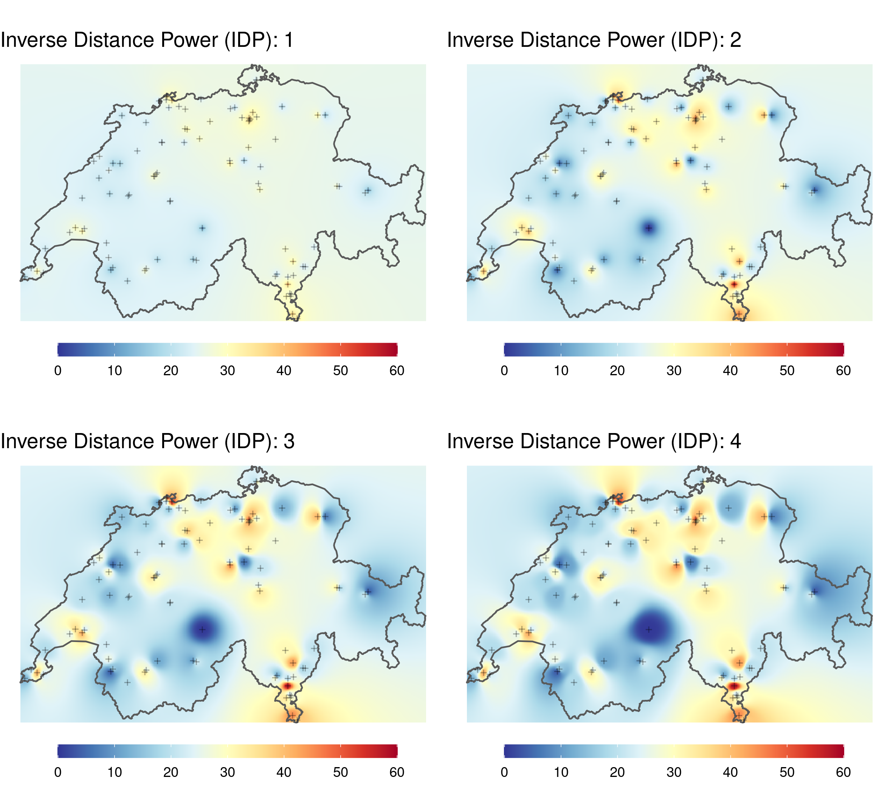

```{r, echo = FALSE}
knitr::opts_chunk$set(echo = FALSE)
```

In dieser Übung geht es darum, zwei verschiedene Interpolationsverfahren in R umzusetzen. Im ersten Interpolationsverfahren verwenden wir die *inverse distance weighted interpolation*, später verwenden wir die *nearest neighbour* methode. Dazu braucht ihr die folgenden Packages:


```{r, echo = TRUE}
library(sf)
library(dplyr)
library(ggplot2)
library(gstat)
```

Weiter benötigt ihr die nachstehenden Datensätze:


```{r, echo = FALSE, results='asis'}
check_download <- function(files, folder, source = "", url = "https://github.com/ResearchMethods-ZHAW/datasets/raw/main/"){
  full_url <- paste0(url,folder,"/",files)
  exists_bool <- !file.exists(files)
  if(sum(exists_bool)>0){
    download.file(full_url[exists_bool],files[exists_bool])
    }
  cat(paste0("- [",files,"](",full_url,") ",source),sep = "\n")
}

check_download(c("schweiz.gpkg", "luftqualitaet.gpkg"),"rauman")


luftqualitaet <- read_sf("luftqualitaet.gpkg")

schweiz <- read_sf("schweiz.gpkg") 


```


### Aufgabe 1: Raeumliche Interpolation mit IDW


Die Library `gstat` bietet verschiedene Möglichkeiten, Datenpunkte zu interpolieren, unter anderem auch den **IDW**. Leider ist das Package *noch* nicht so benutzerfreundlich wie `sf`: Das Package wird aber aktuell überarbeitet und in mittlerer Zukunft sollte es ebenso einfach  zugänglich sein. Damit Ihr Euch nicht mit den Eigenheiten dieser Library umschlagen müsst, haben wir eine Function vorbereitet, die Euch die Verwendung der IDW-Interpolation erleichtern soll.

Wir nehmen Euch damit etwas Komplexität weg und liefern Euch ein pfannenfertiges Werkzeug. Das hat auch Nachteile und wir ermutigen alle, die dafür Kapazität haben, unsere Function eingehend zu studieren und allenfalls ganz auf die Function zu verzichten und stattdessen direkt `gstat` zu verwenden. Egal für welche Variante Ihr Euch entscheidet, installiert vorgängig die Library `gstat`. Liest anschliessend die Funktion `my_idw` ein damit ihr sie nutzen könnt.


```{r, echo = TRUE}
my_idw <- function(groundtruth,column,cellsize, nmax = Inf, maxdist = Inf, idp = 2, extent = NULL){
  library(gstat)
  library(sf)
  
  if(is.null(extent)){
    extent <- groundtruth
  }
  
  samples <- st_make_grid(extent,cellsize,what = "centers")
  my_formula <- formula(paste(column,"~1"))
  idw_sf <- gstat::idw(formula = my_formula,groundtruth, newdata = samples, nmin = 1, maxdist = maxdist, idp = idp)
  
  idw_matrix <- cbind(as.data.frame(st_coordinates(idw_sf)),pred = st_drop_geometry(idw_sf)[,1])
  idw_matrix
}
```


Nun könnt Ihr mit `my_idw()` den Datensatz `luftqualitaet` folgendermassen interpolieren. 

```{r, echo = TRUE, eval = FALSE}
my_idw(groundtruth = luftqualitaet,column = "value",cellsize = 10000, extent = schweiz)
```

Folgende Parameter stehen Euch zur Verfügung:

- Notwendige Parameter:
  - `groundtruth`: Punktdatensatz mit den Messwerten (`sf`-Objekt)
  - `column`: Name der Spalte mit den Messwerten (in Anführungs- und Schlusszeichen)
  - `cellsize`: Zellgrösse des output Rasters

- Optionale Parameter
  - `nmax`: Maximale Anzahl Punkte, die für die Interpolation berücksichtigt werden sollen. Default: `Inf` (alle Werte im gegebenen Suchradius)
  - `maxdist`: Suchradius, welcher für die Interpolation verwendet werden soll. Default `Inf` (alle Werte bis `nmax`)
  - `idp`: **I**nverse **D**istance **P**ower: die Potenz, mit der der Nenner gesteigert werden soll. Default: `2`. Werte werden im Kehrwert des Quadrates gewichtet: $\frac{1}{dist^{idp}}$.
  - `extent`: Gebiet, für welches die Interpolation durchgeführt werden soll. Default `NULL` (die Ausdehnung von `groundtruth`). Wenn `extent` ein Polygon ist, wird die Interpolation für dieses Gebiet "geclipped"

Rechnet so den IDW für die Luftqualitätsmessungen mit verschiedenen Parametern und visualisiert jeweils die Resultate. Der Output aus `my_idw` ist eine `data.frame` mit X und Y Koordinaten sowie eine Spalte `pred`. Nutzt diese drei Spalten mit `geom_raster()` um eure Daten mit `ggplot` zu visualisieren (`aes(x = X, y = Y, fill = pred)`. 


```{r, layout = "l-page", message=FALSE, warning=FALSE}
library(purrr)
library(tidyr)

p <- lapply(1:4, function(idp){
  idw <- my_idw(groundtruth = luftqualitaet,column = "value",cellsize = 1000,nmax = Inf,maxdist = Inf,idp = idp)
  ggplot(idw, aes(X,Y, fill = pred)) +
      geom_raster() +
      scale_fill_gradientn(colours = RColorBrewer::brewer.pal(11,"RdYlBu"),limits = c(0, 60), na.value = NA) +
      labs(fill = "μg/m3",
           title = paste("Inverse Distance Power (IDP):",idp)) +
      theme_void() +
      coord_equal() +
      theme(legend.position = "bottom", legend.title = element_blank(),
        legend.key.width = unit(0.10, 'npc'),
        legend.key.height = unit(0.02, 'npc'))
}) %>%
  cowplot::plot_grid(plotlist = .)

ggsave("idw.png", p, height = 18, width = 20, units = "cm")



```


### Aufgabe 2: Interpolation mit Nearest Neighbour


Eine weitere einfache Möglichkeit zur Interpolation bietet die Erstellung eines Voronoi-Diagrammes, auch als Thiessen-Polygone oder Dirichlet-Zerlegung bekannt. `sf` liefert dazu die Funktion `st_voronoi()`, die einen Punktdatensatz annimmt und eben um die Punkte die Thiessenpolygone konstruiert. Dazu braucht es lediglich einen kleinen Vorverarbeitungsschritt: `sf` möchte für jedes Feature, also für jede *Zeile* in unserem Datensatz, ein Voronoidiagramm. Das macht bei uns wenig Sinn, weil jede Zeile nur aus einem Punkt besteht. Deshalb müssen wir vorher `luftqualitaet` mit `st_union()` von einem `POINT` in ein `MULTIPOINT` Objekt konvertieren, in welchem alle Punkte in einer Zeile zusammengefasst sind.

```{r, echo = TRUE}

luftqualitaet_union <- st_union(luftqualitaet)

thiessenpolygone <- st_voronoi(luftqualitaet_union)

ggplot() + 
  geom_sf(data = schweiz) +
  geom_sf(data = thiessenpolygone, fill = NA)

```

`st_voronoi` hat die Thiessenpolygone etwas weiter gezogen als wir sie wollen. Dies ist allerdings eine schöne Illustration der Randeffekte von Thiessenpolygonen, die zum Rand hin (wo es immer weniger Punkte hat) sehr gross werden können. Wir können die Polygone auf die Ausdehnung der Schweiz mit `st_intersection()` clippen. Auch hier braucht es zwei kleine Vorverarbeitungsschritte:

1. wie vorher müssen wir die einzelnen Kantons-Polygone miteinander verschmelzen. Dies erreichen wir mit `st_union()`. Wir speichern den Output als `schweiz`, was als Resultat ein einzelnes Polygon der Schweizergrenze retourniert.
2. für die Thiessen-Polygone machen wir genau das Umgekehrte: `st_voronoi()` liefert ein einzelnes Feature mit allen Polygonen, welches sich nicht gerne clippen lässt. Mit `st_cast()` wird die `GEOMETRYCOLLECTION` in Einzelpolygone aufgeteilt. 

```{r, echo = TRUE}
thiessenpolygone <- st_cast(thiessenpolygone)

thiessenpolygone_clip <- st_intersection(thiessenpolygone,schweiz)

ggplot() + 
  geom_sf(data = schweiz) +
  geom_sf(data = thiessenpolygone_clip, fill = NA)

```

Jetzt müssen wir nur noch den jeweiligen Wert für jedes Polygon ermitteln. Dies erreichen wir wieder durch `st_join`. Auch hier ist noch ein *kleiner* Vorverarbeitungsschritt nötig: Wir konvertieren das `sfc` Objekt (nur Geometrien) in ein `sf` Objekt (Geometrien mit Attributtabelle).

```{r, echo = TRUE}

thiessenpolygone_clip <- st_as_sf(thiessenpolygone_clip)
thiessenpolygone_clip <- st_join(thiessenpolygone_clip,luftqualitaet)

ggplot() + 
  geom_sf(data = schweiz) +
  geom_sf(data = thiessenpolygone_clip, aes(fill = value)) +
  geom_sf(data = luftqualitaet) +
  scale_fill_viridis_c() +
  theme_void()
```
