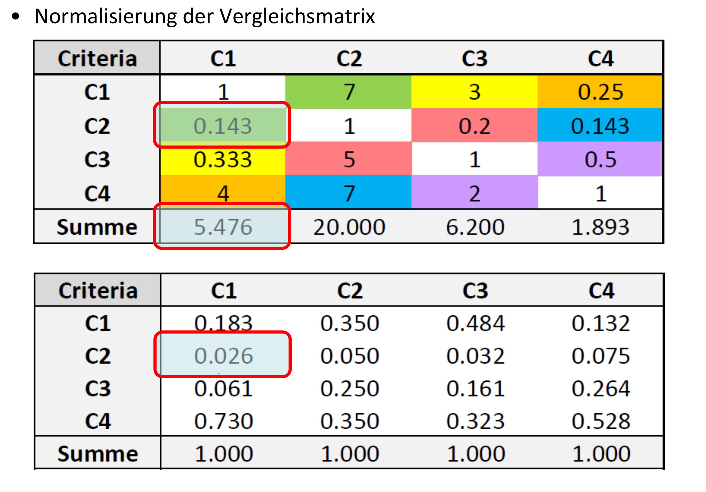
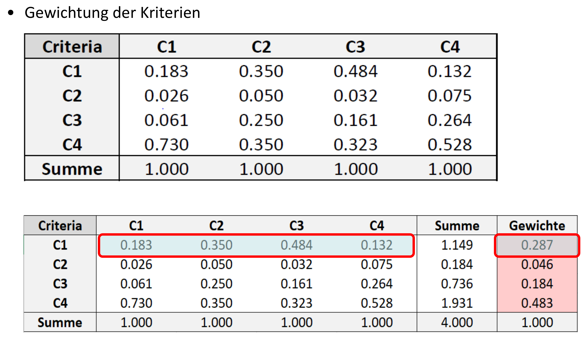

Now that you have learned the theory, a concrete example of an Analytical Hierarchy Process (AHP) is to be carried out. This is a manual approach to show you the basics of an AHP. If you want to build a more complex AHP you can use specific R AHP packages as shown in the digression section at the end of this script.


## Exercise 1: Define initial situation 

First think of an actual decision you are currently facing like buying a bike or a car and define the following points.

* A goal for your AHP (e.g. Buy a bike)
* At least 4 criteria (e.g. price, components, weight, looks)
* At least 3 alternatives (e.g. Scott Genius, Giant XTC, Santa Cruz Megatower C)


```{r, echo = FALSE}
# In our example, we want to rent a new appartement. The 4 criteria we will use to are:

# criteria 1: Price
# criteria 2: Distance to work
# criteria 3: Size
# criteria 4: Scenic Beauty
```


## Exercise 2: Pairwise comparison (Paarweiser Vergleich 1 & 2)

In a first step each criterion needs to be compared with another criteria in pairs. Use the following scale for weighting the criteria (see table \@ref(tab:ahprating)) . 

```{r ahprating, echo = FALSE}
library(dplyr)


tibble::tribble(
  ~Rating,	~Definition,
  1, "The two characteristics are equally important",
  3, "Characteristic A is slightly more important than characteristic B",
  5, "Characteristic A is moderately more important than characteristic B",
  7, "Characteristic A is strongly more important than characteristic B",
  9, "Characteristic A is absolutely more important than characteristic B",
  c(2,4,6,8), "Intermediate Values"
) %>%
  knitr::kable(caption = "Scale for weighting the criteria.")
```

You can use the following code to create your weighting matrix. In the matrix, two criteria are always compared twice, and these two comparisons should be the reciprocal ("Kehrwert") of each other. To illustrate this, we have added the comparison for *Criteria 1* compared to *Criteria 2*. 

Create this matrix comparison matching your criteria, replacing the `0` values with your weights according to table \@ref(tab:ahprating).

```{r ahp_matrix2}
pairwise_comparison <- c(
  1,   3, 0, 0,
  1/3, 1, 0, 0,
  0,   0, 1, 0,
  0,   0, 0, 1
) %>% matrix(ncol = 4, byrow = TRUE) 

```


```{r}
# Todo: replace these criteria
# criteria 1: Price
# criteria 2: Distance to work
# criteria 3: Size
# criteria 4: Scenic Beauty
pairwise_comparison <- c(
  1, 7, 3, 1/4,
  1/7, 1, 1/5, 1/7,
  1/3, 5, 1, 1/2,
  4, 7, 2, 1
) %>%
  matrix(ncol = 4, byrow = TRUE)

```


**Tip**: Add column and row names so your matrix is more readable. 

```{r, echo = TRUE}
criterias <- c("Criteria_1", "Criteria_2","Criteria_3", "Criteria_4")

rownames(pairwise_comparison) <- criterias
colnames(pairwise_comparison) <- criterias
```


## Exercise 3: Calculation of the criteria weights 

### Exercise 3.1: Normalization of matrix (Berechnung der Kritiriengewichte 1)



In the next step the matrix needs to be normalized. For that you need to: 

1. Calculate the sum of each column using `colSums`. Store the output in a variable (e.g. `ahp_colsums`).
2. Divide each value in the matrix by the corresponding column sum. To achieve this, you can use the `sweep()` function on the matrix, which is very similar to `apply` (`MARGIN = 2` (columns), `STATS = ahp_colsums` and `FUN = "/"`).


```{r, echo = FALSE}

ahp_colsums <- colSums(pairwise_comparison)

pairwise_comparison_normalized <- sweep(pairwise_comparison, 2,ahp_colsums, FUN = "/")

```


### Exercise 3.2: Weighting of criteria (Berechnung der Kritiriengewichte 2)




This is the final step to calculate the weight of each criteria. To do so: 
1. calculate the sum of each row and store the output in a variable (e.g. `criteria_sum`). 
2. divide the `criteria_sum` by the sum of `criteria_sum` and store the output in a variable (e.g. `criteria_weight`).

Note: The sum of `criteria_weight` should equal to 1

```{r include=FALSE}
criteria_sums <- rowSums(pairwise_comparison_normalized)

criteria_weight <- criteria_sums/sum(criteria_sums)

sum(criteria_weight)
```


## Exercise 4: Consistency analysis (Konsistenzanalyse 1 & 2)

After the pairwise comparison is done, a consistency analysis needs to be performed. For this you want to calculate the consistency ratio (CR). This checks whether the pairwise comparisons are consistent or not. A certain inconsistency is allowed within the framework of an AHP, but it should not be too great (if CR < 0.10, then the pairwise comparison shows acceptable consistency). 

To calculate consistency, you should proceed as explained in Slide 30 (Konsistenzanalyse 1)

1. do a matrix multiplication (`%*%`) between `pairwise_comparison` and `criteria_weight`. 
2. Divide the result of 1) by `criteria_weight`

```{r}

a_values = pairwise_comparison %*% criteria_weight / criteria_weight

lambda_max = sum(a_values)/length(a_values)
```

3. calculate $CI = \frac{\lambda_{max} - n}{n-1}$, where as `n` equals to the number of criteria

```{r}
CI <- (lambda_max - ncol(pairwise_comparison)) / (ncol(pairwise_comparison)-1)
```

4. Determine $RI$ by consulting the table \@ref(fig:randomindexbysaaty)

```{r}
RI <- 0.89
```


5. Calculate $CR = CI / RI$

```{r}
CR <- CI/RI
```

6. If CR > 0.1, you will need to reevaluate your pairwise comparisons. 

```{r}
CR < 0.1
```

```{r randomindexbysaaty, echo=FALSE, fig.cap="Random index by Saaty", fig.align="center", out.width="50%"}
knitr::include_graphics("images/ahp_random_index_by_saaty.png")
```

## Exercise 5: Prioritization of the alternatives (Priorisierung der Alternativen 1)


### Step 1: Pairwise comparison of the alternatives:

Now, we create a pairwise comparison of all alternatives *for each characteristic* according to the following table. Note that you can disregard the weights for now.

```{r}

tibble::tribble(
  ~Rating,	~Definition,
  1, "Two alternatives are equal",
  3, "Alternative A is slightly more prefferable than alternative B",
  5, "Alternative A is moderately more prefferable than alternative B",
  7, "Alternative A is strongly more prefferable than alternative B",
  9, "Alternative A are absolutely more important than alternative B",
  c(2,4,6,8), "Intermediate Values"
) %>%
  knitr::kable(caption = "Scale for weighting the criteria.")
```


```{r}
# criteria 1: Price
# criteria 2: Distance to work
# criteria 3: Size
# criteria 4: Scenic Beauty


price <- c(
  1,   9,   5,  # Apparement A
  1/9, 1,   5,  # Apparement B
  1/5, 1/5, 1   # Apparement C
) %>%
  matrix(ncol = 3, byrow = TRUE)

distance_to_work <- c(
  1,   8, 2,   # Appartement A
  1/8, 1, 1/3, # Appartement B
  1/2, 3, 1    # Appartement C
) %>% matrix(ncol = 3, byrow = TRUE)


```


## Digression: AHP packages in R
If you want to build even more complex AHP setups you can have a look at the following AHP packages:

* [ahp package](https://www.r-bloggers.com/2016/01/analytic-hierarchy-process-ahp-with-the-ahp-package/)
* [ahpsurvey package](https://cran.r-project.org/web/packages/ahpsurvey/vignettes/my-vignette.html)


