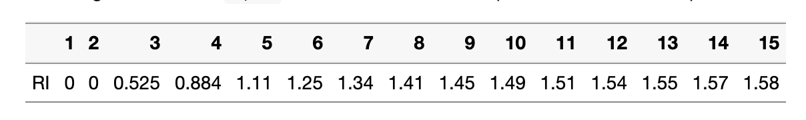

Now that you have learned the theory, a concrete example of an Analytical Hierarchy Process (AHP) is to be carried out. This is a step-by-step guide corresponding to the PPP document `Multikriterielle Entscheidungsanalyse 1`. This is a manual approach to show you the basics of an AHP. If you want to build a more complex AHP you can use specific R AHP packages as shown in the digression section at the end of this script.

**Exercises**: 

- Exercise 1: Define initial situation
- Exercise 2: Pairwise comparison
- Exercise 3: Calculate criteria weights
  - Exercise 3.1: Normalization of matrix
  - Exercise 3.2: Weighting of criteria
- Exercise 4: Consistency analysis
- Exercise 5: Prioritization of the alternatives

**Functions necessary to carry out the exercises **:  
* matrix()
* sweep()
* colnames()
* rownames()
* colSums()
* rowSums()
* cbind()
* ncol()
* matrix multiplication


## Exercise 1: Define initial situation 
**PPP: Slide 24 - 25**

First think of an actual decision you are currently facing like buying a bike or a car and define the following points.

* A goal for your AHP (e.g. Buy a car)
* At least 4 criteria (e.g. price, hp)
* At least 3 alternatives (e.g. Renault Clio)


## Exercise 2: Pairwise comparison
**PPP: Slide 26 - 27**

In a first step each criterion needs to be compared with another criteria in pairs. Use the following scale for weighting the criteria (see Figure \ref{fig:ahp_rating}). 

***Tip**: Add column and row names so your matrix is more readable. You can use the following code to create your AHP as a matrix.*

```{r ahp_matrix, eval=FALSE}
ahp_matrix <- c(
  1, 0, 0, 0,
  0, 1, 0, 0,
  0, 0, 1, 0,
  0, 0, 0, 1
) %>% matrix(ncol = 4, byrow = TRUE) 
```

```{r ahp_rating, warning=FALSE, error=FALSE, message=FALSE, echo=FALSE, fig.cap="Scale for weighting the criteria.", fig.align="center", out.width="30%"}
library(dplyr)

```

## Exercise 3: Calculation of the criteria weights

### Exercise 3.1: Normalization of matrix
**PPP: Slide 28**

In the next step the matrix needs to be normalized. For that you first want to calculate the sum of each column (criteria) and then divide each value in a column with the column sum.  

***Tip**: To achieve this, you can have a look at the [`sweep`](https://www.rdocumentation.org/packages/base/versions/3.6.2/topics/sweep) function (see Figure \ref{fig:ahp_sweep_function}).*

```{r ahp_sweep_function, echo=FALSE, fig.cap="Sweep function; source: https://bioinfomagician.files.wordpress.com/2014/08/screen-shot-2014-08-12-at-10-19-59-am.png", fig.align="center", out.width="30%"}

```

### Exercise 3.2: Weighting of criteria
**PPP: Slide 29**  

In a next step you want to sum up the values of each criteria by using the `rowSums` function and add it to the matrix by using the `cbind` function. In a final step you  want to normalize the weights again. For this you can use the `sweep` function.

***Tip**: Running sweep again will not affect your other values as the column sum now is 1.*

\newpage

## Exercise 4: Consistency analysis
**PPP: Slide 30 - 31**

After the pairwise comparison is done, a consistency analysis needs to be performed. For this you want to calculate the consistency ratio (CR). This checks whether the pairwise comparisons are consistent or not. A certain inconsistency is allowed within the framework of an AHP, but it should not be too great (If CR < 0.10, then the pairwise comparison shows acceptable consistency). The RI is depending on the number of criteria (see Figure \ref{fig:random_index_by_saaty}).

* ***Tip**: In order to calculate* **a***, you first use the operator* `%*%`*, which is used for matrix multiplication. Then use the `sweep` function again.*
* ***Tip**: In order to calculate* **b** ($\lambda_{max}$)*, you can use the functions `colSums` and `ncol`.*

The consistency index CI is calculated with the following formula: $$CI = (\lambda_{max} - n) / (n - 1)$$
The consistency ratio CR is calculated with the following formula: $$CR = CI / RI$$

```{r random_index_by_saaty, echo=FALSE, fig.cap="Random index by Saaty", fig.align="center", out.width="50%"}

```

\newpage

## Exercise 5: Prioritization of the alternatives
**PPP: Slide 32 - 35**

The priorities for the alternatives can also be determined by means of pair comparisons. A pair comparison is made for each criterion. Those weights are then combined in a table and multiplied by the overall weights calculated in exercise 2. In the end we get a final table with the priorities of the alternatives. 

***Tip**: It follows the same principle as exercise 2 and exercise 3, ergo use the same functions and methods.*


## Digression: AHP packages in R
If you want to build even more complex AHP setups you can have a look at the following AHP packages:

* [ahp package](https://www.r-bloggers.com/2016/01/analytic-hierarchy-process-ahp-with-the-ahp-package/)
* [ahpsurvey package](https://cran.r-project.org/web/packages/ahpsurvey/vignettes/my-vignette.html)


