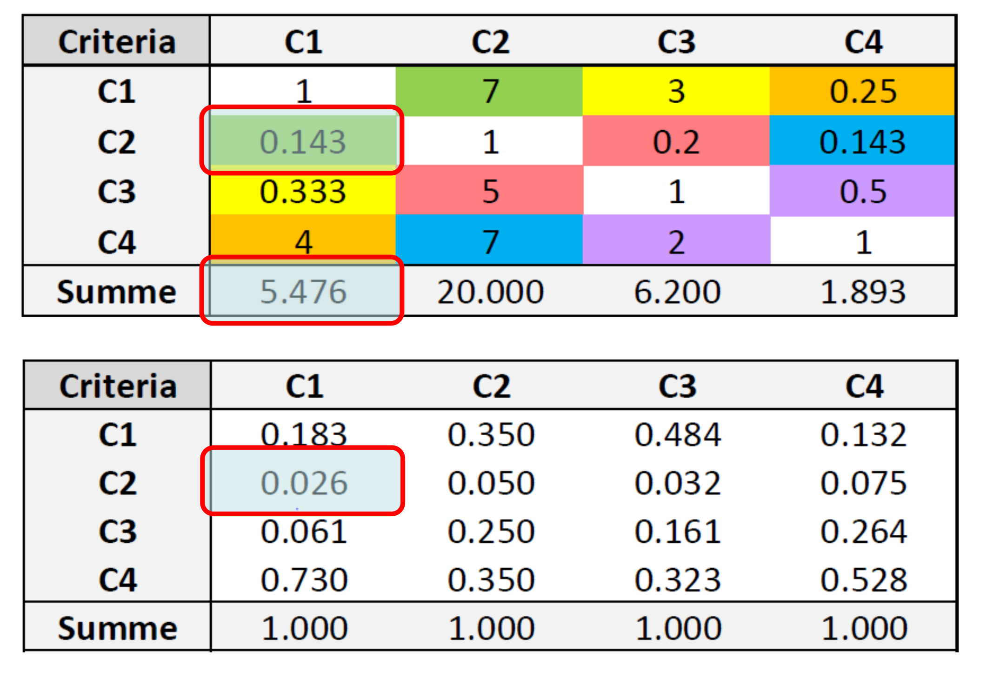

Now that you have learned the theory, a concrete example of an Analytical Hierarchy Process (AHP) is to be carried out. This is a manual approach to show you the basics of an AHP. If you want to build a more complex AHP you can use specific R AHP packages as shown in the digression section at the end of this script.


## Exercise 1: Define initial situation 

First think of an actual decision you are currently facing like buying a bike or a car and define the following points.

* A goal for your AHP (e.g. Buy a bike)
* At least 4 criteria (e.g. price, components, weight, looks)
* At least 3 alternatives (e.g. Scott Genius, Giant XTC, Santa Cruz Megatower C)


```{r, echo = FALSE}
# In our example, we want to rent a new appartement. The 4 criteria we will use to are:
# 
# 1. Price of the appartement
# 2. Distance to work
# 3. Size (in square meters)
# 4. Scenic beauty
```


## Exercise 2: Pairwise comparison (Paarweiser Vergleich 1 & 2)

In a first step each criterion needs to be compared with another criteria in pairs. Use the following scale for weighting the criteria (see table \@ref(tab:ahprating)) . 

```{r ahprating, echo = FALSE}
library(dplyr)


tibble::tribble(
  ~Rating,	~Definition,
  1, "Two characteristics are equally important",
  2, "Between 1 and 3",
  3, "The preferred characteristics are slightly more important",
  4, "Between 3 and 5",
  5, "The preferred characteristics are moderately more important",
  6, "Between 5 and 7",
  7, "The preferred characteristics are strongly more important",
  8, "Between 7 and 9",
  9, "The preferred characteristics are absolutely more important",
) %>%
  knitr::kable(caption = "Scale for weighting the criteria.")
```

You can use the following code to create your weighting matrix. In the matrix, two criteria are always compared twice, and these two comparisons should be the reciprocal ("Kehrwert") of each other. To illustrate this, we have added the comparison for *Criteria 1* compared to *Criteria 2*. 

Create this matrix comparison matching your criteria, replacing the `0` values with your weights according to table \@ref(tab:ahprating).

```{r ahp_matrix2}
ahp_matrix <- c(
  1,   3, 0, 0,
  1/3, 1, 0, 0,
  0,   0, 1, 0,
  0,   0, 0, 1
) %>% matrix(ncol = 4, byrow = TRUE) 

```


```{r}
# criteria 1: Price
# criteria 2: Distance to work
# criteria 3: Size
# criteria 4: Scenic Beauty
ahp_matrix <- c(
  1, 7, 3, 1/4,
  1/7, 1, 1/5, 1/7,
  1/3, 5, 1, 1/2,
  4, 7, 2, 1
) %>%
  matrix(ncol = 4, byrow = TRUE)

```


**Tip**: Add column and row names so your matrix is more readable. 

```{r}
criterias <- c("Criteria_1", "Criteria_2","Criteria_3", "Criteria_4")

rownames(ahp_matrix) <- criterias
colnames(ahp_matrix) <- criterias
```


## Exercise 3: Calculation of the criteria weights 

### Exercise 3.1: Normalization of matrix (Berechnung der Kritiriengewichte 1)



In the next step the matrix needs to be normalized. For that you need to: 

1. Calculate the sum of each column using `colSums`. Store the output in a variable (e.g. `ahp_colsums`).
2. Divide each value in the matrix by the corresponding column sum. To achieve this, you can use the `sweep()` function on the matrix, which is very simmilar to `apply` (`MARGIN = 2` (columns), `STATS = ahp_colsums` and `FUN = "/"`).


```{r, echo = FALSE}

ahp_colsums <- colSums(ahp_matrix)

ahp_matrix_normalized <- sweep(ahp_matrix, 2,ahp_colsums, FUN = "/")

```


### Exercise 3.2: Weighting of criteria (Berechnung der Kritiriengewichte 2)


This is the final step to calculate the weight of each criteria. To do so, 

1. calculate the sum of each row and store the output in a variable (e.g. `criteria_sum`). 
2. divide the `criteria_sum` by the sum of `criteria_sum` and store the output in a variable (e.g. `criteria_weight`).

Note: The sum of `criteria_weight` should equal to 1

```{r include=FALSE}
criteria_sums <- rowSums(ahp_matrix_normalized)

criteria_weight <- criteria_sums/sum(criteria_sums)

sum(criteria_weight)
```


## Exercise 4: Consistency analysis (Konsistenzanalyse 1 & 2)

After the pairwise comparison is done, a consistency analysis needs to be performed. For this you want to calculate the consistency ratio (CR). This checks whether the pairwise comparisons are consistent or not. A certain inconsistency is allowed within the framework of an AHP, but it should not be too great (if CR < 0.10, then the pairwise comparison shows acceptable consistency). 

To calculate consistency, you should proceed as follows:

1. first, calculate the eigenvalues

1. you must first calculate $\lambda$, which is is the weight of each criteria multiplied by the weight 
2. the max value of $\lambda$ is $\lambda_{max}$


```{r}


criteria_weight

apply(ahp_matrix, 1, function(x){sum(w*criteria_weight)})/criteria_weight


```


The RI depends on the number of criteria (Figure \@ref(fig:randomindexbysaaty)).

* Tip: In order to calculate* $a$, you first use the operator `%*%`, which is used for matrix multiplication. Then use the `sweep` function again.
* Tip: In order to calculate* **b** ($\lambda_{max}$)*, you can use the functions `colSums` and `ncol`.

The consistency index CI is calculated with the following formula: $$CI = (\lambda_{max} - n) / (n - 1)$$
The consistency ratio CR is calculated with the following formula: $$CR = CI / RI$$

```{r randomindexbysaaty, echo=FALSE, fig.cap="Random index by Saaty", fig.align="center", out.width="50%"}
knitr::include_graphics("images/ahp_random_index_by_saaty.png")
```

```{r}

```


## Exercise 5: Prioritization of the alternatives (Priorisierung der A)

The priorities for the alternatives can also be determined by means of pair comparisons. A pair comparison is made for each criterion. Those weights are then combined in a table and multiplied by the overall weights calculated in exercise 2. In the end we get a final table with the priorities of the alternatives. 

***Tip**: It follows the same principle as exercise 2 and exercise 3, ergo use the same functions and methods.*


## Digression: AHP packages in R
If you want to build even more complex AHP setups you can have a look at the following AHP packages:

* [ahp package](https://www.r-bloggers.com/2016/01/analytic-hierarchy-process-ahp-with-the-ahp-package/)
* [ahpsurvey package](https://cran.r-project.org/web/packages/ahpsurvey/vignettes/my-vignette.html)


