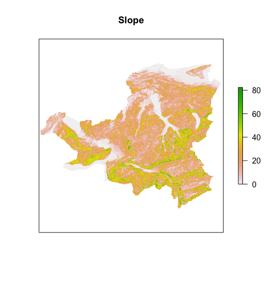

The following exercise may seem familiar to some of you, if you have attended the bachelor program. This MCE was already conducted in the bachelor module "GIS" by using ArcGIS Pro and its ModelBuilder (see figure \@ref(fig:figmce)).

```{r figmce, echo=FALSE, fig.cap="Process model in ArcGIS Pro ModelBuilder", fig.align="center", out.width = '100%'}
knitr::include_graphics("images/mce_process.png")
```

The goal of this exercise is to do the same MCE by just using R. We will mainly use functions from the R packages [sf](https://cran.r-project.org/web/packages/sf/sf.pdf) and [raster](https://cran.r-project.org/web/packages/raster/raster.pdf). Please have a look at the process model (see figure \@ref(fig:figmce)) that was created in ArcGIS Pro and try to figure out which functions in the two R packages correspond to the ones in the model. You will see that there are some similar functions available, but for some calculations a different approach is needed.


## Exercises 1: Load and view data

```{r, results='asis', echo = FALSE}
knitr::opts_chunk$set(echo = TRUE)

check_download <- function(files, folder, source = "", url = "https://github.com/ResearchMethods-ZHAW/datasets/raw/main/"){
  full_url <- paste0(url,folder,"/",files)
  exists_bool <- !file.exists(files)
  if(sum(exists_bool)>0){
    download.file(full_url[exists_bool],files[exists_bool])
    }
  cat(paste0("- [",files,"](",full_url,") ",source),sep = "\n")
}

check_download(c("dhm25m.tif","eis25m.tif","wind25m.tif"),"rauman")

check_download(c("Bewohnte_Flaeche.gpkg","Nationale_Schutzgebiete.gpkg",
                 "Waldgebiete.gpkg","Seeflaechen.gpkg","Strassen.gpkg","Untersuchungsgebiet_Schwyz.gpkg"),"rauman")
```

The data can be loaded by using the functions `terra` for raster data and `read_sf` for vector data. View the available data layers (see Table \ref{tab:datatable}) and plot them in an appealing way. For visualization you can use the functions `plot` for raster data and `ggplot` for vector data.

***Tip**: As some data sets are exceeding the boundaries of the study area, you can use the `crop` function on raster data sets and `st_intersection` for sf/vector data sets, so only relevant data is included.* 

```{r datatable, echo=FALSE, warning=FALSE, message=FALSE, error=FALSE}
library(knitr)
library(kableExtra)
library(dplyr)

name <- c("dhm25m.tif", "eis25m.tif", "wind25m.tif", "Bewohnte_Flaeche.gpkg", "Nationale_Schutzgebiete.gpkg", "Seeflaechen.gpkg", "Strassen.gpkg", "Untersuchungsgebiet_Schwyz.gpkg", "Waldgebiete.gpkg")
description <- c("Terrain model (m)", "Icing frequency (days/year)", "Average wind speed (dm/s) ", "Settlements (incl. buffer 200m)", "National protection areas", "Lake areas", "Streets", "Study area, canton of Schwyz", "Forest areas") 
type <- c("Raster", "Raster", "Raster", "Geopackage", "Geopackage", "Geopackage", "Geopackage", "Geopackage", "Geopackage")
res <- c("25m", "25m", "25m", "", "", "", "", "", "")
geometry <- c("", "", "", "Polygon", "Polygon", "Polygon", "Line", "Polygon", "Polygon")
crs <- c("CH1903/LV03", "CH1903/LV03", "CH1903/LV03", "CH1903/LV03", "CH1903/LV03", "CH1903/LV03", "CH1903/LV03", "CH1903/LV03", "CH1903/LV03")
exclusion_area <- c("No", "No", "No", "(Yes)/Distance", "(Yes)/Distance", "Yes", " No/Distance   ", "No", "(Yes)/Distance")
data_table <- data.frame(name, description, type, res, geometry, crs, exclusion_area)

knitr::kable(data_table, caption = "Data used in this study") %>% kable_styling(latex_options=c("scale_down", "HOLD_position"))
```

```{r solutionEx1, echo=FALSE, message=FALSE, warning=FALSE, eval=FALSE}
library(sf)
library(terra)
library(ggplot2)
library(dplyr)

## -- Exercise 1: Load and view input data -- ##
#Vector data
kt_schwyz <- read_sf("Untersuchungsgebiet_Schwyz.gpkg")
settlements <- read_sf("Bewohnte_Flaeche.gpkg")
forests <- read_sf("Waldgebiete.gpkg")
protected_areas <- read_sf("Nationale_Schutzgebiete.gpkg")
lakes <- read_sf("Seeflaechen.gpkg")
streets <- read_sf("Strassen.gpkg") %>% st_intersection(kt_schwyz) #intersect with study area

#Raster data
eis25m <- rast("eis25m.tif") %>% crop(kt_schwyz) #use terra::crop() to only get data inside of study area
dhm25m <- rast("dhm25m.tif") %>% crop(kt_schwyz) #use terra::crop() to only get data inside of study area
wind25m <- rast("wind25m.tif") %>% crop(kt_schwyz) #use terra::crop() to only get data inside of study area

#Plot vector data
plot_kt_schwyz <- ggplot() + geom_sf(data = kt_schwyz, fill = NA) + theme_void()
plot_settlements <- ggplot() + geom_sf(data = settlements, fill = NA) + theme_void()
plot_forests <- ggplot() + geom_sf(data = forests, fill = NA) + theme_void()
plot_lakes <- ggplot() + geom_sf(data = lakes) + theme_void()
plot_streets <- ggplot() + geom_sf(data = streets, fill = NA) + theme_void()

ggplot() +
  geom_sf(data = kt_schwyz) +
  geom_sf(data = forests, colour = "red") + geom_sf(data = lakes, colour = "green") +
  geom_sf(data = settlements, colour = "blue") + geom_sf(data = streets, colour = "black") +
  coord_sf(default_crs = sf::st_crs(21781))

#Plot raster data
plot(dhm25m, main="Digital Surface Model (DSM)", axes=FALSE)
plot(eis25m, main="Icing frequency", axes=FALSE)
plot(wind25m, main="Average wind speed", axes=FALSE)
```


## Exercise 2: Merge exclusion criteria

Merge the exclusion criteria settlement areas, national protected areas, lake areas and forest areas. These vector data sets are structured as data frames and therefore can be merged by simply combining them. Keep in mind that the data frames have different sizes. Additionally, we need to create a raster out of the newly created vector data set (exclusion area). For that you can use the function `rasterize`. The output should be a raster with 0 and 1, where the fields of the exclusion area have values of 0 and the remaining fields have values of 1 (see Figure \ref(fig:figrasterizeexclusioncriteria)).
  
* ***Tip**: To achieve a raster with only 0 and 1 use the `rasterize` options field = 0 and background = 1.*
* ***Tip**: In order to rasterize vector data, you need to create an empty raster beforehand. This raster should have the same boundaries (extent), resolution and coordinate system (crs) as the other raster sets. Use the following code to do so.*
  
```{r create_empty_raster, eval=FALSE}
r <- terra::rast(ext(kt_schwyz), 
          resolution = c(25, 25), 
          crs = "EPSG:21781")
```
  
```{r figrasterizeexclusioncriteria, echo=FALSE, fig.cap="Exclusion area in the canton of Schwyz", fig.align="center", out.width="50%"}

```

```{r solutionEx2, echo=FALSE, message=FALSE, warning=FALSE, eval=FALSE}
## -- Exercise 2: Merge exclusion criteria -- ##
#Merge exclusion area
exclusion_areas <- dplyr::bind_rows(settlements, forests, protected_areas, lakes)

#create raster
r <- terra::rast(ext(kt_schwyz), 
          resolution = c(25, 25), 
          crs = "EPSG:21781")

raster_exclusion_areas <- rasterize(vect(exclusion_areas), r,
                       field = 0, background = 1) %>% crop(kt_schwyz)
plot(raster_exclusion_areas, main="Exclusion area", axes=FALSE, legend=FALSE, col=terrain.colors(2))
```


## Exercise 3: Calculate slope

Next, calculate the slope in degrees based on the terrain model (dhm25m). The terra package gives you a very helpful function called `terrain`. 

***Tip**: When using the terrain function use the following options: v="slope", unit="degrees", neighbors=8.*

```{r figslope, echo=FALSE, fig.cap="Example output of the calculated slope", fig.align="center", out.width="50%"}

```

```{r solutionEx3, echo=FALSE, message=FALSE, warning=FALSE, eval=FALSE}
## -- Exercise 3: Calculate slope -- ##
slope <- terra::terrain(dhm25m, v="slope",unit="degrees", neighbors=8)
plot(slope, main="Slope", axes=FALSE)
```


## Exercise 4: Calculate distances to criteria

Within the evaluation of suitable sites for wind turbines, the distance to roads, forest areas, national protected areas and inhabited areas are relevant. Depending on the criteria, a short or long distance has a positive influence on the evaluation of potential sites. For this purpose, perform a distance analysis with the selected criteria raster layers. Use the raster function `distance` for this calculation. 

* ***Tip**: In order to perform the `distance` function, you need to `rasterize` the criteria as well. You can use the same command as in exercise 2 but use only option field = 1.*
* ***Tip**: Use the `crop` function again to get only relevant data in the study area.*

As this process will take quite some time (about 2h), you only need to create the distance for the settlement data set, as the logic for the others stays the same.
You can download the other 3 data by clicking on the respective links below:

```{r, results='asis', echo = FALSE}
knitr::opts_chunk$set(echo = TRUE)

check_download <- function(files, folder, source = "", url = "https://github.com/ResearchMethods-ZHAW/datasets/raw/main/"){
  full_url <- paste0(url,folder,"/",files)
  exists_bool <- !file.exists(files)
  if(sum(exists_bool)>0){
    download.file(full_url[exists_bool],files[exists_bool])
    }
  cat(paste0("- [",files,"](",full_url,") ",source),sep = "\n")
}

check_download(c("forests_ed.tif","settlements_ed.tif",
                 "streets_ed.tif"),"rauman")
```


```{r figdistancesettlements, echo=FALSE, fig.cap="Example output for the distances to settlements", fig.align="center", out.width="50%"}
knitr::include_graphics("images/mce_exercise_4_dist_settlements.png")
```

```{r solutionEx4, echo=FALSE, message=FALSE, warning=FALSE, eval=FALSE}
## -- Exercise 4: Calculate distances to criteria -- ##
# This process will take a few hours to run
#create raster layers from vector 
raster_settlements <- terra::rasterize(vect(settlements), r, field = 1)
raster_protected_areas <- terra::rasterize(vect(protected_areas), r, field = 1) 
raster_forests <- terra::rasterize(vect(forests), r, field = 1) 
raster_streets <- terra::rasterize(vect(streets), r, field = 1)

# https://drive.switch.ch/index.php/s/BakVy6vPzgXqs0l/download

#calculate euclidean distances
# settlements_ed <- distance(raster_settlements) %>% crop(kt_schwyz)
settlements_ed <- rast("../RaumAn5_Uebung_MCE/settlements_ed.tif")
protected_areas_ed <- rast("protected_areas_ed.tif")
forests_ed <- rast("forests_ed.tif")
streets_ed <- rast("streets_ed.tif")
# protected_areas_ed <- distance(raster_protected_areas) %>% crop(kt_schwyz)
# forests_ed <- distance(raster_forests) %>% crop(kt_schwyz)
# streets_ed <- distance(raster_streets) %>% crop(kt_schwyz)

```

## Exercise 5: Standardize and grade criteria (grading)

The data layers slope, wind speed, icing frequency and the in exercise 4 calculated distance layers have different units (dm/s, degrees, d/yr and m). These units can't be directly calculated with each other. Therefore, the different layers need to be operationalized by performing a linear grading. The linear grading is done by using the function `reclassify`. Use the  standards for the reclassification in Figure \ref(fig:figreclassify).

* ***Tip**: Keep in mind the min and max values of each raster layer.*
* ***Tip**: Here is an example code to reclassify the distances to settlements.*

```{r examplereclassifysettlements, eval=FALSE}
reclass_settlements <- c(0,80,0,
                        80,160,0.1,
                        160,240,0.2,
                        240,320,0.3,
                        320,400,0.4,
                        400,480,0.5,
                        480,560,0.6,
                        560,640,0.7,
                        640,720,0.8,
                        720,800,0.9,
                        800,minmax(settlements_ed),1.0) %>% matrix(ncol = 3, byrow = TRUE)
reclass_settlements_ed <- terra::classify(settlements_ed, reclass_settlements)
```

```{r figreclassify, echo=FALSE, fig.cap="Reclassify values for all criteria", fig.align = "center", fig.show = "hold", out.width="49%"}
knitr::include_graphics(c("images/mce_reclassify_1.png", "images/mce_reclassify_2.png"))
```

```{r figdistsettlementsreclass, echo=FALSE, fig.cap="Example output for the reclassified distances to settlements", fig.align="center", out.width="45%"}
knitr::include_graphics("images/mce_exercise_4_dist_settlements.png")
```

```{r solutionEx5, echo=FALSE, message=FALSE, warning=FALSE, eval=FALSE}
## -- Exercise 5: Standardize and grade criteria (grading) -- ##
#### reclassify wind    
reclass_wind_m <- c(0,35,0,
                      35,40,0.1,
                      40,45,0.2,
                      45,50,0.3,
                      50,55,0.4,
                      55,60,0.5,
                      60,65,0.6,
                      65,70,0.7,
                      70,75,0.8,
                      75,minmax(wind25m)[2]),0.9) %>% matrix(ncol = 3, byrow = TRUE)
reclass_wind <- classify(wind25m, reclass_wind_m)
plot(reclass_wind, main="Average wind speed (reclassified)", axes=FALSE)

#### reclassify ice    
reclass_ice_m <- c(0,6,1,
                     6,12,0.9,
                     12,18,0.8,
                     18,24,0.7,
                     24,30,0.6,
                     30,36,0.5,
                     36,minmax(eis25m)[2],0.4) %>% matrix(ncol = 3, byrow = TRUE)
reclass_ice <- classify(eis25m, reclass_ice_m)
plot(reclass_ice, main="Icing frequency (reclassified)", axes=FALSE)

#### reclassify slope
reclass_slope_m <- c(0,2,1,
                       2,4,0.9,
                       4,6,0.8,
                       6,8,0.7,
                       8,10,0.6,
                       10,12,0.5,
                       12,14,0.4,
                       14,16,0.3,
                       16,18,0.2,
                       18,20,0.1,
                       20,minmax(slope)[2],0) %>% matrix(ncol = 3, byrow = TRUE)
reclass_slope <- classify(slope, reclass_slope_m)
plot(reclass_slope, main="Slope (reclassified)", axes=FALSE)

#### reclassify settlements 
reclass_settlements <- c(0,80,0,
                             80,160,0.1,
                             160,240,0.2,
                             240,320,0.3,
                             320,400,0.4,
                             400,480,0.5,
                             480,560,0.6,
                             560,640,0.7,
                             640,720,0.8,
                             720,800,0.9,
                             800,minmax(settlements_ed)[2],1.0) %>% matrix(ncol = 3, byrow = TRUE)
reclass_settlements_ed <- classify(settlements_ed, reclass_settlements)
plot(reclass_settlements_ed, main="Distance to settlements (reclassified)", axes=FALSE)

#### reclassify protected areas
reclass_protected_areas <- c(0,50,0,
                                 50,100,0.1,
                                 100,150,0.2,
                                 150,200,0.3,
                                 200,250,0.4,
                                 250,300,0.5,
                                 300,350,0.6,
                                 350,400,0.7,
                                 400,450,0.8,
                                 450,500,0.9,
                                 500,minmax(protected_areas_ed)[2],1.0) %>% matrix(ncol = 3, byrow = TRUE)
reclass_protected_areas_ed <- classify(protected_areas_ed, reclass_protected_areas)
plot(reclass_protected_areas_ed, main="Distance to protected areas (reclassified)", axes=FALSE)

#### reclassify forest area 
reclass_forests <- c(0,10,0,
                         10,20,0.1,
                         20,30,0.2,
                         30,40,0.3,
                         40,50,0.4,
                         50,60,0.5,
                         60,70,0.6,
                         70,80,0.7,
                         80,90,0.8,
                         90,100,0.9,
                         100,minmax(forests_ed)[2],1.0) %>% matrix(ncol = 3, byrow = TRUE)
reclass_forests_ed <- classify(forests_ed, reclass_forests)
plot(reclass_forests_ed, main="Distance to forest areas (reclassified)", axes=FALSE)

#### reclassify streets   
reclass_streets <- c(0,250,1.0,
                     250,500,0.9,
                     500,750,0.8,
                     750,1000,0.7,
                     1000,1250,0.6,
                     1250,1500,0.5,
                     1500,1750,0.4,
                     1750,2000,0.3,
                     2000,2250,0.2,
                     2250,2500,0.1,
                     2500,minmax(streets_ed)[2],0) %>% matrix(ncol = 3, byrow = TRUE)
reclass_streets_ed <- classify(streets_ed, reclass_streets)
plot(reclass_streets_ed, main="Distance to streets (reclassified)", axes=FALSE)
```


## Exercise 6: Weighting criteria with AHP

Perform an AHP to weight the criteria underlying the MCE. First compare the criteria in pairs, and then calculate the weights - as you have learned in last week's lesson. In the end you should have a list of 7 weights as shown below.

***Tip**: Check exercise 2 and 3 from last week's session. Use the prepared R code to create your ahp matrix.*

          Wind       Streets          Ice    Settlements       Forest         Slope  Protected areas 
    0.33862692    0.09816760    0.06166626    0.24969460    0.03515759    0.18043000      0.03625702 
  
```{r ahp_mce, eval=FALSE}
ahp_matrix <- c(
  1, 0, 0, 0, 0, 0, 0, #Wind
  0, 1, 0, 0, 0, 0, 0, #Distance to streets
  0, 0, 1, 0, 0, 0, 0, #Ice
  0, 0, 0, 1, 0, 0, 0, #Distance to settlements
  0, 0, 0, 0, 1, 0, 0, #Distance to forests
  0, 0, 0, 0, 0, 1, 0, #Slope
  0, 0, 0, 0, 0, 0, 1  #Distance to protected areas
) %>% matrix(ncol = 7, byrow = TRUE)
```

```{r solutionEx6, echo=FALSE, message=FALSE, warning=FALSE, eval=FALSE}
## -- Exercise 6: Weighting Criteria with AHP -- ##
#create AHP
ahp_matrix <- c(
  1,   6,   7,   3,   7, 4,   5, #Wind
  1/6, 1,   2,   1/5, 3, 1/5, 3, #Distance to streets
  1/7, 1/2, 1,   1/6, 2, 1/5, 2, #Ice
  1/3, 5,   6,   1,   5, 3,   4, #Distance to settlements
  1/7, 1/3, 1/2, 1/5, 1, 1/4, 1, #Distance to forests
  1/4, 5,   3,   1/3, 4, 1,   4, #Slope
  1/5, 1/3, 1/2, 1/4, 1, 1/4, 1  #Distance to protected areas
) %>% matrix(ncol = 7, byrow = TRUE)
colnames(ahp_matrix) <- c("Wind", "Streets", "Ice", "Settlements", "Forest", "Slope", "Protected areas")
rownames(ahp_matrix) <- c("Wind", "Streets", "Ice", "Settlements", "Forest", "Slope", "Protected areas")

#Normalization of matrix & weighting of criteria
ahp_matrix <- ahp_matrix %>% cbind(rowSums(ahp_matrix)) #add row sum
ahp_matrix <- sweep(ahp_matrix, 2, colSums(ahp_matrix), FUN="/") #normalize data
ahp_matrix

weights <- ahp_matrix[, 8] #only get list of weights
weights
```

## Exercise 7: Weighted Overlay

The linearly ranked criteria (Exercise 5) are now to be combined with each other, taking into account the weighting determined using the AHP (Exercise 6). This weighted overlay can be performed by using raster calculations and simply multiplying each criteria with its weight and adding them together (see figure \@ref(fig:figweightedoverlay)).

* ***Tip**: As the raster sets have slightly different origins, increase the tolerance by using rasterOptions(tolerance = 0.5).*
* ***Tip**: Also keep in mind the order of the weights in your list when doing the multiplication.*

```{r figweightedoverlay, echo=FALSE, fig.cap="Weighted overall of all criteria", fig.align="center", out.width="50%"}

```

```{r solutionEx7, echo=FALSE, message=FALSE, warning=FALSE, eval=FALSE}
## -- Exercise 7: Weighted Overlay -- ##
rasterOptions(tolerance = 0.5) #raster sets have different origins, increase tolerance

weighted_overlay <- (reclass_wind * weights[1]) +
  (reclass_streets_ed * weights[2]) +
  (reclass_ice * weights[3]) +
  (reclass_settlements_ed * weights[4]) +
  (reclass_forests_ed * weights[5]) +
  (reclass_slope * weights[6]) +
  (reclass_protected_areas_ed * weights[7])

plot(weighted_overlay, main="Weighted overlay with all criteria", axes=FALSE, legend=FALSE)

```


## Exercise 8: Intersecting potential areas with exclusion criteria

By simply multiplying the exclusion layer (result from exercise 2) with the weighted overlay layer (result from exercise 7) we are excluding all areas with value 0 (exclusion areas) and keeping all other areas with value 1 (e.g. 0x3=0, 1x3=3). As a conclusion of the study, create a final plot of the potential areas for wind power plants in the canton of Schwyz (like figure \@ref(fig:figfinalresults)). Furthermore, discuss the results obtained and determine three possible locations within which concrete planning of wind power plants would be possible.

```{r figfinalresults, echo=FALSE, fig.cap="Potential sites for wind power plants in Kt. Schwyz (red = less suitable, green = more suitable)", fig.align="center", out.width="80%"}

```

```{r  solutionEx8, echo=FALSE, message=FALSE, warning=FALSE, eval=FALSE}
## -- Exercise 8: Intersecting potential areas with exclusion criteria -- ##
final_model <- weighted_overlay * raster_exclusion_areas 

plot(final_model, main="Potential sites for wind power plants in Kt. Schwyz", axes=FALSE, legend=FALSE)
```

