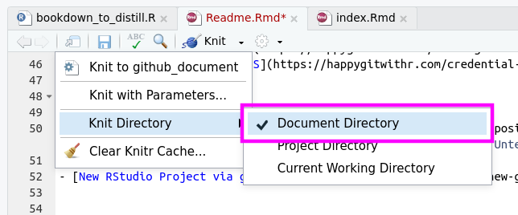

Anleitung für Admins
================

<!--radix_placeholder_navigation_in_header-->
<meta name="distill:offset" content=""/>

<link href="site_libs/font-awesome-5.1.0/css/all.css" rel="stylesheet"/>
<link href="site_libs/font-awesome-5.1.0/css/v4-shims.css" rel="stylesheet"/>

<!--/radix_placeholder_navigation_in_header-->

<!--radix_placeholder_site_in_header-->

<!--/radix_placeholder_site_in_header-->

<!--radix_placeholder_navigation_before_body-->
<header class="header header--fixed" role="banner">
<nav class="distill-site-nav distill-site-header">

<a href="index.html" class="title">Modul Research Methods</a>
<input id="distill-search" class="nav-search hidden" type="text" placeholder="Search..."/>

<a href="index.html">Home</a>

<button class="nav-dropbtn">
Preprocessing
 
&#x25BE;
</button>

<a href="PrePro_abstract.html">Abstract</a>

<a href="PrePro.html#category:PrePro1">PrePro1</a>
<a href="PrePro.html#category:PrePro2">PrePro2</a>

<button class="nav-dropbtn">
InforVis
 
&#x25BE;
</button>

<a href="InfoVis_abstract.html">Abstract</a>

<a href="InfoVis.html#category:InfoVis1">InfoVis1</a>
<a href="InfoVis.html#category:InfoVis2">InfoVis2</a>

<button class="nav-dropbtn">
Statistik
 
&#x25BE;
</button>

<a href="Statistik_abstract.html">Abstract</a>

Statistik 1 - 4
<a href="Statistik.html#category:Statistik1">Statistik1</a>
<a href="Statistik.html#category:Statistik2">Statistik2</a>
<a href="Statistik.html#category:Statistik3">Statistik3</a>
<a href="Statistik.html#category:Statistik4">Statistik4</a>

Statistik 5 - 8
<a href="Statistik.html#category:Statistik5">Statistik5</a>
<a href="Statistik.html#category:Statistik6">Statistik6</a>
<a href="Statistik.html#category:Statistik7">Statistik7</a>
<a href="Statistik.html#category:Statistik8">Statistik8</a>

<button class="nav-dropbtn">
Statistik Konsolidierung
 
&#x25BE;
</button>

<a href="Statistik-Konsolidierung_abstract.html">Abstract</a>

Statistik Konsolidierung 1 - 4
<a href="Statistik-Konsolidierung.html#category:Statistik_Konsolidierung1">Statistik_Konsolidierung1</a>
<a href="Statistik-Konsolidierung.html#category:Statistik_Konsolidierung2">Statistik_Konsolidierung2</a>
<a href="Statistik-Konsolidierung.html#category:Statistik_Konsolidierung3">Statistik_Konsolidierung3</a>
<a href="Statistik-Konsolidierung.html#category:Statistik_Konsolidierung4">Statistik_Konsolidierung4</a>

<button class="nav-dropbtn">
Räumliche Analyse
 
&#x25BE;
</button>

<a href="RaumAn_abstract.html">Abstract</a>

<a href="RaumAn.html#category:RaumAn1">RaumAn1</a>
<a href="RaumAn.html#category:RaumAn2">RaumAn2</a>
<a href="RaumAn.html#category:RaumAn3">RaumAn3</a>

<a href="javascript:void(0);" class="nav-toggle">&#9776;</a>

</nav>
</header>
<!--/radix_placeholder_navigation_before_body-->

<!--radix_placeholder_site_before_body-->
<!--/radix_placeholder_site_before_body-->

-   [Allgemeines](#allgemeines)
    -   [Distill](#distill)
    -   [Renv](#renv)
-   [Schritt für Schritt Anleitung](#schritt-für-schritt-anleitung)
    -   [R, RStudio und Git
        installieren](#r-rstudio-und-git-installieren)
    -   [Git konfigurieren](#git-konfigurieren)
    -   [Repo Klonen](#repo-klonen)
    -   [Notwendige Packages
        installieren](#notwendige-packages-installieren)
    -   [Inhalte editieren](#inhalte-editieren)
-   [Dependencies](#dependencies)

## Allgemeines

### Distill

Im Kurs Research Methods verwenden wir seit einigen Jahren RMarkdown um
die R Unterlagen für die Studenten bereit zu stellen. Bis und mit HS2020
haben wir dafür [`bookdown`](https://bookdown.org/yihui/blogdown/)
verwendet, im HS2021 wollen wir zu
[`distill`](https://rstudio.github.io/distill/) wechseln. Grund für
diesen Wechsel ist folgender: Mit Bookdown müssen bei Änderungen jeweils
*alle* .Rmd-Files neu kompiliert werden, was unter umständen sehr lange
dauern kann. Mit `distill` ist jedes .Rmd File wie ein eigenes kleines
Projekt und kann eigenständig kompiliert werden.

### Renv

Im Unterricht werden sehr viele RPackages verwendet. Um sicher zu
stellen, das wir alle mit der gleichen Version dieser Packages arbeiten
verwenden wir das RPackage [`renv`](https://rstudio.github.io/renv/).
Das arbeiten mit `renv` bringt folgende Änderungen mit sich:

-   Packages werden alle im Projektfolder installiert (`renv/library`)
    statt wie üblich in `C:/Users/xyz/Documents/R/win-library/3.6` bzw.
    `C:/Program Files/R/R-3.6.1/library`
    -   Dies wird durch `.Rprofile` sichergestellt (`.Rprofile` wird
        automatisch beim Laden des Projektes ausgeführt)
    -   Der Folder `renv/library` wird *nicht* via github geteilt (dies
        wird mit `renv/.gitignore` sichergestellt)
-   Die Liste der Packages wird in `renv.lock` festgehalten (mit dem
    Befehl `renv::snapshot()`, mehr dazu später)
-   Die Packages werden mit `renv::restore()` lokal installiert

## Schritt für Schritt Anleitung

### R, RStudio und Git installieren

*(wer dies bereits gemacht hat, kann diesen Schritt überspringen)*

Wer Lokal auf seinem eingenen PC arbeiten will, muss eine aktuell
version von R, RStudio und Git installieren. Siehe dazu folgende
Anleitungen:

-   [Install or upgrade R and
    RStudio](https://happygitwithr.com/install-r-rstudio.html)
-   [Install Git](https://happygitwithr.com/install-git.html)

### Git konfigurieren

*(wer dies bereits gemacht hat, kann diesen Schritt überspringen)*

Nach der Installation muss git konfiguriert werden. Siehe dazu folgende
Kapitel:

-   [Introduce yourself to
    Git](https://happygitwithr.com/hello-git.html)
-   [Cache credentials for
    HTTPS](https://happygitwithr.com/credential-caching.html)

### Repo Klonen

Um die ganzen \*.Rmd Files lokal bearbeiten zu können, muss das
Repository geklont werden. Mit RStudio ist dies sehr einfach, siehe dazu
nachstehende Anleitung. Als Repo-URL folgendes einfügen:
`https://github.zhaw.ch/ModulResearchMethods/Unterrichtsunterlagen_HS20.git`

-   [New RStudio Project via git
    clone](https://happygitwithr.com/new-github-first.html#new-rstudio-project-via-git)

### Notwendige Packages installieren

Wie bereits erwähnt, verwenden wir im Projekt `renv`.

-   Installiert dieses Package mit `install.packages("renv")`
-   Installiert alle notwendigen Packages mit `renv::restore()`

### Inhalte editieren

Um Inhalte zu editieren, öffnet ihr das entsprechende .Rmd file in einem
der Ordner \_infovis, \_prepro, \_rauman, \_statistik,
\_statistik-konsolidierung. Ihr könnt dies wie ein reguläres,
eigenständiges .Rmd File handhaben. Alle Pfade im Dokument sind
*relativ* zum .Rmd File zu verstehen: **Das Working directory ist der
Folder des entsprechenden Rmd Files!!**. D.h. ihr müsst sicherstellen,
dass die "knit Di

Um das Rmd File zu kompilieren

## Dependencies

    ## 
    ## Attaching package: 'dplyr'

    ## The following objects are masked from 'package:stats':
    ## 
    ##     filter, lag

    ## The following objects are masked from 'package:base':
    ## 
    ##     intersect, setdiff, setequal, union

    ## 
    ## Attaching package: 'jsonlite'

    ## The following object is masked from 'package:purrr':
    ## 
    ##     flatten

| Package           | Version    |
|:------------------|:-----------|
| AER               | 1.2-9      |
| AICcmodavg        | 2.3-1      |
| AlgDesign         | 1.2.0      |
| Amelia            | 1.8.0      |
| DBI               | 1.1.1      |
| DT                | 0.18       |
| DataEditR         | 0.1.3      |
| FNN               | 1.1.3      |
| FSA               | 0.9.1      |
| FactoMineR        | 2.4        |
| Formula           | 1.2-4      |
| GGally            | 2.1.2      |
| Hmisc             | 4.5-0      |
| KernSmooth        | 2.23-20    |
| LearnBayes        | 2.15.1     |
| MASS              | 7.3-54     |
| Matrix            | 1.3-4      |
| MatrixModels      | 0.5-0      |
| MuMIn             | 1.43.17    |
| R.cache           | 0.15.0     |
| R.methodsS3       | 1.8.1      |
| R.oo              | 1.24.0     |
| R.utils           | 2.10.1     |
| R6                | 2.5.1      |
| RColorBrewer      | 1.1-2      |
| RNeXML            | 2.4.5      |
| Rcpp              | 1.0.7      |
| RcppArmadillo     | 0.10.6.0.0 |
| RcppEigen         | 0.3.3.9.1  |
| Rtsne             | 0.15       |
| SparseM           | 1.81       |
| TH.data           | 1.0-10     |
| TMB               | 1.7.20     |
| VGAM              | 1.1-5      |
| XML               | 3.99-0.7   |
| abind             | 1.4-5      |
| ade4              | 1.7-17     |
| adegenet          | 2.1.4      |
| adegraphics       | 1.0-15     |
| adephylo          | 1.1-11     |
| adespatial        | 0.3-14     |
| agricolae         | 1.3-5      |
| ape               | 5.5        |
| askpass           | 1.1        |
| assertthat        | 0.2.1      |
| backports         | 1.2.1      |
| base64enc         | 0.1-3      |
| betareg           | 3.1-4      |
| biscale           | 0.2.0      |
| bit               | 4.0.4      |
| bit64             | 4.0.5      |
| blob              | 1.2.2      |
| bookdown          | 0.23       |
| boot              | 1.3-28     |
| brio              | 1.1.2      |
| broom             | 0.7.9      |
| bslib             | 0.2.5.1    |
| cachem            | 1.0.6      |
| callr             | 3.7.0      |
| car               | 3.0-11     |
| carData           | 3.0-4      |
| cellranger        | 1.1.0      |
| checkmate         | 2.0.0      |
| class             | 7.3-19     |
| classInt          | 0.4-3      |
| cli               | 3.0.1      |
| clipr             | 0.7.1      |
| cluster           | 2.1.2      |
| cocorresp         | 0.4-3      |
| coda              | 0.19-4     |
| codetools         | 0.2-18     |
| colorspace        | 2.0-2      |
| colourpicker      | 1.1.0      |
| combinat          | 0.0-8      |
| commonmark        | 1.7        |
| conquer           | 1.0.2      |
| cowplot           | 1.1.1      |
| cpp11             | 0.3.1      |
| crayon            | 1.4.1      |
| crosstalk         | 1.1.1      |
| curl              | 4.3.2      |
| data.table        | 1.14.0     |
| dave              | 2.0        |
| dbplyr            | 2.1.1      |
| deldir            | 0.2-10     |
| dichromat         | 2.0-0      |
| diffr             | 0.1        |
| digest            | 0.6.27     |
| distill           | 1.2.4      |
| downlit           | 0.2.1      |
| dplyr             | 1.0.7      |
| dtplyr            | 1.1.0      |
| dunn.test         | 1.3.5      |
| e1071             | 1.7-8      |
| ellipse           | 0.4.2      |
| ellipsis          | 0.3.2      |
| evaluate          | 0.14       |
| expm              | 0.999-6    |
| fansi             | 0.5.0      |
| farver            | 2.1.0      |
| fasterize         | 1.0.3      |
| fastmap           | 1.1.0      |
| flashClust        | 1.01-2     |
| flexmix           | 2.3-17     |
| forcats           | 0.5.1      |
| foreign           | 0.8-81     |
| fs                | 1.5.0      |
| gargle            | 1.2.0      |
| gclus             | 1.3.2      |
| gdata             | 2.18.0     |
| generics          | 0.1.0      |
| geojsonsf         | 2.0.1      |
| geometries        | 0.2.0      |
| geosphere         | 1.5-10     |
| ggExtra           | 0.9        |
| ggfortify         | 0.4.12     |
| ggplot2           | 3.3.5      |
| ggrepel           | 0.9.1      |
| glmmML            | 1.1.1      |
| glue              | 1.4.2      |
| gmodels           | 2.18.1     |
| googledrive       | 2.0.0      |
| googlesheets4     | 1.0.0      |
| gridExtra         | 2.3        |
| gstat             | 2.0-7      |
| gtable            | 0.3.0      |
| gtools            | 3.9.2      |
| haven             | 2.4.3      |
| here              | 1.0.1      |
| hier.part         | 1.0-6      |
| highr             | 0.9        |
| hms               | 1.1.0      |
| htmlTable         | 2.2.1      |
| htmltools         | 0.5.1.1    |
| htmlwidgets       | 1.5.3      |
| httpuv            | 1.6.2      |
| httr              | 1.4.2      |
| ids               | 1.0.1      |
| igraph            | 1.2.6      |
| intervals         | 0.15.2     |
| isoband           | 0.2.5      |
| janitor           | 2.1.0      |
| jpeg              | 0.1-9      |
| jquerylib         | 0.1.4      |
| jsonify           | 1.2.1      |
| jsonlite          | 1.7.2      |
| jtools            | 2.1.3      |
| klaR              | 0.6-15     |
| knitr             | 1.33       |
| labdsv            | 2.0-1      |
| labeling          | 0.4.2      |
| labelled          | 2.8.0      |
| languageR         | 1.5.0      |
| later             | 1.3.0      |
| lattice           | 0.20-44    |
| latticeExtra      | 0.6-29     |
| lazyeval          | 0.2.2      |
| leafem            | 0.1.6      |
| leaflet           | 2.0.4.1    |
| leaflet.providers | 1.9.0      |
| leafsync          | 0.1.0      |
| leaps             | 3.1        |
| lifecycle         | 1.0.0      |
| lme4              | 1.1-27.1   |
| lmerTest          | 3.1-3      |
| lmodel2           | 1.7-3      |
| lmtest            | 0.9-38     |
| lubridate         | 1.7.10     |
| lwgeom            | 0.2-7      |
| magrittr          | 2.0.1      |
| maptools          | 1.1-1      |
| markdown          | 1.1        |
| matrixStats       | 0.60.1     |
| memoise           | 2.0.0      |
| mgcv              | 1.8-36     |
| mime              | 0.11       |
| miniUI            | 0.1.1.1    |
| minqa             | 1.2.4      |
| mnormt            | 2.0.2      |
| modelr            | 0.1.8      |
| modeltools        | 0.2-23     |
| move              | 4.0.6      |
| multcomp          | 1.4-17     |
| multcompView      | 0.1-8      |
| munsell           | 0.5.0      |
| mvtnorm           | 1.1-2      |
| nlme              | 3.1-152    |
| nloptr            | 1.2.2.2    |
| nlstools          | 1.0-2      |
| nnet              | 7.3-16     |
| numDeriv          | 2016.8-1.1 |
| openssl           | 1.4.4      |
| openxlsx          | 4.2.4      |
| packrat           | 0.7.0      |
| pander            | 0.6.4      |
| pbkrtest          | 0.5.1      |
| permute           | 0.9-5      |
| phylobase         | 0.8.10     |
| pillar            | 1.6.2      |
| pixmap            | 0.4-12     |
| pkgconfig         | 2.0.3      |
| plotly            | 4.9.4.1    |
| plotrix           | 3.8-1      |
| plyr              | 1.8.6      |
| png               | 0.1-7      |
| polspline         | 1.1.19     |
| prettyunits       | 1.1.1      |
| processx          | 3.5.2      |
| progress          | 1.2.2      |
| promises          | 1.2.0.1    |
| proxy             | 0.4-26     |
| ps                | 1.6.0      |
| pscl              | 1.5.5      |
| psych             | 2.1.6      |
| purrr             | 0.3.4      |
| quantreg          | 5.86       |
| questionr         | 0.7.4      |
| rapidjsonr        | 1.2.0      |
| rappdirs          | 0.3.3      |
| raster            | 3.4-13     |
| readr             | 2.0.1      |
| readxl            | 1.3.1      |
| rematch           | 1.0.1      |
| rematch2          | 2.1.2      |
| renv              | 0.14.0     |
| reprex            | 2.0.1      |
| reshape           | 0.8.8      |
| reshape2          | 1.4.4      |
| rgdal             | 1.5-23     |
| rgl               | 0.107.14   |
| rhandsontable     | 0.3.8      |
| rio               | 0.5.27     |
| rlang             | 0.4.11     |
| rmarkdown         | 2.10       |
| rms               | 6.2-0      |
| rncl              | 0.8.4      |
| rpart             | 4.1-15     |
| rprojroot         | 2.0.2      |
| rsconnect         | 0.8.24     |
| rstudioapi        | 0.13       |
| rvest             | 1.0.1      |
| s2                | 1.0.6      |
| sandwich          | 3.0-1      |
| sass              | 0.4.0      |
| scales            | 1.1.1      |
| scatterplot3d     | 0.3-41     |
| sciplot           | 1.2-0      |
| segmented         | 1.3-4      |
| selectr           | 0.4-2      |
| seqinr            | 4.2-8      |
| sf                | 1.0-2      |
| sfheaders         | 0.4.0      |
| shiny             | 1.6.0      |
| shinyBS           | 0.61       |
| shinyWidgets      | 0.6.0      |
| shinyjs           | 2.0.0      |
| shinythemes       | 1.2.0      |
| snakecase         | 0.11.0     |
| sourcetools       | 0.1.7      |
| sp                | 1.4-5      |
| spData            | 0.3.10     |
| spacetime         | 1.2-5      |
| spdep             | 1.1-8      |
| stars             | 0.5-3      |
| stringi           | 1.7.3      |
| stringr           | 1.4.0      |
| styler            | 1.5.1      |
| survival          | 3.2-13     |
| sys               | 3.4        |
| tibble            | 3.1.3      |
| tidyr             | 1.1.3      |
| tidyselect        | 1.1.1      |
| tidyverse         | 1.3.1      |
| tinytex           | 0.33       |
| tmap              | 3.3-2      |
| tmaptools         | 3.1-1      |
| tmvnsim           | 1.0-2      |
| tree              | 1.0-41     |
| tzdb              | 0.1.2      |
| units             | 0.7-2      |
| unmarked          | 1.1.1      |
| utf8              | 1.2.2      |
| uuid              | 0.1-4      |
| vctrs             | 0.3.8      |
| vegan             | 2.5-7      |
| vegan3d           | 1.1-2      |
| viridis           | 0.6.1      |
| viridisLite       | 0.4.0      |
| vroom             | 1.5.4      |
| webshot           | 0.5.2      |
| wesanderson       | 0.3.6      |
| whisker           | 0.4        |
| widgetframe       | 0.3.1      |
| withr             | 2.4.2      |
| wk                | 0.5.0      |
| xfun              | 0.25       |
| xml2              | 1.3.2      |
| xtable            | 1.8-4      |
| xts               | 0.12.1     |
| yaml              | 2.2.1      |
| zip               | 2.2.0      |
| zoo               | 1.8-9      |

<!--radix_placeholder_site_after_body-->
<!--/radix_placeholder_site_after_body-->

<!--radix_placeholder_navigation_after_body-->

  </img>
  
  
These Materials are created by variouse authors for the Course Research Methods and are licensed under Creative Commons Attribution 4.0 International License.
 
  
  <a rel="license" href="http://creativecommons.org/licenses/by/4.0/"></img></a>

<!--/radix_placeholder_navigation_after_body-->
